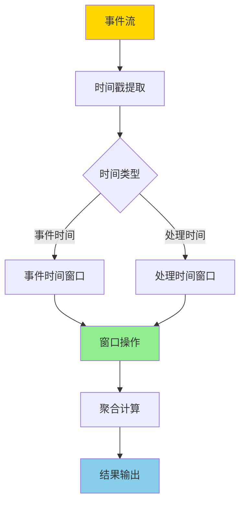
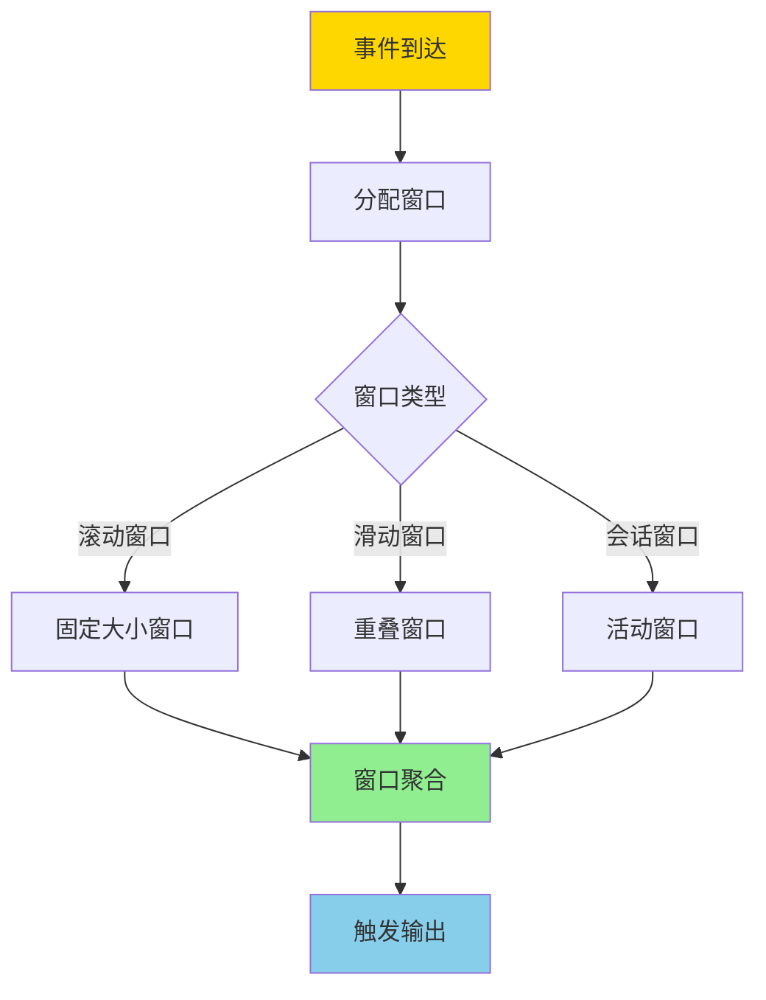
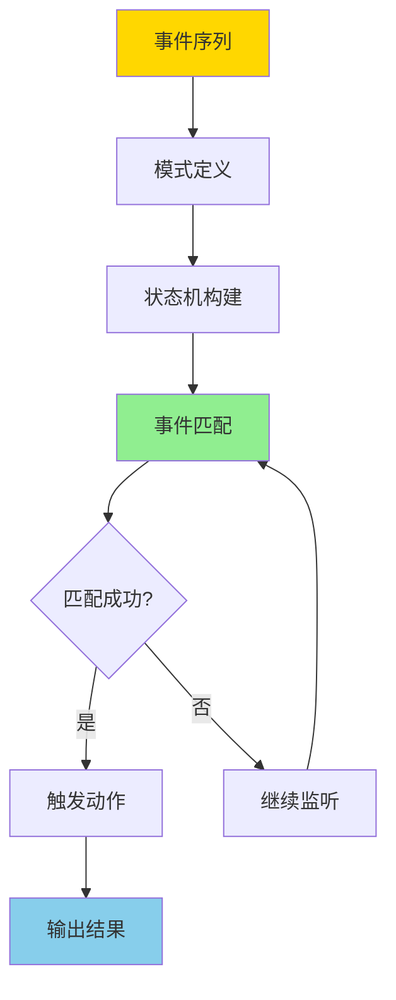

# 流处理与时间语义-窗口与CEP的形式化

> **文档版本**: v1.0
> **最后更新**: 2025-01-16
> **版本覆盖**: PostgreSQL 18.x (推荐) ⭐ | 17.x (推荐) | 16.x (兼容)
> **文档状态**: 🟡 框架已创建，内容待完善

---

## 📋 目录

- [流处理与时间语义-窗口与CEP的形式化](#流处理与时间语义-窗口与cep的形式化)
  - [📋 目录](#-目录)
  - [1. 概述](#1-概述)
    - [1.1 本文档的范围](#11-本文档的范围)
  - [2. 核心内容](#2-核心内容)
  - [3. 形式化定义](#3-形式化定义)
  - [4. 定理与证明](#4-定理与证明)
  - [5. 实际应用](#5-实际应用)
  - [6. 相关文档](#6-相关文档)
    - [6.1 理论基础文档](#61-理论基础文档)
  - [7. 参考文献](#7-参考文献)

---

## 1. 概述

### 1.0 流处理与时间语义工作原理概述

**流处理时间语义**：

流处理系统需要处理无界数据流，时间语义是流处理的核心概念。本文档提供流处理时间语义和窗口操作的形式化模型，包括事件时间、处理时间、窗口操作和CEP（复杂事件处理）的形式化定义。

**流处理架构**：

**窗口操作流程**：

**CEP模式匹配流程**：

### 1.1 本文档的范围

本文档涵盖：

- **时间语义**：事件时间、处理时间、水印机制的形式化定义
- **窗口操作**：滚动窗口、滑动窗口、会话窗口的形式化模型
- **CEP模式匹配**：复杂事件模式的形式化定义和匹配算法
- **实际应用**：流处理在PostgreSQL和TimescaleDB中的应用

---

## 2. 核心内容

[待补充]

---

## 3. 形式化定义

[待补充]

---

## 4. 定理与证明

[待补充]

---

## 5. 实际应用

[待补充]

---

## 6. 相关文档

### 6.1 理论基础文档

- [形式语言与证明：总论](./1.1.25-形式语言与证明-总论.md)
- [理论基础导航](./README.md)

---

## 7. 参考文献

### 7.1 核心理论文献

- **Arasu, A., et al. (2006). "The CQL Continuous Query Language: Semantic Foundations and Query Execution."**
  - 会议: VLDB Journal 2006
  - **重要性**: 流查询语言的经典论文
  - **核心贡献**: 提出了流查询语言的形式语义

- **Babcock, B., et al. (2002). "Models and Issues in Data Stream Systems."**
  - 会议: PODS 2002
  - **重要性**: 数据流系统的经典综述
  - **核心贡献**: 系统阐述了流处理的时间语义和窗口操作

### 7.2 窗口操作相关

- **Tucker, P. A., et al. (2003). "Exploiting Punctuation Semantics in Continuous Data Streams."**
  - 会议: TKDE 2003
  - **重要性**: 流处理窗口操作的经典研究
  - **核心贡献**: 提供了窗口操作的形式化模型

### 7.3 CEP相关

- **Luckham, D. C. (2002). "The Power of Events: An Introduction to Complex Event Processing."**
  - 出版社: Addison-Wesley
  - **重要性**: CEP的经典教材
  - **核心贡献**: 提出了CEP的理论框架

### 7.4 PostgreSQL实现相关

- **[TimescaleDB文档 - 连续聚合](<https://docs.timescale.com/timescaledb/latest/how-to-guides/continuous-aggregates/>)**
  - TimescaleDB连续聚合实现说明

### 7.5 相关文档

- [双时态表-事务时间与有效时间的形式语义](./10.02-双时态表-事务时间与有效时间的形式语义.md)
- [数据库事件处理模型-复杂事件处理与模式匹配的形式化](./10.05-数据库事件处理模型-复杂事件处理与模式匹配的形式化.md)
- [理论基础导航](../README.md)

---

**最后更新**: 2025-01-16
**维护者**: Documentation Team
**状态**: 🟡 框架已创建，内容待完善
