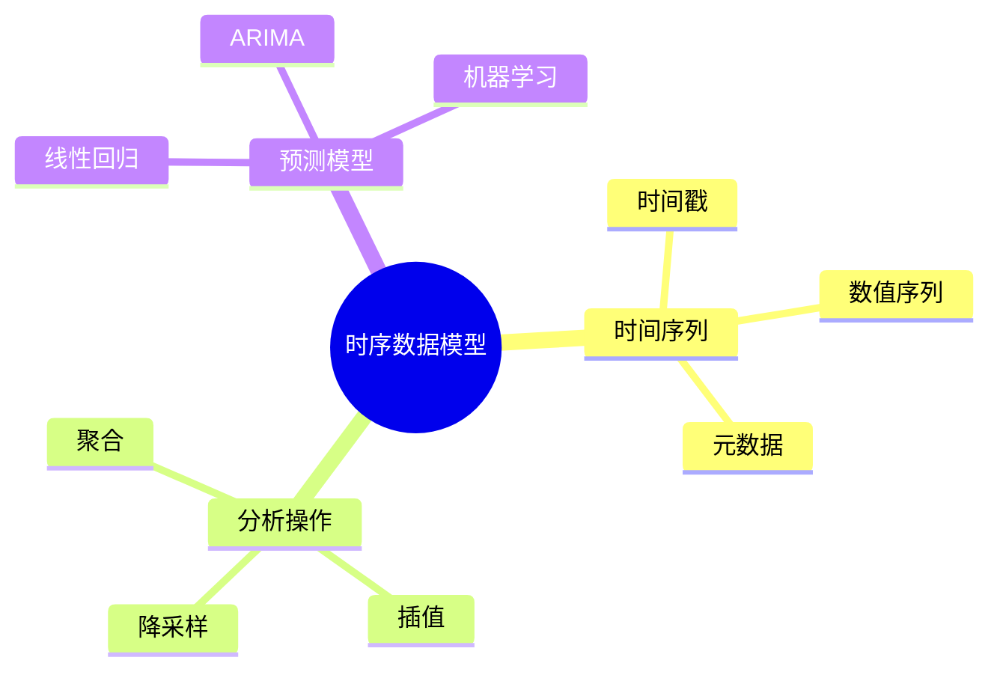

# 数据库时序数据模型-时间序列分析与预测的形式化

> **文档版本**: v1.0
> **最后更新**: 2025-01-16
> **版本覆盖**: PostgreSQL 18.x (推荐) ⭐ | 17.x (推荐) | 16.x (兼容)
> **文档状态**: 🟡 框架已创建，内容待完善

---

## 📋 目录

- [数据库时序数据模型-时间序列分析与预测的形式化](#数据库时序数据模型-时间序列分析与预测的形式化)
  - [📋 目录](#-目录)
  - [1. 概述](#1-概述)
    - [1.0 时序数据模型工作原理概述](#10-时序数据模型工作原理概述)
    - [1.1 本文档的范围](#11-本文档的范围)
  - [2. 核心内容](#2-核心内容)
    - [2.1 时间序列模型](#21-时间序列模型)
    - [2.2 时间序列分析](#22-时间序列分析)
  - [3. 形式化定义](#3-形式化定义)
    - [3.1 时间序列形式化](#31-时间序列形式化)
  - [4. 实际应用](#4-实际应用)
    - [4.1 PostgreSQL时序支持](#41-postgresql时序支持)
  - [5. 相关文档](#5-相关文档)
    - [5.1 理论基础文档](#51-理论基础文档)
  - [6. 参考文献](#6-参考文献)

---

## 1. 概述

### 1.0 时序数据模型工作原理概述

**时序数据模型**：

时序数据模型用于存储和分析时间序列数据，支持时间序列分析和预测。

**时序模型思维导图**：



### 1.1 本文档的范围

本文档涵盖：

- **时序数据模型**：时间序列的形式化定义
- **时间序列分析**：聚合、插值等操作
- **预测模型**：时间序列预测的形式化
- **实际应用**：PostgreSQL时序数据支持

---

## 2. 核心内容

### 2.1 时间序列模型

**时间序列定义**：

```haskell
-- 时间序列
data TimeSeries = TimeSeries {
    timestamps :: [Timestamp],
    values :: [Value],
    metadata :: Metadata
}
```

### 2.2 时间序列分析

**分析操作**：

| 操作 | 定义 | 用途 |
|------|------|------|
| **聚合** | 按时间窗口聚合 | 降采样 |
| **插值** | 填充缺失值 | 数据完整性 |
| **平滑** | 去除噪声 | 趋势分析 |

---

## 3. 形式化定义

### 3.1 时间序列形式化

**时间序列**：

```haskell
-- 时间序列形式化
TimeSeries = {(t1, v1), (t2, v2), ..., (tn, vn)}
where
    t1 < t2 < ... < tn
```

---

## 4. 实际应用

### 4.1 PostgreSQL时序支持

**使用TimescaleDB**：

```sql
-- 创建时序表
CREATE TABLE sensor_data (
    time TIMESTAMPTZ NOT NULL,
    sensor_id INTEGER,
    value DOUBLE PRECISION
);

-- 转换为超表
SELECT create_hypertable('sensor_data', 'time');

-- 时间序列查询
SELECT time_bucket('1 hour', time) AS hour,
       AVG(value) AS avg_value
FROM sensor_data
GROUP BY hour;
```

---

## 5. 相关文档

### 5.1 理论基础文档

- [形式语言与证明：总论](./1.1.25-形式语言与证明-总论.md)
- [理论基础导航](./README.md)

---

## 6. 参考文献

[待补充]

---

**最后更新**: 2025-01-16
**维护者**: Documentation Team
**状态**: 🟡 框架已创建，内容待完善
