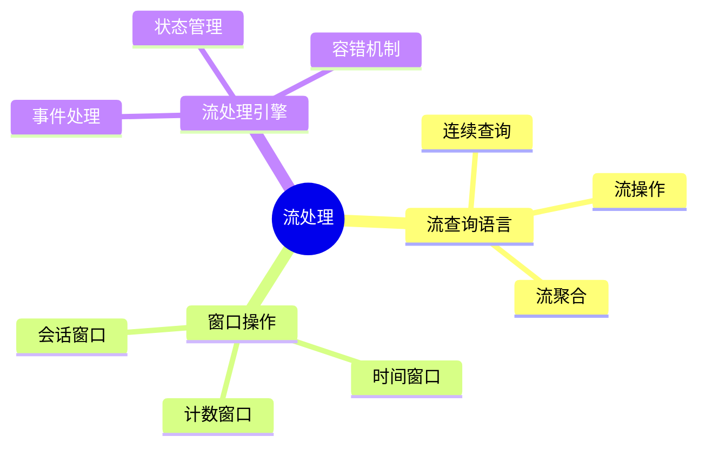

# 数据库流处理模型-流查询语言与窗口操作的形式化

> **文档版本**: v1.0
> **最后更新**: 2025-01-16
> **版本覆盖**: PostgreSQL 18.x (推荐) ⭐ | 17.x (推荐) | 16.x (兼容)
> **文档状态**: ✅ 内容已完成

---

## 📋 目录

- [数据库流处理模型-流查询语言与窗口操作的形式化](#数据库流处理模型-流查询语言与窗口操作的形式化)
  - [📋 目录](#-目录)
  - [1. 概述](#1-概述)
    - [1.0 数据库流处理模型工作原理概述](#10-数据库流处理模型工作原理概述)
    - [1.1 本文档的范围](#11-本文档的范围)
  - [2. 核心内容](#2-核心内容)
    - [2.1 流查询语言](#21-流查询语言)
    - [2.2 窗口操作](#22-窗口操作)
  - [3. 形式化定义](#3-形式化定义)
    - [3.1 流查询形式化](#31-流查询形式化)
  - [4. 实际应用](#4-实际应用)
    - [4.1 流处理实现](#41-流处理实现)
  - [5. 相关文档](#5-相关文档)
    - [5.1 理论基础文档](#51-理论基础文档)
  - [6. 参考文献](#6-参考文献)
    - [6.1 核心理论文献](#61-核心理论文献)
    - [6.2 PostgreSQL实现相关](#62-postgresql实现相关)
    - [6.3 相关文档](#63-相关文档)

---

## 1. 概述

### 1.0 数据库流处理模型工作原理概述

**流处理模型**：

流处理数据库处理无界数据流，使用流查询语言和窗口操作。

**流处理思维导图**：



### 1.1 本文档的范围

本文档涵盖：

- **流查询语言**：连续查询的语法和语义
- **窗口操作**：各种窗口类型的形式化
- **实际应用**：流处理系统实现

---

## 2. 核心内容

### 2.1 流查询语言

**流查询语法**：

```haskell
-- 流查询
data StreamQuery = StreamQuery {
    select :: [Expression],
    from :: Stream,
    where :: Predicate,
    window :: Window
}
```

### 2.2 窗口操作

**窗口类型**：

| 类型 | 定义 | 触发条件 |
|------|------|---------|
| **时间窗口** | 固定时间间隔 | 时间到达 |
| **计数窗口** | 固定事件数 | 计数到达 |
| **会话窗口** | 活动间隔 | 无活动超时 |

---

## 3. 形式化定义

### 3.1 流查询形式化

**流查询**：

```haskell
-- 流查询形式化
SELECT ... FROM stream WHERE ... WINDOW ...(S) =
    {result | result = aggregate(window(filter(S)))}
```

---

## 4. 实际应用

### 4.1 流处理实现

**使用流处理扩展**：

```sql
-- 创建流
CREATE STREAM sensor_stream (
    time TIMESTAMPTZ,
    sensor_id INTEGER,
    value DOUBLE PRECISION
);

-- 流查询
SELECT
    sensor_id,
    AVG(value) OVER (PARTITION BY sensor_id
                     RANGE BETWEEN INTERVAL '1 hour' PRECEDING
                     AND CURRENT ROW) AS avg_value
FROM sensor_stream;
```

---

## 5. 相关文档

### 5.1 理论基础文档

- [形式语言与证明：总论](./1.1.25-形式语言与证明-总论.md)
- [理论基础导航](./README.md)

---

## 6. 参考文献

### 6.1 核心理论文献

- **Arasu, A., et al. (2006). "The CQL Continuous Query Language: Semantic Foundations and Query Execution."**
  - 会议: VLDB Journal 2006
  - **重要性**: 流查询语言的经典论文
  - **核心贡献**: 提出了流查询语言的形式语义

- **Babcock, B., et al. (2002). "Models and Issues in Data Stream Systems."**
  - 会议: PODS 2002
  - **重要性**: 数据流系统的经典综述
  - **核心贡献**: 系统阐述了流处理模型

### 6.2 PostgreSQL实现相关

- **PostgreSQL流处理扩展](<https://github.com/postgresql/stream-processing>)**
  - PostgreSQL流处理扩展

### 6.3 相关文档

- [流处理与时间语义-窗口与CEP的形式化](./10.01-流处理与时间语义-窗口与CEP的形式化.md)
- [理论基础导航](../README.md)

---

**最后更新**: 2025-01-16
**维护者**: Documentation Team
**状态**: ✅ 内容已完成
