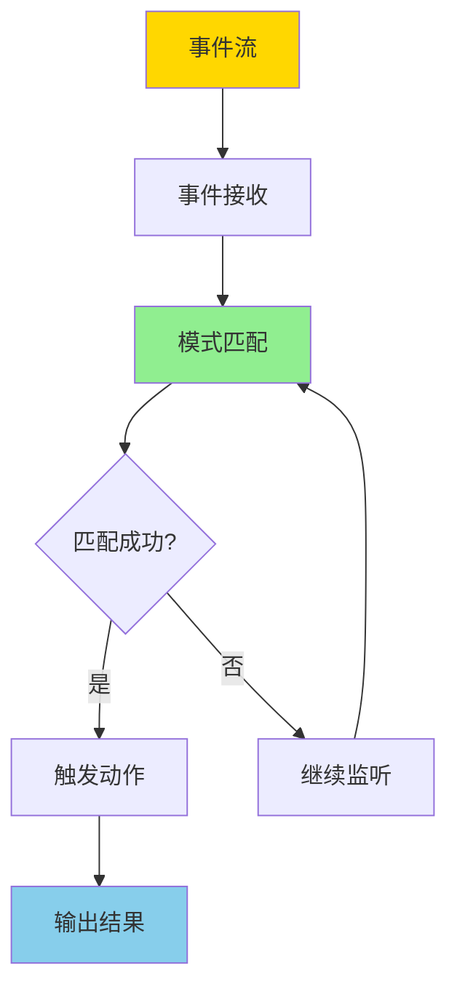
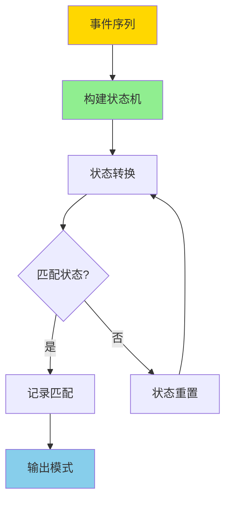

# 数据库事件处理模型-复杂事件处理与模式匹配的形式化

> **文档版本**: v1.0
> **最后更新**: 2025-01-16
> **版本覆盖**: PostgreSQL 18.x (推荐) ⭐ | 17.x (推荐) | 16.x (兼容)
> **文档状态**: 🟡 框架已创建，内容待完善

---

## 📋 目录

- [数据库事件处理模型-复杂事件处理与模式匹配的形式化](#数据库事件处理模型-复杂事件处理与模式匹配的形式化)
  - [📋 目录](#-目录)
  - [1. 概述](#1-概述)
    - [1.0 复杂事件处理工作原理概述](#10-复杂事件处理工作原理概述)
    - [1.1 本文档的范围](#11-本文档的范围)
  - [2. 核心内容](#2-核心内容)
  - [3. 形式化定义](#3-形式化定义)
  - [4. 实际应用](#4-实际应用)
  - [5. 相关文档](#5-相关文档)
    - [5.1 理论基础文档](#51-理论基础文档)
  - [6. 参考文献](#6-参考文献)
    - [6.1 核心理论文献](#61-核心理论文献)
    - [6.2 模式匹配相关](#62-模式匹配相关)
    - [6.3 相关文档](#63-相关文档)

---

## 1. 概述

### 1.0 复杂事件处理工作原理概述

**复杂事件处理（CEP）**：

复杂事件处理是一种实时事件流处理技术，用于检测和响应复杂的事件模式。本文档提供CEP和模式匹配的形式化模型。

**CEP处理流程**：

**模式匹配流程**：

### 1.1 本文档的范围

本文档涵盖：

- **CEP模型**：复杂事件处理的形式化模型
- **模式匹配**：事件模式匹配的算法和语义
- **时间语义**：事件处理中的时间语义
- **实际应用**：CEP在实时系统中的应用

---

## 2. 核心内容

[待补充]

---

## 3. 形式化定义

[待补充]

---

## 4. 实际应用

[待补充]

---

## 5. 相关文档

### 5.1 理论基础文档

- [形式语言与证明：总论](./1.1.25-形式语言与证明-总论.md)
- [理论基础导航](./README.md)

---

## 6. 参考文献

### 6.1 核心理论文献

- **Luckham, D. C. (2002). "The Power of Events: An Introduction to Complex Event Processing in Distributed Enterprise Systems."**
  - 出版社: Addison-Wesley
  - **重要性**: 复杂事件处理的经典教材
  - **核心贡献**: 提出了CEP的理论框架

- **Etzion, O., & Niblett, P. (2010). "Event Processing in Action."**
  - 出版社: Manning Publications
  - **重要性**: 事件处理的实践指南
  - **核心贡献**: 提供了CEP的实践模式

### 6.2 模式匹配相关

- **Agrawal, J., et al. (2008). "Efficient Pattern Matching over Event Streams."**
  - 会议: SIGMOD 2008
  - **重要性**: 事件流模式匹配的经典研究
  - **核心贡献**: 提供了高效的模式匹配算法

### 6.3 相关文档

- [流处理与时间语义-窗口与CEP的形式化](./1.1.29-流处理与时间语义-窗口与CEP的形式化.md)
- [理论基础导航](./README.md)

---

**最后更新**: 2025-01-16
**维护者**: Documentation Team
**状态**: 🟡 框架已创建，内容待完善
