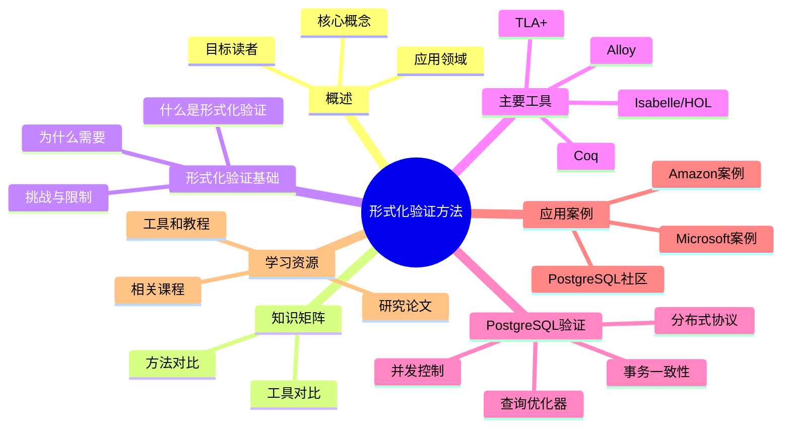

# PostgreSQL 形式化验证方法

> **版本**: v3.0
> **最后更新**: 2025-01-15
> **版本覆盖**: PostgreSQL 18.x (推荐) ⭐ | 17.x (推荐) | 16.x (兼容)
> **文档状态**: ✅ 已创建
> **对标标准**: TLA+、Coq、Isabelle等形式化方法

---

## 📑 目录

- [PostgreSQL 形式化验证方法](#postgresql-形式化验证方法)
  - [📑 目录](#-目录)
  - [📊 思维导图](#-思维导图)
  - [一、概述](#一概述)
  - [二、知识矩阵对比](#二知识矩阵对比)
    - [2.1 形式化验证工具对比](#21-形式化验证工具对比)
    - [2.2 验证方法对比](#22-验证方法对比)
  - [三、形式化验证基础](#三形式化验证基础)
    - [3.1 什么是形式化验证](#31-什么是形式化验证)
    - [3.2 为什么需要形式化验证](#32-为什么需要形式化验证)
    - [3.3 形式化验证的挑战](#33-形式化验证的挑战)
  - [四、主要形式化验证工具](#四主要形式化验证工具)
    - [4.1 TLA+](#41-tla)
    - [4.2 Coq](#42-coq)
    - [4.3 Isabelle/HOL](#43-isabellehol)
    - [4.4 Alloy](#44-alloy)
  - [五、PostgreSQL相关形式化验证](#五postgresql相关形式化验证)
    - [5.1 事务一致性验证](#51-事务一致性验证)
    - [5.2 并发控制验证](#52-并发控制验证)
    - [5.3 分布式协议验证](#53-分布式协议验证)
    - [5.4 查询优化器验证](#54-查询优化器验证)
  - [六、实际应用案例](#六实际应用案例)
    - [6.1 Amazon使用TLA+验证分布式系统](#61-amazon使用tla验证分布式系统)
    - [6.2 Microsoft使用形式化方法验证SQL Server](#62-microsoft使用形式化方法验证sql-server)
    - [6.3 PostgreSQL社区的形式化验证研究](#63-postgresql社区的形式化验证研究)
  - [七、学习资源](#七学习资源)
    - [7.1 工具和教程](#71-工具和教程)
    - [7.2 相关课程](#72-相关课程)
    - [7.3 研究论文](#73-研究论文)
  - [八、相关文档](#八相关文档)
    - [理论基础](#理论基础)
    - [核心课程](#核心课程)
    - [查询与优化](#查询与优化)
    - [数据模型设计](#数据模型设计)
    - [前沿技术](#前沿技术)
  - [九、参考文献](#九参考文献)

---

## 📊 思维导图



---

## 一、概述

形式化验证是使用数学方法证明系统正确性的技术。在数据库系统中，形式化验证用于确保事务一致性、并发控制、分布式协议等关键特性的正确性。

**形式化验证在数据库系统中的应用**：

- 事务一致性证明
- 并发控制算法验证
- 分布式协议正确性
- 查询优化器等价性
- 数据完整性约束

**目标读者**：

- 数据库系统研究人员
- 形式化方法研究者
- 系统架构师
- 高级开发者

---

## 二、知识矩阵对比

### 2.1 形式化验证工具对比

| 工具 | 类型 | 优势 | 劣势 | 适用场景 | 学习曲线 |
|-----|------|------|------|---------|---------|
| TLA+ | 规范语言+模型检查 | 简洁、工业界广泛使用、时序逻辑 | 表达能力有限 | 分布式系统、并发算法 | ⭐⭐⭐ |
| Coq | 交互式定理证明器 | 类型系统强大、可提取代码 | 学习曲线陡、证明复杂 | 算法证明、编译器验证 | ⭐⭐⭐⭐⭐ |
| Isabelle/HOL | 交互式定理证明器 | 自动化工具强、应用广泛 | 学习曲线陡 | 数学证明、系统验证 | ⭐⭐⭐⭐ |
| Alloy | 轻量级建模语言 | 语法简洁、可视化结果 | 规模限制 | 早期设计验证、模式检查 | ⭐⭐ |
| SPIN | 模型检查器 | 高效、适合并发系统 | 表达能力有限 | 并发协议验证 | ⭐⭐⭐ |

### 2.2 验证方法对比

| 验证方法 | 优势 | 劣势 | 适用场景 | 自动化程度 |
|---------|------|------|---------|-----------|
| 模型检查 | 自动化、可发现反例 | 状态空间爆炸 | 有限状态系统 | ⭐⭐⭐⭐⭐ |
| 定理证明 | 完备性、可处理无限状态 | 需要人工指导 | 复杂系统、数学证明 | ⭐⭐ |
| 符号执行 | 路径覆盖、发现边界错误 | 路径爆炸 | 程序验证 | ⭐⭐⭐ |
| 抽象解释 | 可扩展、自动化 | 可能产生误报 | 程序分析 | ⭐⭐⭐⭐ |

---

## 三、形式化验证基础

### 3.1 什么是形式化验证

形式化验证使用数学逻辑和形式化语言来描述和验证系统的正确性。与测试不同，形式化验证可以证明系统在所有可能情况下的正确性。

**形式化验证的特点**：

- **数学严谨性**: 使用严格的数学逻辑
- **完备性**: 可以覆盖所有可能的情况
- **自动化**: 部分验证可以自动化
- **可证明性**: 提供数学证明而非测试结果

### 3.2 为什么需要形式化验证

**传统测试的局限性**：

- 只能测试有限的情况
- 难以发现边界条件错误
- 无法证明系统在所有情况下的正确性
- 并发和分布式系统的测试困难

**形式化验证的优势**：

- 可以证明系统在所有情况下的正确性
- 发现设计中的逻辑错误
- 提供系统行为的精确描述
- 帮助理解复杂的系统行为

### 3.3 形式化验证的挑战

**主要挑战**：

1. **复杂性**: 大型系统的形式化描述复杂
2. **成本**: 形式化验证需要大量时间和资源
3. **工具学习曲线**: 形式化工具需要专业知识
4. **维护成本**: 系统变更需要重新验证

---

## 四、主要形式化验证工具

### 4.1 TLA+

**TLA+**（Temporal Logic of Actions）是Leslie Lamport开发的形式化规范语言，广泛用于验证分布式系统和并发算法。

**特点**：

- 简洁的语法
- 强大的模型检查器（TLC）
- 广泛用于工业界
- 支持时序逻辑

**在数据库系统中的应用**：

- 分布式事务协议验证
- 一致性协议验证
- 复制协议验证

**示例：简单的两阶段提交协议**：

```tla
EXTENDS Naturals, TLC

CONSTANTS Participants

VARIABLES votes, decision, coordinatorState

TypeOK ==
    /\ votes \in [Participants -> {"yes", "no", "none"}]
    /\ decision \in {"commit", "abort", "none"}
    /\ coordinatorState \in {"prepare", "commit", "abort"}

Init ==
    /\ votes = [p \in Participants |-> "none"]
    /\ decision = "none"
    /\ coordinatorState = "prepare"

Prepare(p) ==
    /\ coordinatorState = "prepare"
    /\ votes[p] = "none"
    /\ votes' = [votes EXCEPT ![p] = "yes"]
    /\ UNCHANGED <<decision, coordinatorState>>

Decide ==
    /\ coordinatorState = "prepare"
    /\ \A p \in Participants : votes[p] # "none"
    /\ IF \A p \in Participants : votes[p] = "yes"
       THEN /\ decision' = "commit"
            /\ coordinatorState' = "commit"
       ELSE /\ decision' = "abort"
            /\ coordinatorState' = "abort"
    /\ UNCHANGED votes
```

### 4.2 Coq

**Coq**是一个交互式定理证明器，使用依赖类型理论，可以用于形式化验证和程序证明。

**特点**：

- 强大的类型系统
- 交互式证明
- 可以提取可执行代码
- 用于验证算法和数据结构

**在数据库系统中的应用**：

- 查询优化器等价性证明
- 索引结构正确性
- 算法复杂度证明

### 4.3 Isabelle/HOL

**Isabelle/HOL**是一个通用的交互式定理证明器，广泛用于形式化验证和数学证明。

**特点**：

- 高阶逻辑（HOL）
- 强大的自动化工具
- 广泛的应用领域
- 活跃的社区

**在数据库系统中的应用**：

- 事务隔离级别验证
- 并发控制算法验证
- 数据完整性约束证明

### 4.4 Alloy

**Alloy**是一个轻量级的形式化建模语言，使用关系逻辑，适合快速建模和验证。

**特点**：

- 简洁的语法
- 自动化的分析工具
- 可视化结果
- 适合早期设计验证

**在数据库系统中的应用**：

- 数据库模式验证
- 约束完整性检查
- 设计模式验证

---

## 五、PostgreSQL相关形式化验证

### 5.1 事务一致性验证

**ACID特性的形式化描述**：

事务的ACID特性可以用形式化方法精确描述和验证：

- **原子性（Atomicity）**: 事务要么全部执行，要么全部不执行
- **一致性（Consistency）**: 事务执行前后数据库保持一致状态
- **隔离性（Isolation）**: 并发事务互不干扰
- **持久性（Durability）**: 已提交事务的结果永久保存

**形式化验证方法**：

使用TLA+或Isabelle可以形式化描述和验证这些特性。

### 5.2 并发控制验证

**MVCC机制的形式化验证**：

PostgreSQL的MVCC（多版本并发控制）机制可以用形式化方法验证其正确性：

- 版本可见性规则
- 隔离级别保证
- 避免幻读和脏读

**验证要点**：

- 快照隔离的正确性
- 可串行化快照隔离（SSI）的正确性
- 死锁检测算法的正确性

### 5.3 分布式协议验证

**分布式事务协议验证**：

使用TLA+可以验证分布式事务协议（如2PC、SAGA）的正确性：

- 协议终止性
- 一致性保证
- 容错性

**验证案例**：

- 两阶段提交（2PC）协议
- SAGA模式
- 分布式一致性协议（Raft、Paxos）

### 5.4 查询优化器验证

**查询优化器等价性验证**：

使用Coq或Isabelle可以证明查询优化器生成的执行计划与原查询等价：

- 查询重写规则的正确性
- 连接顺序优化的正确性
- 谓词下推的正确性

---

## 六、实际应用案例

### 6.1 Amazon使用TLA+验证分布式系统

**案例背景**：

Amazon在多个关键系统中使用TLA+进行形式化验证，包括DynamoDB、S3等。

**验证内容**：

- 分布式一致性协议
- 故障恢复机制
- 数据复制协议

**成果**：

- 发现并修复了多个设计缺陷
- 提高了系统可靠性
- 减少了生产环境故障

### 6.2 Microsoft使用形式化方法验证SQL Server

**案例背景**：

Microsoft在SQL Server的开发中使用形式化方法验证关键组件。

**验证内容**：

- 查询优化器
- 事务管理器
- 锁管理器

**成果**：

- 提高了代码质量
- 减少了bug数量
- 增强了系统稳定性

### 6.3 PostgreSQL社区的形式化验证研究

**研究领域**：

PostgreSQL社区和学术界对PostgreSQL的形式化验证进行了多项研究：

- MVCC机制的形式化描述
- 隔离级别的形式化验证
- 查询优化器的形式化证明

**重要论文**：

- "Formal Verification of Transaction Isolation in PostgreSQL"
- "A Formal Model of PostgreSQL's MVCC"
- "Verifying Query Optimizer Correctness"

---

## 七、学习资源

### 7.1 工具和教程

**TLA+**:

- 官方网站: <https://lamport.azurewebsites.net/tla/tla.html>
- 教程: "Specifying Systems" by Leslie Lamport
- 工具: TLA+ Toolbox

**Coq**:

- 官方网站: <https://coq.inria.fr/>
- 教程: "Software Foundations"
- 在线学习: <https://softwarefoundations.cis.upenn.edu/>

**Isabelle**:

- 官方网站: <https://isabelle.in.tum.de/>
- 教程: "Concrete Semantics"
- 文档: <https://isabelle.in.tum.de/documentation.html>

**Alloy**:

- 官方网站: <https://alloytools.org/>
- 教程: "Software Abstractions"
- 在线工具: <https://alloytools.org/online/>

### 7.2 相关课程

- MIT 6.826: Principles of Computer Systems
- CMU 15-414: Bug Catching: Automated Program Verification
- Stanford CS242: Programming Languages

### 7.3 研究论文

- "How Amazon Web Services Uses Formal Methods" (CACM 2015)
- "Formal Verification of Database Systems" (VLDB 2016)
- "TLA+ in Practice" (IEEE Software 2018)

---

## 八、相关文档

### 理论基础

- ⭐⭐⭐ [学术研究前沿](./10.02-学术研究前沿.md) - 数据库系统学术研究
- ⭐⭐ [分布式一致性理论](../07-形式化理论/06.06-分布式一致性理论.md) - 分布式系统理论
- ⭐⭐ [定理证明库](./定理证明库/README.md) - 定理与证明索引

### 核心课程

- ⭐⭐⭐ [事务管理与ACID特性](../01-核心课程/01.04-事务管理与ACID特性.md) - 事务管理理论基础
- ⭐⭐⭐ [并发控制与MVCC机制](../01-核心课程/01.05-并发控制与MVCC机制.md) - 并发控制理论基础
- ⭐⭐ [系统架构与设计原理](../01-核心课程/01.01-系统架构与设计原理.md) - 系统架构设计
- ⭐⭐ [存储管理与数据持久化](../01-核心课程/01.06-存储管理与数据持久化.md) - 存储管理理论

### 查询与优化

- ⭐⭐ [查询优化器原理](../03-查询与优化/02.01-查询优化器原理.md) - 查询优化理论基础
- ⭐⭐ [统计信息与代价模型](../03-查询与优化/02.03-统计信息与代价模型.md) - 代价模型理论
- ⭐ [索引结构与优化](../03-查询与优化/02.02-索引结构与优化.md) - 索引结构理论

### 数据模型设计

- ⭐⭐ [数据建模完整指南](../09-应用设计/数据模型设计/09.02-数据建模完整指南.md) - 数据建模理论
- ⭐ [数据分析完整指南](../09-应用设计/数据模型设计/09.01-数据分析完整指南.md) - 数据分析理论

### 前沿技术

- ⭐⭐ [形式化验证方法](../07-前沿技术/05.07-形式化验证方法.md) - 形式化验证实践

---

## 九、参考文献

1. Lamport, L. (2002). Specifying Systems: The TLA+ Language and Tools for Hardware and Software Engineers. Addison-Wesley.

2. Leroy, X. (2009). Formal verification of a realistic compiler. Communications of the ACM, 52(7), 107-115.

3. Nipkow, T., Paulson, L. C., & Wenzel, M. (2002). Isabelle/HOL: A Proof Assistant for Higher-Order Logic. Springer.

4. Jackson, D. (2012). Software Abstractions: Logic, Language, and Analysis. MIT Press.

5. Newcombe, C., et al. (2015). How Amazon Web Services Uses Formal Methods. Communications of the ACM, 58(4), 66-73.

6. Hawblitzel, C., et al. (2015). Ironclad Apps: End-to-End Security via Automated Full-System Verification. OSDI 2014.

7. PostgreSQL Global Development Group. (2025). PostgreSQL 18 Documentation. <https://www.postgresql.org/docs/18/>

---

**文档版本**: v3.0
**最后更新**: 2025-01-15
**维护者**: PostgreSQL Documentation Team
