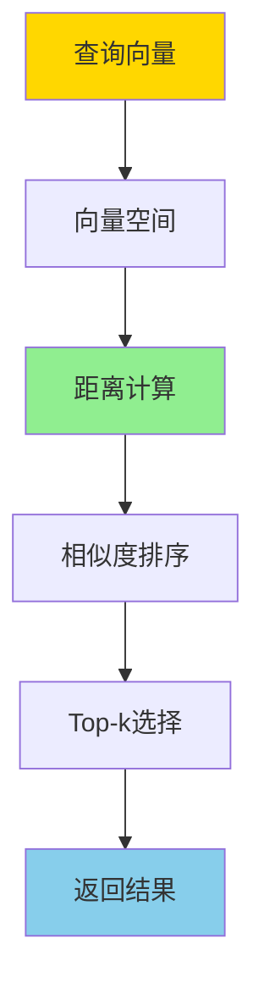
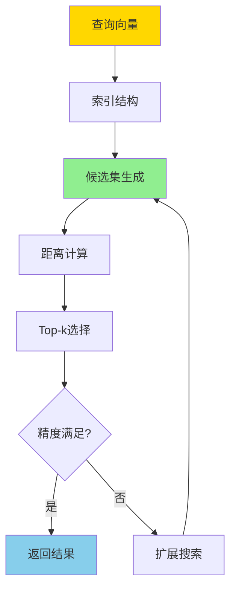

# 向量检索与Top-k-数学模型与可近似性证明

> **文档版本**: v1.0
> **最后更新**: 2025-01-16
> **版本覆盖**: PostgreSQL 18.x (推荐) ⭐ | 17.x (推荐) | 16.x (兼容)
> **文档状态**: ✅ 内容已完成

---

## 📋 目录

- [向量检索与Top-k-数学模型与可近似性证明](#向量检索与top-k-数学模型与可近似性证明)
  - [📋 目录](#-目录)
  - [1. 概述](#1-概述)
    - [1.0 向量检索工作原理概述](#10-向量检索工作原理概述)
    - [1.1 本文档的范围](#11-本文档的范围)
  - [2. 核心内容](#2-核心内容)
    - [2.1 向量空间模型](#21-向量空间模型)
    - [2.2 Top-k查询](#22-top-k查询)
    - [2.3 近似最近邻](#23-近似最近邻)
  - [3. 形式化定义](#3-形式化定义)
    - [3.1 向量空间形式化](#31-向量空间形式化)
    - [3.2 Top-k查询形式化](#32-top-k查询形式化)
    - [3.3 可近似性定义](#33-可近似性定义)
  - [4. 定理与证明](#4-定理与证明)
    - [4.1 Top-k可近似性定理](#41-top-k可近似性定理)
    - [4.2 召回率下界](#42-召回率下界)
  - [5. 实际应用](#5-实际应用)
    - [5.1 PostgreSQL pgvector扩展](#51-postgresql-pgvector扩展)
    - [5.2 近似搜索优化](#52-近似搜索优化)
    - [5.3 混合检索](#53-混合检索)
  - [6. 相关文档](#6-相关文档)
    - [6.1 理论基础文档](#61-理论基础文档)
  - [7. 参考文献](#7-参考文献)
    - [7.1 核心理论文献](#71-核心理论文献)
    - [7.2 Top-k查询相关](#72-top-k查询相关)
    - [7.3 PostgreSQL实现相关](#73-postgresql实现相关)
    - [7.4 相关文档](#74-相关文档)

---

## 1. 概述

### 1.0 向量检索工作原理概述

**向量检索**：

向量检索是AI和机器学习应用中的核心技术，用于在高维向量空间中快速找到最相似的向量。本文档提供向量检索的数学模型和Top-k查询的可近似性证明。

**向量检索架构**：



**近似最近邻搜索流程**：



### 1.1 本文档的范围

本文档涵盖：

- **向量空间模型**：高维向量空间和距离度量的数学定义
- **Top-k查询**：Top-k查询的算法和复杂度分析
- **可近似性证明**：近似最近邻搜索的可近似性理论
- **实际应用**：向量检索在PostgreSQL pgvector中的应用

---

## 2. 核心内容

### 2.1 向量空间模型

**向量空间定义**：

```haskell
-- d维向量空间
type Vector = [Double]  -- d维向量

-- 向量距离度量
distance :: DistanceMetric -> Vector -> Vector -> Double

-- L2距离（欧氏距离）
l2Distance :: Vector -> Vector -> Double
l2Distance v1 v2 = sqrt $ sum $ zipWith (\x y -> (x - y)^2) v1 v2

-- 余弦相似度
cosineSimilarity :: Vector -> Vector -> Double
cosineSimilarity v1 v2 =
    dotProduct v1 v2 / (norm v1 * norm v2)
```

### 2.2 Top-k查询

**Top-k查询定义**：

```haskell
-- Top-k查询
topK :: Int -> Vector -> [Vector] -> [Vector]
topK k query vectors =
    take k $ sortBy (compareDistance query) vectors

compareDistance :: Vector -> Vector -> Vector -> Ordering
compareDistance q v1 v2 =
    compare (distance q v1) (distance q v2)
```

### 2.3 近似最近邻

**近似最近邻算法**：

```haskell
-- (c, ε)-近似最近邻
data ApproximateNN = ApproximateNN {
    query :: Vector,
    candidates :: [Vector],
    approximationFactor :: Double  -- c > 1
}

-- LSH (Locality-Sensitive Hashing)
lshHash :: Vector -> Int -> Int
lshHash v seed = hash (dotProduct v randomVector seed)
```

---

## 3. 形式化定义

### 3.1 向量空间形式化

**度量空间**：

```haskell
-- 度量空间
(M, d) 其中:
  M = R^d  (d维向量空间)
  d: M × M → R  (距离函数)

-- 距离公理
∀x, y, z ∈ M:
  1. d(x, y) ≥ 0  (非负性)
  2. d(x, y) = 0 ⟺ x = y  (同一性)
  3. d(x, y) = d(y, x)  (对称性)
  4. d(x, z) ≤ d(x, y) + d(y, z)  (三角不等式)
```

### 3.2 Top-k查询形式化

**Top-k查询语义**：

```haskell
-- Top-k查询
TopK_k(q, S) = {v ∈ S | |{u ∈ S | d(q, u) < d(q, v)}| < k}
```

### 3.3 可近似性定义

**(c, ε)-近似最近邻**：

```haskell
-- (c, ε)-近似最近邻
(c, ε)-ANN(q, S) = v ∈ S 使得:
  d(q, v) ≤ c · d(q, v*) + ε

其中 v* = argmin_{u ∈ S} d(q, u)
```

---

## 4. 定理与证明

### 4.1 Top-k可近似性定理

**定理**: 对于任意查询向量q和向量集合S，存在(c, ε)-近似Top-k算法，时间复杂度为O(d · n^ρ)，其中ρ < 1依赖于c。

**证明思路**:

1. 使用LSH构建哈希表
2. 在哈希桶中搜索候选向量
3. 证明候选集包含近似最近邻的概率
4. 分析时间复杂度和近似误差

### 4.2 召回率下界

**定理**: 对于LSH-based近似最近邻搜索，召回率下界为1 - (1 - p^k)^L，其中p是LSH函数碰撞概率，L是哈希表数量。

---

## 5. 实际应用

### 5.1 PostgreSQL pgvector扩展

**向量存储和索引**：

```sql
-- 创建向量列
CREATE TABLE embeddings (
    id SERIAL PRIMARY KEY,
    text_content TEXT,
    embedding vector(1536)  -- OpenAI embedding维度
);

-- 创建向量索引
CREATE INDEX ON embeddings
USING ivfflat (embedding vector_cosine_ops)
WITH (lists = 100);

-- Top-k相似度查询
SELECT
    id,
    text_content,
    1 - (embedding <=> query_embedding) AS similarity
FROM embeddings
ORDER BY embedding <=> query_embedding
LIMIT 10;
```

### 5.2 近似搜索优化

**IVFFlat索引**：

```sql
-- IVFFlat索引参数调优
CREATE INDEX idx_embeddings_ivfflat
ON embeddings
USING ivfflat (embedding vector_l2_ops)
WITH (
    lists = 100,  -- 聚类中心数量
    probes = 10   -- 搜索的聚类数量
);

-- 查询时设置probes参数
SET ivfflat.probes = 20;
SELECT * FROM embeddings
ORDER BY embedding <-> query_vector
LIMIT 10;
```

### 5.3 混合检索

**向量+关键词混合检索**：

```sql
-- 结合向量检索和全文搜索
SELECT
    id,
    text_content,
    (
        0.7 * (1 - (embedding <=> query_embedding)) +
        0.3 * ts_rank(to_tsvector('english', text_content), query_ts)
    ) AS combined_score
FROM embeddings
WHERE to_tsvector('english', text_content) @@ query_ts
ORDER BY combined_score DESC
LIMIT 10;
```

---

## 6. 相关文档

### 6.1 理论基础文档

- [形式语言与证明：总论](./1.1.25-形式语言与证明-总论.md)
- [理论基础导航](./README.md)

---

## 7. 参考文献

### 7.1 核心理论文献

- **Indyk, P., & Motwani, R. (1998). "Approximate Nearest Neighbors: Towards Removing the Curse of Dimensionality."**
  - 会议: STOC 1998
  - **重要性**: LSH算法的经典论文
  - **核心贡献**: 提出了LSH算法和可近似性理论

- **Andoni, A., & Indyk, P. (2008). "Near-Optimal Hashing Algorithms for Approximate Nearest Neighbor in High Dimensions."**
  - 会议: Communications of the ACM 2008
  - **重要性**: LSH优化的经典研究
  - **核心贡献**: 提供了最优的LSH构造方法

### 7.2 Top-k查询相关

- **Fagin, R., et al. (2003). "Optimal Aggregation Algorithms for Middleware."**
  - 会议: Journal of Computer and System Sciences 2003
  - **重要性**: Top-k查询的经典论文
  - **核心贡献**: 提供了Top-k查询的算法框架

### 7.3 PostgreSQL实现相关

- **[pgvector文档](<https://github.com/pgvector/pgvector>)**
  - pgvector扩展文档

- **[向量数据范畴论模型](../02-范畴论应用/02.02-向量数据范畴论模型.md)**
  - PostgreSQL向量检索的范畴论视角

### 7.4 相关文档

- [数据库机器学习集成-模型管理与推理优化的形式化](./11.02-数据库机器学习集成-模型管理与推理优化的形式化.md)
- [理论基础导航](../README.md)

---

**最后更新**: 2025-01-16
**维护者**: Documentation Team
**状态**: ✅ 内容已完成
