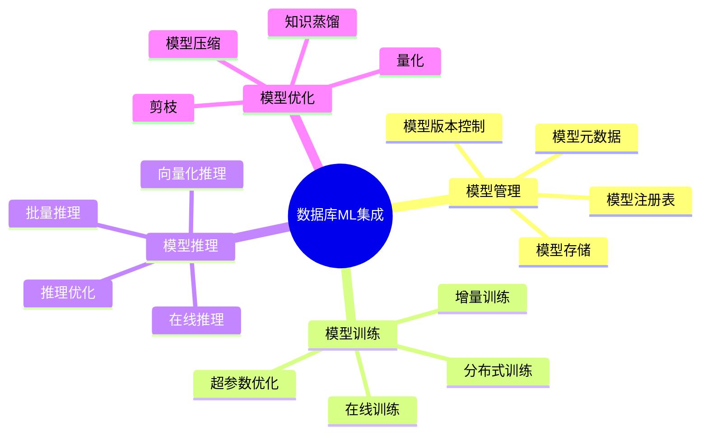
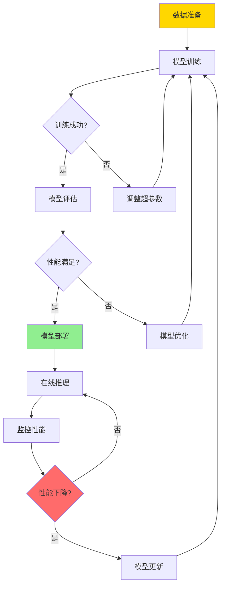
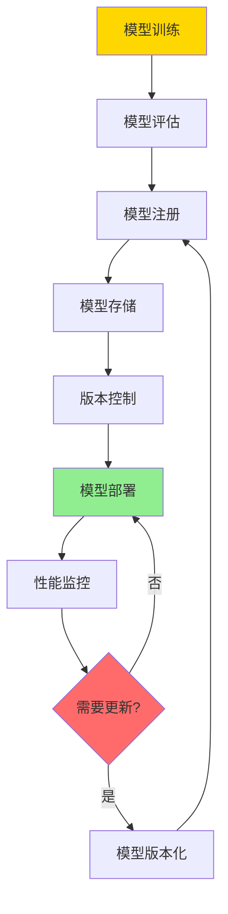
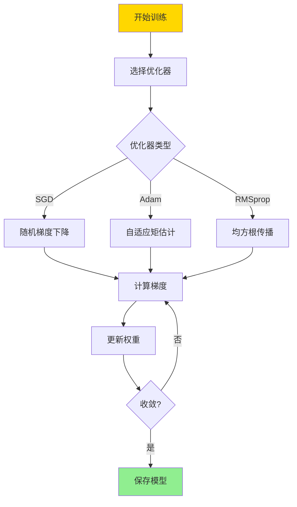

# 数据库机器学习集成-模型管理与推理优化的形式化

> **文档版本**: v1.0
> **最后更新**: 2025-01-16
> **版本覆盖**: PostgreSQL 18.x (推荐) ⭐ | 17.x (推荐) | 16.x (兼容)
> **文档状态**: 🟡 框架已创建，内容待完善

---

## 📋 目录

- [数据库机器学习集成-模型管理与推理优化的形式化](#数据库机器学习集成-模型管理与推理优化的形式化)
  - [📋 目录](#-目录)
  - [1. 概述](#1-概述)
    - [1.0 数据库机器学习集成工作原理概述](#10-数据库机器学习集成工作原理概述)
    - [1.1 本文档的范围](#11-本文档的范围)
  - [2. 核心内容](#2-核心内容)
    - [2.1 模型管理](#21-模型管理)
    - [2.2 模型训练](#22-模型训练)
    - [2.3 模型推理](#23-模型推理)
  - [3. 形式化定义](#3-形式化定义)
    - [3.1 模型形式化](#31-模型形式化)
    - [3.2 训练形式化](#32-训练形式化)
    - [3.3 推理形式化](#33-推理形式化)
  - [4. 实际应用](#4-实际应用)
    - [4.1 PostgreSQL ML扩展](#41-postgresql-ml扩展)
    - [4.2 模型管理](#42-模型管理)
    - [4.3 推理优化](#43-推理优化)
  - [5. 相关文档](#5-相关文档)
    - [5.1 理论基础文档](#51-理论基础文档)
  - [6. 参考文献](#6-参考文献)
    - [6.1 核心理论文献](#61-核心理论文献)
    - [6.2 推理优化相关](#62-推理优化相关)
    - [6.3 PostgreSQL实现相关](#63-postgresql实现相关)
    - [6.4 相关文档](#64-相关文档)

---

## 1. 概述

### 1.0 数据库机器学习集成工作原理概述

**ML集成架构**：

数据库与机器学习的集成使得可以在数据库内部进行模型训练、推理和优化。本文档提供数据库ML集成的形式化模型。

**ML集成层次思维导图**：



**ML生命周期决策树**：



**ML集成方式对比矩阵**：

| 集成方式 | 优势 | 劣势 | 适用场景 |
|---------|------|------|---------|
| **数据库内ML** | 低延迟、数据本地性 | 资源限制 | 实时推理 |
| **外部ML服务** | 灵活性高、资源丰富 | 网络延迟 | 复杂模型 |
| **混合方式** | 平衡性能与灵活性 | 复杂度高 | 生产环境 |

### 1.1 本文档的范围

本文档涵盖：

- **模型管理**：模型存储、版本控制、元数据管理
- **模型训练**：在线训练、增量训练的形式化
- **模型推理**：推理优化和向量化推理
- **实际应用**：PostgreSQL ML扩展的应用

---

## 2. 核心内容

### 2.1 模型管理

**模型元数据**：

```haskell
-- 模型元数据
data ModelMetadata = ModelMetadata {
    modelId :: ModelID,
    modelName :: String,
    modelType :: ModelType,
    version :: Version,
    trainingData :: DataSet,
    hyperparameters :: Map String Value,
    metrics :: Map String Double,
    createdAt :: Timestamp
}

-- 模型类型
data ModelType =
    LinearRegression
  | LogisticRegression
  | NeuralNetwork
  | RandomForest
  | SVM
```

**模型管理流程**：



### 2.2 模型训练

**在线训练形式化**：

```haskell
-- 在线训练
onlineTrain :: Model -> DataPoint -> Model
onlineTrain model point =
    updateWeights model (gradient model point)

-- 增量训练
incrementalTrain :: Model -> DataSet -> Model
incrementalTrain model newData =
    foldl onlineTrain model newData
```

**训练优化决策树**：



### 2.3 模型推理

**推理优化**：

```haskell
-- 批量推理
batchInference :: Model -> [DataPoint] -> [Prediction]
batchInference model points =
    map (inference model) points

-- 向量化推理
vectorizedInference :: Model -> Matrix -> Matrix
vectorizedInference model data =
    matrixMultiply (weights model) data
```

**推理优化策略对比矩阵**：

| 优化策略 | 方法 | 性能提升 | 适用场景 |
|---------|------|---------|---------|
| **向量化** | 批量处理 | 10-100x | 批量推理 |
| **模型压缩** | 量化/剪枝 | 2-5x | 资源受限 |
| **缓存** | 结果缓存 | 100-1000x | 重复查询 |
| **并行化** | 多线程/GPU | 4-100x | 大规模推理 |

---

## 3. 形式化定义

### 3.1 模型形式化

**模型定义**：

```haskell
-- 模型
Model = (Weights, Architecture, Hyperparameters)

-- 推理函数
inference : Model × DataPoint → Prediction

-- 训练函数
train : Model × DataSet → Model
```

### 3.2 训练形式化

**损失函数**：

```haskell
-- 损失函数
loss : Model × DataPoint → Real

-- 梯度
gradient : Model × DataPoint → Weights

-- 权重更新
update : Model × Weights → Model
```

### 3.3 推理形式化

**推理语义**：

```haskell
-- 推理语义
inference(model, point) =
    forward(model.weights, point)

-- 批量推理
batchInference(model, points) =
    [inference(model, p) | p ← points]
```

---

## 4. 实际应用

### 4.1 PostgreSQL ML扩展

**pgml扩展**：

```sql
-- 安装pgml扩展
CREATE EXTENSION pgml;

-- 训练模型
SELECT pgml.train(
    'regression',
    'SELECT price, bedrooms, bathrooms FROM houses',
    'price',
    algorithm => 'linear_regression'
);

-- 在线推理
SELECT
    bedrooms,
    bathrooms,
    pgml.predict('house_price_model',
        ARRAY[bedrooms, bathrooms]) as predicted_price
FROM houses;
```

### 4.2 模型管理

**模型版本控制**：

```sql
-- 创建模型表
CREATE TABLE ml_models (
    model_id SERIAL PRIMARY KEY,
    model_name VARCHAR(100),
    version INT,
    model_data BYTEA,
    metrics JSONB,
    created_at TIMESTAMPTZ DEFAULT NOW()
);

-- 注册模型
INSERT INTO ml_models (model_name, version, model_data, metrics)
VALUES (
    'house_price_predictor',
    1,
    model_bytes,
    '{"r2": 0.85, "rmse": 50000}'::jsonb
);
```

### 4.3 推理优化

**批量推理优化**：

```sql
-- 使用向量化推理
WITH predictions AS (
    SELECT
        id,
        pgml.predict_batch(
            'house_price_model',
            ARRAY[bedrooms, bathrooms, sqft]
        ) as price
    FROM houses
    WHERE price IS NULL
)
UPDATE houses h
SET predicted_price = p.price
FROM predictions p
WHERE h.id = p.id;
```

**缓存优化**：

```sql
-- 创建推理结果缓存
CREATE MATERIALIZED VIEW prediction_cache AS
SELECT
    bedrooms,
    bathrooms,
    sqft,
    pgml.predict('house_price_model',
        ARRAY[bedrooms, bathrooms, sqft]) as price
FROM (
    SELECT DISTINCT bedrooms, bathrooms, sqft
    FROM houses
) unique_combinations;

-- 使用缓存
SELECT h.*, pc.price
FROM houses h
JOIN prediction_cache pc
    ON h.bedrooms = pc.bedrooms
    AND h.bathrooms = pc.bathrooms
    AND h.sqft = pc.sqft;
```

---

## 5. 相关文档

### 5.1 理论基础文档

- [向量检索与Top-k-数学模型与可近似性证明](./11.01-向量检索与Top-k-数学模型与可近似性证明.md)
- [形式语言与证明：总论](../01-形式化方法与基础理论/01.05-形式语言与证明-总论.md)
- [理论基础导航](../README.md)

---

## 6. 参考文献

### 6.1 核心理论文献

- **Hellerstein, J. M., et al. (2012). "The MADlib Analytics Library: Or MAD Skills, the SQL."**
  - 会议: VLDB 2012
  - **重要性**: 数据库内机器学习的经典论文
  - **核心贡献**: 提出了在数据库中集成ML的框架

- **Kumar, A., et al. (2015). "Model Selection Management Systems: The Next Frontier of Advanced Analytics."**
  - 会议: SIGMOD 2015
  - **重要性**: 模型管理系统的研究
  - **核心贡献**: 提出了模型管理系统架构

### 6.2 推理优化相关

- **Park, Y., et al. (2018). "Deep Learning Inference Serving."**
  - 会议: VLDB 2018
  - **重要性**: 深度学习推理优化的研究
  - **核心贡献**: 提供了推理优化的方法

### 6.3 PostgreSQL实现相关

- **[pgml文档](<https://github.com/postgresml/postgresml>)**
  - PostgreSQL ML扩展文档

### 6.4 相关文档

- [向量检索与Top-k-数学模型与可近似性证明](./11.01-向量检索与Top-k-数学模型与可近似性证明.md)
- [理论基础导航](../README.md)

---

**最后更新**: 2025-01-16
**维护者**: Documentation Team
**状态**: 🟡 框架已创建，内容待完善
