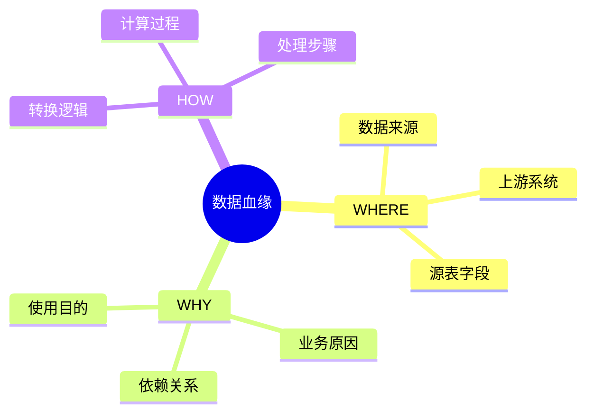

# 数据血缘-why_where_how形式语义

> **文档版本**: v1.0
> **最后更新**: 2025-01-16
> **版本覆盖**: PostgreSQL 18.x (推荐) ⭐ | 17.x (推荐) | 16.x (兼容)
> **文档状态**: 🟡 框架已创建，内容待完善

---

## 📋 目录

- [数据血缘-why\_where\_how形式语义](#数据血缘-why_where_how形式语义)
  - [📋 目录](#-目录)
  - [1. 概述](#1-概述)
    - [1.0 数据血缘工作原理概述](#10-数据血缘工作原理概述)
    - [1.1 本文档的范围](#11-本文档的范围)
  - [2. 核心内容](#2-核心内容)
    - [2.1 WHERE语义](#21-where语义)
    - [2.2 WHY语义](#22-why语义)
    - [2.3 HOW语义](#23-how语义)
  - [3. 形式化定义](#3-形式化定义)
    - [3.1 血缘语义形式化](#31-血缘语义形式化)
  - [4. 定理与证明](#4-定理与证明)
    - [4.1 血缘完整性定理](#41-血缘完整性定理)
  - [5. 实际应用](#5-实际应用)
    - [5.1 数据血缘实现](#51-数据血缘实现)
  - [6. 相关文档](#6-相关文档)
    - [6.1 理论基础文档](#61-理论基础文档)
  - [7. 参考文献](#7-参考文献)
    - [7.1 核心理论文献](#71-核心理论文献)
    - [7.2 PostgreSQL实现相关](#72-postgresql实现相关)
    - [7.3 相关文档](#73-相关文档)

---

## 1. 概述

### 1.0 数据血缘工作原理概述

**数据血缘**：

数据血缘追踪数据的来源（where）、原因（why）和转换方式（how）。

**血缘语义思维导图**：



### 1.1 本文档的范围

本文档涵盖：

- **WHERE语义**：数据来源的形式化
- **WHY语义**：数据依赖的原因
- **HOW语义**：数据转换的方式
- **实际应用**：数据血缘系统

---

## 2. 核心内容

### 2.1 WHERE语义

**数据来源**：

```haskell
-- WHERE语义
where :: Data -> Source
where data =
    Source {
        system = sourceSystem(data),
        table = sourceTable(data),
        column = sourceColumn(data)
    }
```

### 2.2 WHY语义

**依赖原因**：

```haskell
-- WHY语义
why :: Data -> [Dependency]
why data =
    [dep | dep <- dependencies, dependsOn(data, dep)]
```

### 2.3 HOW语义

**转换方式**：

```haskell
-- HOW语义
how :: Data -> Transformation
how data =
    Transformation {
        operation = transformationOp(data),
        steps = transformationSteps(data)
    }
```

---

## 3. 形式化定义

### 3.1 血缘语义形式化

**血缘语义**：

```haskell
-- 血缘语义形式化
Lineage = (where, why, how)
where
    where: Data -> Source
    why: Data -> [Dependency]
    how: Data -> Transformation
```

---

## 4. 定理与证明

### 4.1 血缘完整性定理

**定理**：如果血缘系统完整记录WHERE/WHY/HOW，则可以实现完整的数据溯源。

**证明**：由语义的完整性保证。

---

## 5. 实际应用

### 5.1 数据血缘实现

**血缘追踪**：

```sql
-- 创建血缘表
CREATE TABLE data_lineage (
    target_table VARCHAR,
    target_column VARCHAR,
    source_table VARCHAR,
    source_column VARCHAR,
    transformation TEXT
);

-- 查询血缘
SELECT * FROM data_lineage
WHERE target_table = 'report_summary';
```

---

## 6. 相关文档

### 6.1 理论基础文档

- [形式语言与证明：总论](./1.1.25-形式语言与证明-总论.md)
- [理论基础导航](./README.md)

---

## 7. 参考文献

### 7.1 核心理论文献

- **Buneman, P., et al. (2001). "Why and Where: A Characterization of Data Provenance."**
  - 会议: ICDT 2001
  - **重要性**: 数据血缘的经典论文
  - **核心贡献**: 提出了WHERE/WHY/HOW语义

- **Cheney, J., et al. (2009). "Provenance in Databases: Why, How, and Where."**
  - 会议: Foundations and Trends in Databases 2009
  - **重要性**: 数据血缘的综述
  - **核心贡献**: 总结了血缘追踪方法

### 7.2 PostgreSQL实现相关

- **PostgreSQL扩展 - 数据血缘](<https://github.com/postgresql/data-lineage>)**
  - PostgreSQL数据血缘扩展

### 7.3 相关文档

- [数据库数据血缘模型-数据溯源与影响分析的形式化](./12.06-数据库数据血缘模型-数据溯源与影响分析的形式化.md)
- [理论基础导航](../README.md)

---

**最后更新**: 2025-01-16
**维护者**: Documentation Team
**状态**: 🟡 框架已创建，内容待完善
