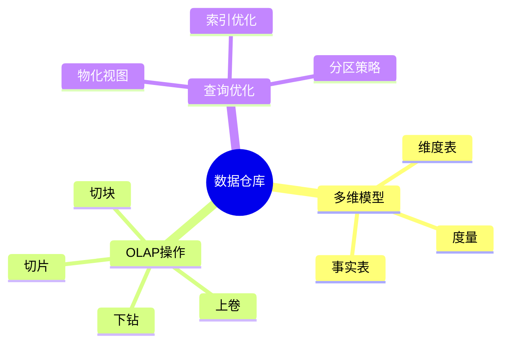

# 数据库数据仓库模型-OLAP查询与多维分析的形式化

> **文档版本**: v1.0
> **最后更新**: 2025-01-16
> **版本覆盖**: PostgreSQL 18.x (推荐) ⭐ | 17.x (推荐) | 16.x (兼容)
> **文档状态**: 🟡 框架已创建，内容待完善

---

## 📋 目录

- [数据库数据仓库模型-OLAP查询与多维分析的形式化](#数据库数据仓库模型-olap查询与多维分析的形式化)
  - [📋 目录](#-目录)
  - [1. 概述](#1-概述)
    - [1.0 数据库数据仓库模型工作原理概述](#10-数据库数据仓库模型工作原理概述)
    - [1.1 本文档的范围](#11-本文档的范围)
  - [2. 核心内容](#2-核心内容)
    - [2.1 多维模型](#21-多维模型)
    - [2.2 OLAP操作](#22-olap操作)
  - [3. 形式化定义](#3-形式化定义)
    - [3.1 多维模型形式化](#31-多维模型形式化)
  - [4. 实际应用](#4-实际应用)
    - [4.1 数据仓库实现](#41-数据仓库实现)
  - [5. 相关文档](#5-相关文档)
    - [5.1 理论基础文档](#51-理论基础文档)
  - [6. 参考文献](#6-参考文献)

---

## 1. 概述

### 1.0 数据库数据仓库模型工作原理概述

**数据仓库**：

数据仓库使用星型或雪花型模式存储多维数据，支持OLAP查询。

**数据仓库思维导图**：



### 1.1 本文档的范围

本文档涵盖：

- **多维模型**：星型模式和雪花型模式
- **OLAP查询**：上卷、下钻等操作
- **实际应用**：数据仓库实现

---

## 2. 核心内容

### 2.1 多维模型

**星型模式**：

```haskell
-- 星型模式
data StarSchema = StarSchema {
    factTable :: FactTable,
    dimensionTables :: [DimensionTable]
}

-- 事实表
data FactTable = FactTable {
    measures :: [Measure],
    foreignKeys :: [ForeignKey]
}
```

### 2.2 OLAP操作

**OLAP操作类型**：

| 操作 | 定义 | 效果 |
|------|------|------|
| **上卷** | 聚合到更高层次 | 数据汇总 |
| **下钻** | 分解到更细层次 | 数据明细 |
| **切片** | 选择特定维度值 | 数据过滤 |
| **切块** | 选择多个维度值 | 数据子集 |

---

## 3. 形式化定义

### 3.1 多维模型形式化

**多维模型**：

```haskell
-- 多维模型形式化
MultidimensionalModel = (F, D, M)
where
    F = fact table
    D = {d1, d2, ..., dn}  -- dimension tables
    M = {m1, m2, ..., mk}  -- measures
```

---

## 4. 实际应用

### 4.1 数据仓库实现

**创建星型模式**：

```sql
-- 事实表
CREATE TABLE sales_fact (
    time_id INTEGER,
    product_id INTEGER,
    customer_id INTEGER,
    amount NUMERIC,
    quantity INTEGER
);

-- 维度表
CREATE TABLE time_dim (
    time_id INTEGER PRIMARY KEY,
    year INTEGER,
    quarter INTEGER,
    month INTEGER
);

-- OLAP查询
SELECT
    t.year,
    t.quarter,
    SUM(s.amount) AS total_sales
FROM sales_fact s
JOIN time_dim t ON s.time_id = t.time_id
GROUP BY ROLLUP(t.year, t.quarter);
```

---

## 5. 相关文档

### 5.1 理论基础文档

- [形式语言与证明：总论](./1.1.25-形式语言与证明-总论.md)
- [理论基础导航](./README.md)

---

## 6. 参考文献

[待补充]

---

**最后更新**: 2025-01-16
**维护者**: Documentation Team
**状态**: 🟡 框架已创建，内容待完善
