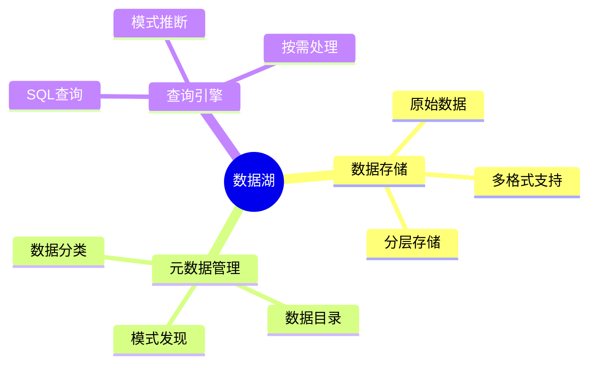

# 数据库数据湖模型-半结构化数据与元数据管理的形式化

> **文档版本**: v1.0
> **最后更新**: 2025-01-16
> **版本覆盖**: PostgreSQL 18.x (推荐) ⭐ | 17.x (推荐) | 16.x (兼容)
> **文档状态**: 🟡 框架已创建，内容待完善

---

## 📋 目录

- [数据库数据湖模型-半结构化数据与元数据管理的形式化](#数据库数据湖模型-半结构化数据与元数据管理的形式化)
  - [📋 目录](#-目录)
  - [1. 概述](#1-概述)
    - [1.0 数据库数据湖模型工作原理概述](#10-数据库数据湖模型工作原理概述)
    - [1.1 本文档的范围](#11-本文档的范围)
  - [2. 核心内容](#2-核心内容)
    - [2.1 数据湖架构](#21-数据湖架构)
    - [2.2 元数据管理](#22-元数据管理)
  - [3. 形式化定义](#3-形式化定义)
    - [3.1 数据湖形式化](#31-数据湖形式化)
  - [4. 实际应用](#4-实际应用)
    - [4.1 数据湖实现](#41-数据湖实现)
  - [5. 相关文档](#5-相关文档)
    - [5.1 理论基础文档](#51-理论基础文档)
  - [6. 参考文献](#6-参考文献)
    - [6.1 核心理论文献](#61-核心理论文献)
    - [6.2 PostgreSQL实现相关](#62-postgresql实现相关)
    - [6.3 相关文档](#63-相关文档)

---

## 1. 概述

### 1.0 数据库数据湖模型工作原理概述

**数据湖**：

数据湖存储原始数据（结构化、半结构化、非结构化），使用元数据管理来组织数据。

**数据湖思维导图**：



### 1.1 本文档的范围

本文档涵盖：

- **数据湖模型**：原始数据存储的形式化
- **元数据管理**：元数据模型和目录
- **实际应用**：数据湖系统实现

---

## 2. 核心内容

### 2.1 数据湖架构

**数据湖层次**：

| 层次 | 内容 | 特点 |
|------|------|------|
| **原始层** | 原始数据 | 无转换 |
| **清洗层** | 清洗后数据 | 标准化 |
| **聚合层** | 聚合数据 | 业务就绪 |

### 2.2 元数据管理

**元数据模型**：

```haskell
-- 元数据
data Metadata = Metadata {
    schema :: Schema,
    format :: Format,
    location :: Location,
    quality :: QualityMetrics
}
```

---

## 3. 形式化定义

### 3.1 数据湖形式化

**数据湖**：

```haskell
-- 数据湖形式化
DataLake = (D, M, C)
where
    D = data set
    M = metadata set
    C = catalog
```

---

## 4. 实际应用

### 4.1 数据湖实现

**使用PostgreSQL作为数据湖**：

```sql
-- 存储半结构化数据
CREATE TABLE data_lake (
    id UUID PRIMARY KEY,
    raw_data JSONB,
    metadata JSONB,
    created_at TIMESTAMP
);

-- 元数据查询
SELECT
    id,
    metadata->>'format' AS format,
    metadata->>'schema' AS schema
FROM data_lake;
```

---

## 5. 相关文档

### 5.1 理论基础文档

- [形式语言与证明：总论](./1.1.25-形式语言与证明-总论.md)
- [理论基础导航](./README.md)

---

## 6. 参考文献

### 6.1 核心理论文献

- **Dixon, J. (2010). "Pentaho, Hadoop, and Data Lakes."**
  - 博客: James Dixon's Blog 2010
  - **重要性**: 数据湖概念的提出
  - **核心贡献**: 定义了数据湖概念

- **Inmon, W. H., & Linstedt, D. (2014). "Data Architecture: A Primer for the Data Scientist."**
  - 出版社: Morgan Kaufmann
  - **重要性**: 数据架构的教材
  - **核心贡献**: 阐述了数据湖架构

### 6.2 PostgreSQL实现相关

- **PostgreSQL官方文档 - JSONB](<https://www.postgresql.org/docs/current/datatype-json.html>)**
  - PostgreSQL JSONB支持半结构化数据

### 6.3 相关文档

- [数据库JSON数据模型-JSON查询与模式验证的形式化](../14-图与时序数据模型/14.02-数据库JSON数据模型-JSON查询与模式验证的形式化.md)
- [理论基础导航](../README.md)

---

**最后更新**: 2025-01-16
**维护者**: Documentation Team
**状态**: 🟡 框架已创建，内容待完善
