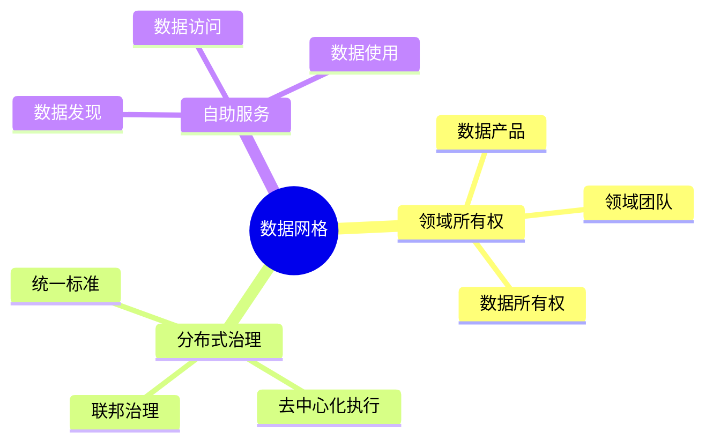

# 数据库数据网格模型-分布式数据治理与访问控制的形式化

> **文档版本**: v1.0
> **最后更新**: 2025-01-16
> **版本覆盖**: PostgreSQL 18.x (推荐) ⭐ | 17.x (推荐) | 16.x (兼容)
> **文档状态**: 🟡 框架已创建，内容待完善

---

## 📋 目录

- [数据库数据网格模型-分布式数据治理与访问控制的形式化](#数据库数据网格模型-分布式数据治理与访问控制的形式化)
  - [📋 目录](#-目录)
  - [1. 概述](#1-概述)
    - [1.0 数据库数据网格模型工作原理概述](#10-数据库数据网格模型工作原理概述)
    - [1.1 本文档的范围](#11-本文档的范围)
  - [2. 核心内容](#2-核心内容)
    - [2.1 数据网格架构](#21-数据网格架构)
    - [2.2 分布式治理](#22-分布式治理)
  - [3. 形式化定义](#3-形式化定义)
    - [3.1 数据网格形式化](#31-数据网格形式化)
  - [4. 实际应用](#4-实际应用)
    - [4.1 数据网格实现](#41-数据网格实现)
  - [5. 相关文档](#5-相关文档)
    - [5.1 理论基础文档](#51-理论基础文档)
  - [6. 参考文献](#6-参考文献)

---

## 1. 概述

### 1.0 数据库数据网格模型工作原理概述

**数据网格**：

数据网格是分布式数据治理架构，将数据所有权分散到领域团队。

**数据网格思维导图**：



### 1.1 本文档的范围

本文档涵盖：

- **数据网格架构**：领域所有权和治理
- **访问控制**：分布式访问控制模型
- **实际应用**：数据网格实现

---

## 2. 核心内容

### 2.1 数据网格架构

**数据产品**：

```haskell
-- 数据产品
data DataProduct = DataProduct {
    domain :: Domain,
    owner :: Team,
    data :: Data,
    metadata :: Metadata,
    accessControl :: AccessPolicy
}
```

### 2.2 分布式治理

**治理模型**：

| 层面 | 职责 | 执行方式 |
|------|------|---------|
| **全局** | 标准制定 | 集中式 |
| **领域** | 数据管理 | 分布式 |
| **产品** | 数据服务 | 自主式 |

---

## 3. 形式化定义

### 3.1 数据网格形式化

**数据网格**：

```haskell
-- 数据网格形式化
DataMesh = (DP, G, A)
where
    DP = {dp1, dp2, ..., dpn}  -- data products
    G = governance model
    A = access control
```

---

## 4. 实际应用

### 4.1 数据网格实现

**数据产品注册**：

```sql
-- 数据产品目录
CREATE TABLE data_products (
    product_id UUID PRIMARY KEY,
    domain VARCHAR,
    owner_team VARCHAR,
    data_location VARCHAR,
    access_policy JSONB
);

-- 查询数据产品
SELECT * FROM data_products
WHERE domain = 'sales';
```

---

## 5. 相关文档

### 5.1 理论基础文档

- [形式语言与证明：总论](./1.1.25-形式语言与证明-总论.md)
- [理论基础导航](./README.md)

---

## 6. 参考文献

[待补充]

---

**最后更新**: 2025-01-16
**维护者**: Documentation Team
**状态**: 🟡 框架已创建，内容待完善
