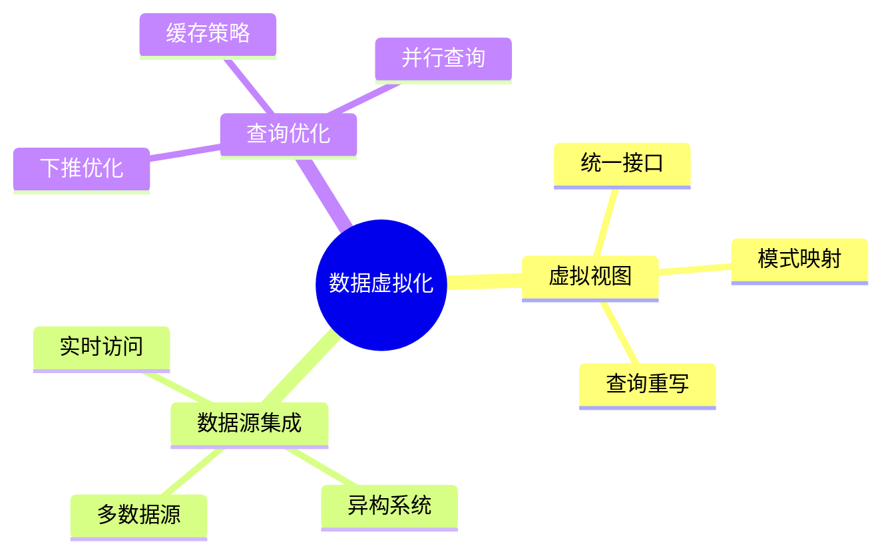

# 数据库数据虚拟化模型-虚拟视图与查询重写的形式化

> **文档版本**: v1.0
> **最后更新**: 2025-01-16
> **版本覆盖**: PostgreSQL 18.x (推荐) ⭐ | 17.x (推荐) | 16.x (兼容)
> **文档状态**: 🟡 框架已创建，内容待完善

---

## 📋 目录

- [数据库数据虚拟化模型-虚拟视图与查询重写的形式化](#数据库数据虚拟化模型-虚拟视图与查询重写的形式化)
  - [📋 目录](#-目录)
  - [1. 概述](#1-概述)
    - [1.0 数据库数据虚拟化模型工作原理概述](#10-数据库数据虚拟化模型工作原理概述)
    - [1.1 本文档的范围](#11-本文档的范围)
  - [2. 核心内容](#2-核心内容)
    - [2.1 虚拟视图](#21-虚拟视图)
    - [2.2 查询重写](#22-查询重写)
  - [3. 形式化定义](#3-形式化定义)
    - [3.1 虚拟视图形式化](#31-虚拟视图形式化)
  - [4. 实际应用](#4-实际应用)
    - [4.1 数据虚拟化实现](#41-数据虚拟化实现)
  - [5. 相关文档](#5-相关文档)
    - [5.1 理论基础文档](#51-理论基础文档)
  - [6. 参考文献](#6-参考文献)

---

## 1. 概述

### 1.0 数据库数据虚拟化模型工作原理概述

**数据虚拟化**：

数据虚拟化通过虚拟视图提供统一数据访问，无需物理复制数据。

**虚拟化思维导图**：



### 1.1 本文档的范围

本文档涵盖：

- **虚拟视图**：虚拟视图的定义和语义
- **查询重写**：查询重写算法
- **实际应用**：数据虚拟化系统

---

## 2. 核心内容

### 2.1 虚拟视图

**虚拟视图定义**：

```haskell
-- 虚拟视图
data VirtualView = VirtualView {
    name :: String,
    definition :: Query,
    dataSources :: [DataSource]
}
```

### 2.2 查询重写

**查询重写算法**：

```haskell
-- 查询重写
rewriteQuery :: Query -> VirtualView -> Query
rewriteQuery query view =
    substitute(query, view.definition, view.dataSources)
```

---

## 3. 形式化定义

### 3.1 虚拟视图形式化

**虚拟视图**：

```haskell
-- 虚拟视图形式化
VirtualView = (V, Q, S)
where
    V = view name
    Q = view definition query
    S = {s1, s2, ..., sn}  -- data sources
```

---

## 4. 实际应用

### 4.1 数据虚拟化实现

**创建虚拟视图**：

```sql
-- 使用外部表创建虚拟视图
CREATE FOREIGN TABLE remote_customers (
    id INTEGER,
    name VARCHAR
) SERVER remote_server;

-- 虚拟视图
CREATE VIEW virtual_customers AS
SELECT * FROM remote_customers;
```

---

## 5. 相关文档

### 5.1 理论基础文档

- [形式语言与证明：总论](./1.1.25-形式语言与证明-总论.md)
- [理论基础导航](./README.md)

---

## 6. 参考文献

[待补充]

---

**最后更新**: 2025-01-16
**维护者**: Documentation Team
**状态**: 🟡 框架已创建，内容待完善
