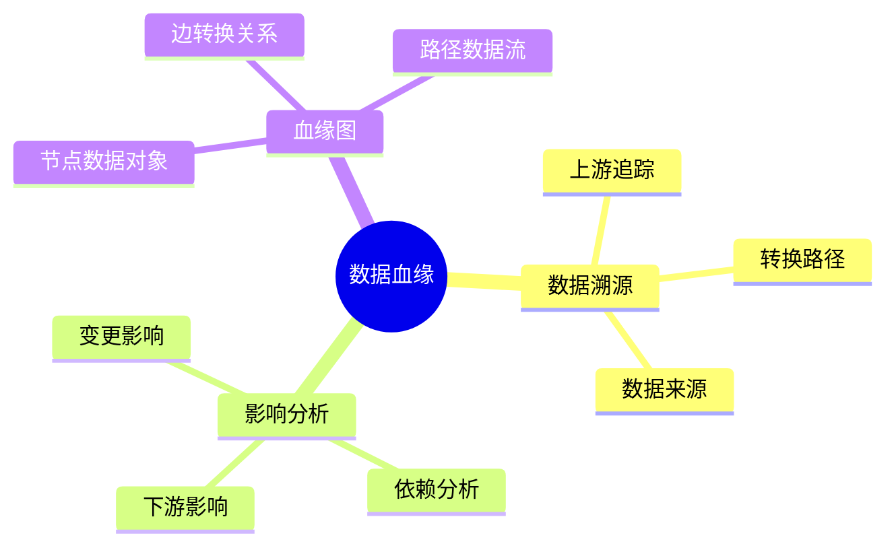

# 数据库数据血缘模型-数据溯源与影响分析的形式化

> **文档版本**: v1.0
> **最后更新**: 2025-01-16
> **版本覆盖**: PostgreSQL 18.x (推荐) ⭐ | 17.x (推荐) | 16.x (兼容)
> **文档状态**: 🟡 框架已创建，内容待完善

---

## 📋 目录

- [数据库数据血缘模型-数据溯源与影响分析的形式化](#数据库数据血缘模型-数据溯源与影响分析的形式化)
  - [📋 目录](#-目录)
  - [1. 概述](#1-概述)
    - [1.0 数据库数据血缘模型工作原理概述](#10-数据库数据血缘模型工作原理概述)
    - [1.1 本文档的范围](#11-本文档的范围)
  - [2. 核心内容](#2-核心内容)
    - [2.1 数据溯源](#21-数据溯源)
    - [2.2 影响分析](#22-影响分析)
  - [3. 形式化定义](#3-形式化定义)
    - [3.1 血缘模型形式化](#31-血缘模型形式化)
  - [4. 实际应用](#4-实际应用)
    - [4.1 数据血缘实现](#41-数据血缘实现)
  - [5. 相关文档](#5-相关文档)
    - [5.1 理论基础文档](#51-理论基础文档)
  - [6. 参考文献](#6-参考文献)
    - [6.1 核心理论文献](#61-核心理论文献)
    - [6.2 PostgreSQL实现相关](#62-postgresql实现相关)
    - [6.3 相关文档](#63-相关文档)

---

## 1. 概述

### 1.0 数据库数据血缘模型工作原理概述

**数据血缘**：

数据血缘追踪数据的来源、转换和依赖关系，支持数据溯源和影响分析。

**血缘模型思维导图**：



### 1.1 本文档的范围

本文档涵盖：

- **数据溯源**：向上追踪数据来源
- **影响分析**：向下分析数据影响
- **实际应用**：数据血缘系统

---

## 2. 核心内容

### 2.1 数据溯源

**溯源算法**：

```haskell
-- 数据溯源
lineage :: DataObject -> [DataObject]
lineage obj =
    let sources = upstream(obj)
    in sources ++ concatMap lineage sources
```

### 2.2 影响分析

**影响分析算法**：

```haskell
-- 影响分析
impact :: DataObject -> [DataObject]
impact obj =
    let dependents = downstream(obj)
    in dependents ++ concatMap impact dependents
```

---

## 3. 形式化定义

### 3.1 血缘模型形式化

**血缘模型**：

```haskell
-- 血缘模型形式化
LineageModel = (O, T, →)
where
    O = data object set
    T = transformation set
    → = transformation relation
```

---

## 4. 实际应用

### 4.1 数据血缘实现

**血缘追踪**：

```sql
-- 血缘表
CREATE TABLE data_lineage (
    target_id UUID,
    source_id UUID,
    transformation TEXT,
    created_at TIMESTAMP
);

-- 溯源查询
WITH RECURSIVE lineage AS (
    SELECT source_id FROM data_lineage WHERE target_id = $1
    UNION
    SELECT dl.source_id FROM data_lineage dl
    JOIN lineage l ON dl.target_id = l.source_id
)
SELECT * FROM lineage;
```

---

## 5. 相关文档

### 5.1 理论基础文档

- [形式语言与证明：总论](./1.1.25-形式语言与证明-总论.md)
- [理论基础导航](./README.md)

---

## 6. 参考文献

### 6.1 核心理论文献

- **Buneman, P., et al. (2001). "Why and Where: A Characterization of Data Provenance."**
  - 会议: ICDT 2001
  - **重要性**: 数据血缘的经典论文
  - **核心贡献**: 提出了溯源和影响分析

- **Cheney, J., et al. (2009). "Provenance in Databases: Why, How, and Where."**
  - 会议: Foundations and Trends in Databases 2009
  - **重要性**: 数据血缘的综述
  - **核心贡献**: 总结了血缘追踪方法

### 6.2 PostgreSQL实现相关

- **PostgreSQL扩展 - 数据血缘](<https://github.com/postgresql/data-lineage>)**
  - PostgreSQL数据血缘扩展

### 6.3 相关文档

- [数据血缘-why_where_how形式语义](./12.01-数据血缘-why_where_how形式语义.md)
- [理论基础导航](../README.md)

---

**最后更新**: 2025-01-16
**维护者**: Documentation Team
**状态**: 🟡 框架已创建，内容待完善
