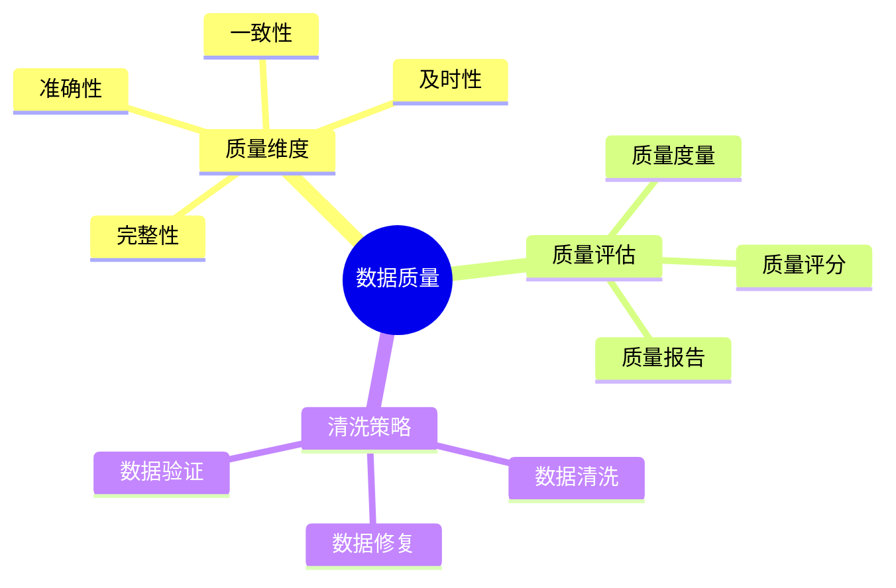

# 数据库数据质量模型-质量评估与清洗策略的形式化

> **文档版本**: v1.0
> **最后更新**: 2025-01-16
> **版本覆盖**: PostgreSQL 18.x (推荐) ⭐ | 17.x (推荐) | 16.x (兼容)
> **文档状态**: 🟡 框架已创建，内容待完善

---

## 📋 目录

- [数据库数据质量模型-质量评估与清洗策略的形式化](#数据库数据质量模型-质量评估与清洗策略的形式化)
  - [📋 目录](#-目录)
  - [1. 概述](#1-概述)
    - [1.0 数据库数据质量模型工作原理概述](#10-数据库数据质量模型工作原理概述)
    - [1.1 本文档的范围](#11-本文档的范围)
  - [2. 核心内容](#2-核心内容)
    - [2.1 质量维度](#21-质量维度)
    - [2.2 清洗策略](#22-清洗策略)
  - [3. 形式化定义](#3-形式化定义)
    - [3.1 质量模型形式化](#31-质量模型形式化)
  - [4. 实际应用](#4-实际应用)
    - [4.1 数据质量实现](#41-数据质量实现)
  - [5. 相关文档](#5-相关文档)
    - [5.1 理论基础文档](#51-理论基础文档)
  - [6. 参考文献](#6-参考文献)

---

## 1. 概述

### 1.0 数据库数据质量模型工作原理概述

**数据质量**：

数据质量模型评估数据质量并制定清洗策略。

**质量模型思维导图**：



### 1.1 本文档的范围

本文档涵盖：

- **质量评估**：质量度量和评分
- **清洗策略**：数据清洗算法
- **实际应用**：数据质量系统

---

## 2. 核心内容

### 2.1 质量维度

**质量维度**：

| 维度 | 定义 | 度量方法 |
|------|------|---------|
| **完整性** | 数据完整程度 | 缺失值比例 |
| **准确性** | 数据准确程度 | 错误值比例 |
| **一致性** | 数据一致程度 | 冲突值比例 |
| **及时性** | 数据新鲜程度 | 数据年龄 |

### 2.2 清洗策略

**清洗算法**：

```haskell
-- 数据清洗
cleanData :: Data -> QualityRules -> Data
cleanData data rules =
    applyRules(data, rules)
```

---

## 3. 形式化定义

### 3.1 质量模型形式化

**质量模型**：

```haskell
-- 质量模型形式化
QualityModel = (D, M, S)
where
    D = data set
    M = quality metrics
    S = cleaning strategies
```

---

## 4. 实际应用

### 4.1 数据质量实现

**质量评估**：

```sql
-- 质量评估函数
CREATE FUNCTION assess_quality(table_name VARCHAR)
RETURNS JSONB AS $$
DECLARE
    completeness DOUBLE;
    accuracy DOUBLE;
BEGIN
    -- 计算完整性
    SELECT COUNT(*)::DOUBLE / NULLIF(COUNT(*) FILTER (WHERE col IS NOT NULL), 0)
    INTO completeness
    FROM table_name;

    -- 返回质量评分
    RETURN jsonb_build_object(
        'completeness', completeness,
        'accuracy', accuracy
    );
END;
$$ LANGUAGE plpgsql;
```

---

## 5. 相关文档

### 5.1 理论基础文档

- [形式语言与证明：总论](./1.1.25-形式语言与证明-总论.md)
- [理论基础导航](./README.md)

---

## 6. 参考文献

[待补充]

---

**最后更新**: 2025-01-16
**维护者**: Documentation Team
**状态**: 🟡 框架已创建，内容待完善
