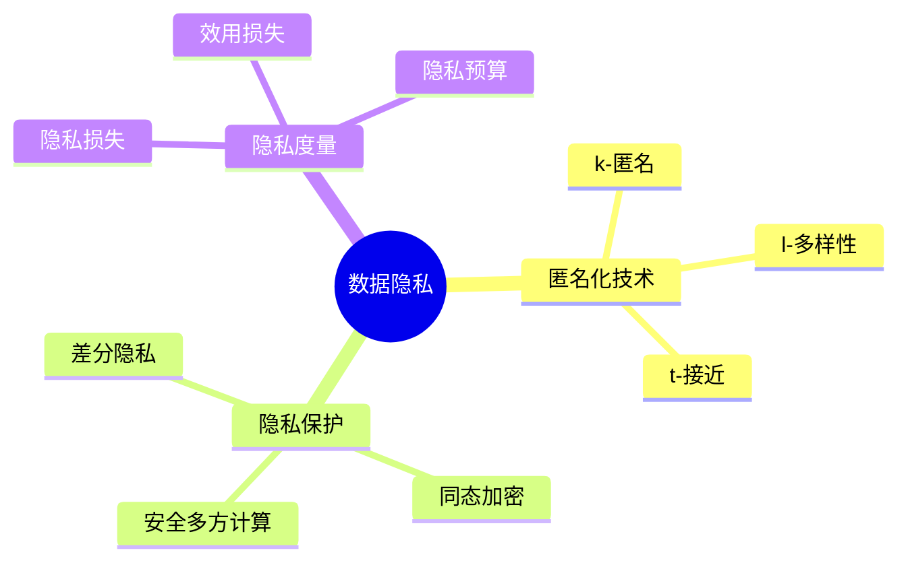

# 数据库数据隐私模型-隐私保护与匿名化技术的形式化

> **文档版本**: v1.0
> **最后更新**: 2025-01-16
> **版本覆盖**: PostgreSQL 18.x (推荐) ⭐ | 17.x (推荐) | 16.x (兼容)
> **文档状态**: 🟡 框架已创建，内容待完善

---

## 📋 目录

- [数据库数据隐私模型-隐私保护与匿名化技术的形式化](#数据库数据隐私模型-隐私保护与匿名化技术的形式化)
  - [📋 目录](#-目录)
  - [1. 概述](#1-概述)
    - [1.0 数据库数据隐私模型工作原理概述](#10-数据库数据隐私模型工作原理概述)
    - [1.1 本文档的范围](#11-本文档的范围)
  - [2. 核心内容](#2-核心内容)
    - [2.1 匿名化技术](#21-匿名化技术)
    - [2.2 隐私保护](#22-隐私保护)
  - [3. 形式化定义](#3-形式化定义)
    - [3.1 匿名化形式化](#31-匿名化形式化)
  - [4. 实际应用](#4-实际应用)
    - [4.1 隐私保护实现](#41-隐私保护实现)
  - [5. 相关文档](#5-相关文档)
    - [5.1 理论基础文档](#51-理论基础文档)
  - [6. 参考文献](#6-参考文献)
    - [6.1 核心理论文献](#61-核心理论文献)
    - [6.2 PostgreSQL实现相关](#62-postgresql实现相关)
    - [6.3 相关文档](#63-相关文档)

---

## 1. 概述

### 1.0 数据库数据隐私模型工作原理概述

**数据隐私**：

数据隐私模型使用匿名化和隐私保护技术来保护个人隐私。

**隐私保护思维导图**：



### 1.1 本文档的范围

本文档涵盖：

- **匿名化技术**：k-匿名、l-多样性等
- **隐私保护**：差分隐私等机制
- **实际应用**：隐私保护系统

---

## 2. 核心内容

### 2.1 匿名化技术

**匿名化方法**：

| 方法 | 定义 | 隐私保证 |
|------|------|---------|
| **k-匿名** | 每组至少k条记录 | 身份保护 |
| **l-多样性** | 每组至少l个敏感值 | 属性保护 |
| **t-接近** | 敏感值分布接近总体 | 分布保护 |

### 2.2 隐私保护

**隐私保护机制**：

```haskell
-- 差分隐私
differentialPrivacy :: Query -> Double -> Query
differentialPrivacy query epsilon =
    addNoise(query, laplace(epsilon))
```

---

## 3. 形式化定义

### 3.1 匿名化形式化

**k-匿名**：

```haskell
-- k-匿名形式化
kAnonymity(data, k) =
    forall group g in data:
        |g| >= k
        and
        g.quasiIdentifiers are identical
```

---

## 4. 实际应用

### 4.1 隐私保护实现

**匿名化处理**：

```sql
-- 数据匿名化
CREATE TABLE anonymized_customers AS
SELECT
    age_group,
    city,
    COUNT(*) AS count
FROM customers
GROUP BY age_group, city
HAVING COUNT(*) >= 5;  -- k-匿名
```

---

## 5. 相关文档

### 5.1 理论基础文档

- [形式语言与证明：总论](./1.1.25-形式语言与证明-总论.md)
- [理论基础导航](./README.md)

---

## 6. 参考文献

### 6.1 核心理论文献

- **Sweeney, L. (2002). "k-Anonymity: A Model for Protecting Privacy."**
  - 会议: International Journal of Uncertainty 2002
  - **重要性**: k-匿名的经典论文
  - **核心贡献**: 提出了k-匿名模型

- **Machanavajjhala, A., et al. (2007). "l-Diversity: Privacy Beyond k-Anonymity."**
  - 会议: TKDE 2007
  - **重要性**: l-多样性的经典论文
  - **核心贡献**: 扩展了匿名化技术

### 6.2 PostgreSQL实现相关

- **PostgreSQL扩展 - 隐私保护](<https://github.com/postgresql/privacy-protection>)**
  - PostgreSQL隐私保护扩展

### 6.3 相关文档

- [差分隐私-SQL聚合的灵敏度与噪声机制](../07-安全与合规/07.02-差分隐私-SQL聚合的灵敏度与噪声机制.md)
- [理论基础导航](../README.md)

---

**最后更新**: 2025-01-16
**维护者**: Documentation Team
**状态**: 🟡 框架已创建，内容待完善
