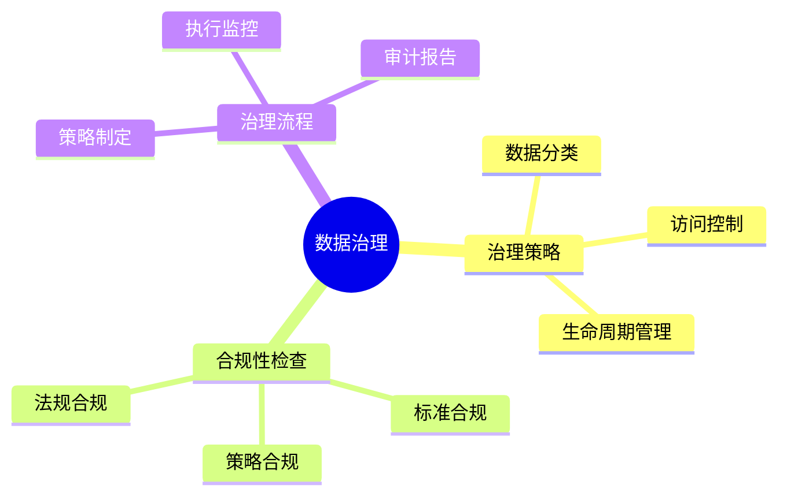

# 数据库数据治理模型-治理策略与合规性检查的形式化

> **文档版本**: v1.0
> **最后更新**: 2025-01-16
> **版本覆盖**: PostgreSQL 18.x (推荐) ⭐ | 17.x (推荐) | 16.x (兼容)
> **文档状态**: 🟡 框架已创建，内容待完善

---

## 📋 目录

- [数据库数据治理模型-治理策略与合规性检查的形式化](#数据库数据治理模型-治理策略与合规性检查的形式化)
  - [📋 目录](#-目录)
  - [1. 概述](#1-概述)
    - [1.0 数据库数据治理模型工作原理概述](#10-数据库数据治理模型工作原理概述)
    - [1.1 本文档的范围](#11-本文档的范围)
  - [2. 核心内容](#2-核心内容)
    - [2.1 治理策略](#21-治理策略)
    - [2.2 合规性检查](#22-合规性检查)
  - [3. 形式化定义](#3-形式化定义)
    - [3.1 治理模型形式化](#31-治理模型形式化)
  - [4. 实际应用](#4-实际应用)
    - [4.1 数据治理实现](#41-数据治理实现)
  - [5. 相关文档](#5-相关文档)
    - [5.1 理论基础文档](#51-理论基础文档)
  - [6. 参考文献](#6-参考文献)
    - [6.1 核心理论文献](#61-核心理论文献)
    - [6.2 PostgreSQL实现相关](#62-postgresql实现相关)
    - [6.3 相关文档](#63-相关文档)

---

## 1. 概述

### 1.0 数据库数据治理模型工作原理概述

**数据治理**：

数据治理通过策略和合规性检查来管理数据资产。

**治理模型思维导图**：



### 1.1 本文档的范围

本文档涵盖：

- **治理策略**：数据治理策略的形式化
- **合规性检查**：合规性验证算法
- **实际应用**：数据治理系统

---

## 2. 核心内容

### 2.1 治理策略

**策略类型**：

| 类型 | 内容 | 执行方式 |
|------|------|---------|
| **数据分类** | 敏感度分级 | 自动/手动 |
| **访问控制** | 权限管理 | 强制执行 |
| **生命周期** | 数据保留 | 自动清理 |

### 2.2 合规性检查

**合规性验证**：

```haskell
-- 合规性检查
complianceCheck :: Data -> Policy -> Bool
complianceCheck data policy =
    validate(data, policy.rules)
```

---

## 3. 形式化定义

### 3.1 治理模型形式化

**治理模型**：

```haskell
-- 治理模型形式化
GovernanceModel = (P, C, E)
where
    P = policy set
    C = compliance checker
    E = enforcement mechanism
```

---

## 4. 实际应用

### 4.1 数据治理实现

**策略执行**：

```sql
-- 数据分类
ALTER TABLE customers
ADD COLUMN data_classification VARCHAR DEFAULT 'public';

-- 合规性检查
CREATE FUNCTION check_compliance(table_name VARCHAR)
RETURNS BOOLEAN AS $$
BEGIN
    -- 检查数据分类
    -- 检查访问控制
    -- 检查保留策略
    RETURN TRUE;
END;
$$ LANGUAGE plpgsql;
```

---

## 5. 相关文档

### 5.1 理论基础文档

- [形式语言与证明：总论](./1.1.25-形式语言与证明-总论.md)
- [理论基础导航](./README.md)

---

## 6. 参考文献

### 6.1 核心理论文献

- **Khatri, V., & Brown, C. V. (2010). "Designing Data Governance."**
  - 会议: Communications of the ACM 2010
  - **重要性**: 数据治理设计的经典论文
  - **核心贡献**: 提出了治理框架

- **Weber, K., et al. (2009). "One Size Does Not Fit All - A Contingency Approach to Data Governance."**
  - 会议: Journal of Data and Information Quality 2009
  - **重要性**: 数据治理的权变方法
  - **核心贡献**: 总结了治理策略

### 6.2 PostgreSQL实现相关

- **PostgreSQL官方文档 - 安全](<https://www.postgresql.org/docs/current/security.html>)**
  - PostgreSQL安全实现说明

### 6.3 相关文档

- [数据库审计与合规-完整性约束与审计轨迹的形式化](../07-安全与合规/07.05-数据库审计与合规-完整性约束与审计轨迹的形式化.md)
- [理论基础导航](../README.md)

---

**最后更新**: 2025-01-16
**维护者**: Documentation Team
**状态**: 🟡 框架已创建，内容待完善
