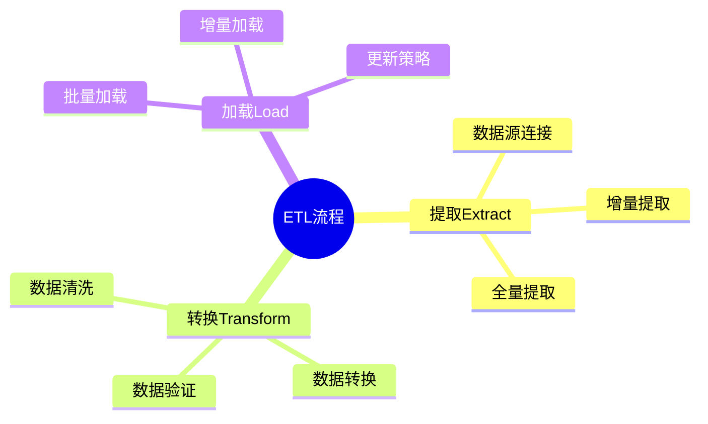

# 数据库数据集成模型-ETL流程与数据转换的形式化

> **文档版本**: v1.0
> **最后更新**: 2025-01-16
> **版本覆盖**: PostgreSQL 18.x (推荐) ⭐ | 17.x (推荐) | 16.x (兼容)
> **文档状态**: 🟡 框架已创建，内容待完善

---

## 📋 目录

- [数据库数据集成模型-ETL流程与数据转换的形式化](#数据库数据集成模型-etl流程与数据转换的形式化)
  - [📋 目录](#-目录)
  - [1. 概述](#1-概述)
    - [1.0 数据库数据集成模型工作原理概述](#10-数据库数据集成模型工作原理概述)
    - [1.1 本文档的范围](#11-本文档的范围)
  - [2. 核心内容](#2-核心内容)
    - [2.1 ETL流程](#21-etl流程)
    - [2.2 数据转换](#22-数据转换)
  - [3. 形式化定义](#3-形式化定义)
    - [3.1 ETL形式化](#31-etl形式化)
  - [4. 实际应用](#4-实际应用)
    - [4.1 ETL实现](#41-etl实现)
  - [5. 相关文档](#5-相关文档)
    - [5.1 理论基础文档](#51-理论基础文档)
  - [6. 参考文献](#6-参考文献)
    - [6.1 核心理论文献](#61-核心理论文献)
    - [6.2 PostgreSQL实现相关](#62-postgresql实现相关)
    - [6.3 相关文档](#63-相关文档)

---

## 1. 概述

### 1.0 数据库数据集成模型工作原理概述

**数据集成**：

数据集成通过ETL流程将数据从源系统提取、转换并加载到目标系统。

**ETL流程思维导图**：



### 1.1 本文档的范围

本文档涵盖：

- **ETL流程**：提取、转换、加载的形式化
- **数据转换**：转换规则和映射
- **实际应用**：ETL系统实现

---

## 2. 核心内容

### 2.1 ETL流程

**ETL阶段**：

```haskell
-- ETL流程
etl :: Source -> Transform -> Target -> IO ()
etl source transform target = do
    data <- extract(source)
    transformed <- transform(data)
    load(transformed, target)
```

### 2.2 数据转换

**转换规则**：

| 类型 | 操作 | 示例 |
|------|------|------|
| **清洗** | 去除异常值 | 过滤NULL |
| **转换** | 格式转换 | 日期格式化 |
| **聚合** | 数据汇总 | GROUP BY |

---

## 3. 形式化定义

### 3.1 ETL形式化

**ETL**：

```haskell
-- ETL形式化
ETL = (E, T, L)
where
    E = extract function
    T = transform function
    L = load function
```

---

## 4. 实际应用

### 4.1 ETL实现

**ETL流程**：

```sql
-- 提取
CREATE TABLE staging_table AS
SELECT * FROM source_table;

-- 转换
CREATE TABLE transformed_table AS
SELECT
    id,
    UPPER(name) AS name,
    DATE_TRUNC('month', created_at) AS month
FROM staging_table;

-- 加载
INSERT INTO target_table
SELECT * FROM transformed_table;
```

---

## 5. 相关文档

### 5.1 理论基础文档

- [形式语言与证明：总论](./1.1.25-形式语言与证明-总论.md)
- [理论基础导航](./README.md)

---

## 6. 参考文献

### 6.1 核心理论文献

- **Kimball, R., & Caserta, J. (2004). "The Data Warehouse ETL Toolkit."**
  - 出版社: Wiley
  - **重要性**: ETL流程的经典教材
  - **核心贡献**: 系统阐述了ETL方法

- **Vassiliadis, P. (2009). "A Survey of Extract-Transform-Load Technology."**
  - 会议: International Journal of Data Warehousing and Mining 2009
  - **重要性**: ETL技术的综述
  - **核心贡献**: 总结了ETL工具和方法

### 6.2 PostgreSQL实现相关

- **PostgreSQL官方文档 - COPY](<https://www.postgresql.org/docs/current/sql-copy.html>)**
  - PostgreSQL数据导入导出说明

### 6.3 相关文档

- [数据库数据流模型-流式ETL与实时处理的形式化](./12.11-数据库数据流模型-流式ETL与实时处理的形式化.md)
- [理论基础导航](../README.md)

---

**最后更新**: 2025-01-16
**维护者**: Documentation Team
**状态**: 🟡 框架已创建，内容待完善
