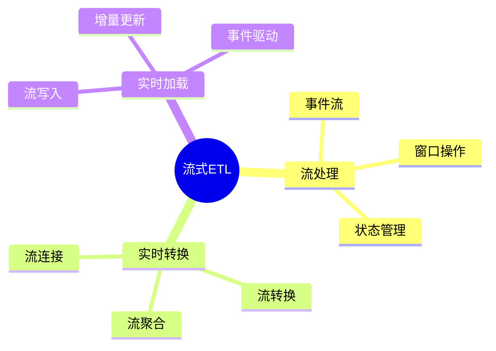

# 数据库数据流模型-流式ETL与实时处理的形式化

> **文档版本**: v1.0
> **最后更新**: 2025-01-16
> **版本覆盖**: PostgreSQL 18.x (推荐) ⭐ | 17.x (推荐) | 16.x (兼容)
> **文档状态**: 🟡 框架已创建，内容待完善

---

## 📋 目录

- [数据库数据流模型-流式ETL与实时处理的形式化](#数据库数据流模型-流式etl与实时处理的形式化)
  - [📋 目录](#-目录)
  - [1. 概述](#1-概述)
    - [1.0 数据库数据流模型工作原理概述](#10-数据库数据流模型工作原理概述)
    - [1.1 本文档的范围](#11-本文档的范围)
  - [2. 核心内容](#2-核心内容)
    - [2.1 流式ETL](#21-流式etl)
    - [2.2 实时处理](#22-实时处理)
  - [3. 形式化定义](#3-形式化定义)
    - [3.1 流式ETL形式化](#31-流式etl形式化)
  - [4. 实际应用](#4-实际应用)
    - [4.1 流式ETL实现](#41-流式etl实现)
  - [5. 相关文档](#5-相关文档)
    - [5.1 理论基础文档](#51-理论基础文档)
  - [6. 参考文献](#6-参考文献)
    - [6.1 核心理论文献](#61-核心理论文献)
    - [6.2 PostgreSQL实现相关](#62-postgresql实现相关)
    - [6.3 相关文档](#63-相关文档)

---

## 1. 概述

### 1.0 数据库数据流模型工作原理概述

**流式ETL**：

流式ETL处理实时数据流，支持低延迟数据处理。

**流式ETL思维导图**：



### 1.1 本文档的范围

本文档涵盖：

- **流式ETL**：实时ETL流程
- **流处理**：流操作和状态管理
- **实际应用**：流处理系统

---

## 2. 核心内容

### 2.1 流式ETL

**流式ETL流程**：

```haskell
-- 流式ETL
streamETL :: Stream -> Transform -> Stream -> IO ()
streamETL inputStream transform outputStream = do
    events <- readStream(inputStream)
    transformed <- mapM transform events
    writeStream(transformed, outputStream)
```

### 2.2 实时处理

**流操作**：

| 操作 | 定义 | 延迟 |
|------|------|------|
| **过滤** | 事件过滤 | 低 |
| **转换** | 事件转换 | 低 |
| **聚合** | 窗口聚合 | 中 |

---

## 3. 形式化定义

### 3.1 流式ETL形式化

**流式ETL**：

```haskell
-- 流式ETL形式化
StreamETL = (S_in, T, S_out)
where
    S_in = input stream
    T = transformation function
    S_out = output stream
```

---

## 4. 实际应用

### 4.1 流式ETL实现

**流处理**：

```sql
-- 使用流处理
CREATE STREAM sales_stream (
    time TIMESTAMPTZ,
    product_id INTEGER,
    amount NUMERIC
);

-- 实时聚合
SELECT
    time_bucket('1 minute', time) AS minute,
    SUM(amount) AS total_sales
FROM sales_stream
GROUP BY minute;
```

---

## 5. 相关文档

### 5.1 理论基础文档

- [形式语言与证明：总论](./1.1.25-形式语言与证明-总论.md)
- [理论基础导航](./README.md)

---

## 6. 参考文献

### 6.1 核心理论文献

- **Stonebraker, M., et al. (2005). "C-Store: A Column-oriented DBMS."**
  - 会议: VLDB 2005
  - **重要性**: 列存储数据库的经典论文
  - **核心贡献**: 提出了流式处理架构

- **Kreps, J., et al. (2011). "Kafka: A Distributed Messaging System for Log Processing."**
  - 会议: NetDB 2011
  - **重要性**: 分布式流处理系统
  - **核心贡献**: 提出了流式ETL架构

### 6.2 PostgreSQL实现相关

- **PostgreSQL流处理扩展](<https://github.com/postgresql/stream-processing>)**
  - PostgreSQL流处理扩展

### 6.3 相关文档

- [数据库流处理模型-流查询语言与窗口操作的形式化](../10-流处理与时序/10.04-数据库流处理模型-流查询语言与窗口操作的形式化.md)
- [理论基础导航](../README.md)

---

**最后更新**: 2025-01-16
**维护者**: Documentation Team
**状态**: 🟡 框架已创建，内容待完善
