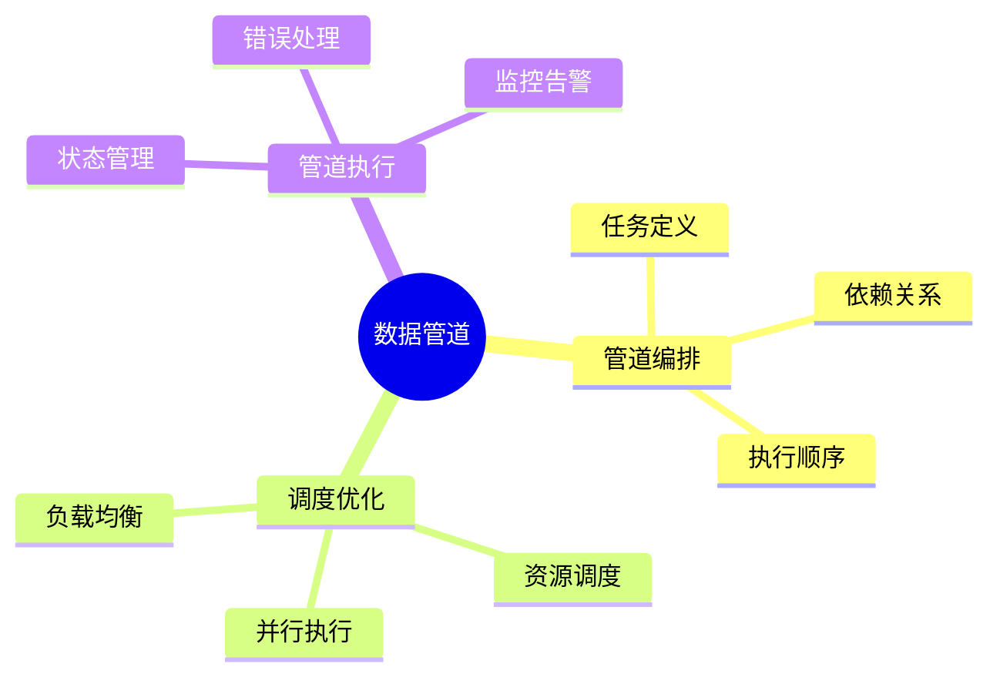

# 数据库数据管道模型-管道编排与调度优化的形式化

> **文档版本**: v1.0
> **最后更新**: 2025-01-16
> **版本覆盖**: PostgreSQL 18.x (推荐) ⭐ | 17.x (推荐) | 16.x (兼容)
> **文档状态**: 🟡 框架已创建，内容待完善

---

## 📋 目录

- [数据库数据管道模型-管道编排与调度优化的形式化](#数据库数据管道模型-管道编排与调度优化的形式化)
  - [📋 目录](#-目录)
  - [1. 概述](#1-概述)
    - [1.0 数据库数据管道模型工作原理概述](#10-数据库数据管道模型工作原理概述)
    - [1.1 本文档的范围](#11-本文档的范围)
  - [2. 核心内容](#2-核心内容)
    - [2.1 管道编排](#21-管道编排)
    - [2.2 调度优化](#22-调度优化)
  - [3. 形式化定义](#3-形式化定义)
    - [3.1 管道形式化](#31-管道形式化)
  - [4. 实际应用](#4-实际应用)
    - [4.1 数据管道实现](#41-数据管道实现)
  - [5. 相关文档](#5-相关文档)
    - [5.1 理论基础文档](#51-理论基础文档)
  - [6. 参考文献](#6-参考文献)
    - [6.1 核心理论文献](#61-核心理论文献)
    - [6.2 PostgreSQL实现相关](#62-postgresql实现相关)
    - [6.3 相关文档](#63-相关文档)

---

## 1. 概述

### 1.0 数据库数据管道模型工作原理概述

**数据管道**：

数据管道通过编排和调度优化来管理数据处理流程。

**管道模型思维导图**：



### 1.1 本文档的范围

本文档涵盖：

- **管道编排**：任务编排和依赖管理
- **调度优化**：调度算法和资源优化
- **实际应用**：数据管道系统

---

## 2. 核心内容

### 2.1 管道编排

**管道定义**：

```haskell
-- 数据管道
data Pipeline = Pipeline {
    tasks :: [Task],
    dependencies :: [(Task, Task)],
    schedule :: Schedule
}
```

### 2.2 调度优化

**调度策略**：

| 策略 | 方法 | 优点 |
|------|------|------|
| **FIFO** | 先进先出 | 简单 |
| **优先级** | 按优先级 | 灵活 |
| **最短作业** | 最短优先 | 高效 |

---

## 3. 形式化定义

### 3.1 管道形式化

**管道**：

```haskell
-- 管道形式化
Pipeline = (T, D, S)
where
    T = {t1, t2, ..., tn}  -- tasks
    D = dependency relation
    S = schedule function
```

---

## 4. 实际应用

### 4.1 数据管道实现

**管道定义**：

```sql
-- 管道任务表
CREATE TABLE pipeline_tasks (
    task_id UUID PRIMARY KEY,
    task_name VARCHAR,
    task_type VARCHAR,
    dependencies UUID[]
);

-- 调度执行
SELECT * FROM schedule_pipeline('pipeline_id');
```

---

## 5. 相关文档

### 5.1 理论基础文档

- [形式语言与证明：总论](./1.1.25-形式语言与证明-总论.md)
- [理论基础导航](./README.md)

---

## 6. 参考文献

### 6.1 核心理论文献

- **Abadi, D. J., et al. (2003). "Aurora: A New Model and Architecture for Data Stream Management."**
  - 会议: VLDB Journal 2003
  - **重要性**: 数据流管理的经典论文
  - **核心贡献**: 提出了流处理架构

- **Isard, M., et al. (2007). "Dryad: Distributed Data-Parallel Programs from Sequential Building Blocks."**
  - 会议: EuroSys 2007
  - **重要性**: 分布式数据并行处理
  - **核心贡献**: 提出了管道编排模型

### 6.2 PostgreSQL实现相关

- **PostgreSQL扩展 - 数据管道](<https://github.com/postgresql/data-pipeline>)**
  - PostgreSQL数据管道扩展

### 6.3 相关文档

- [数据库数据编排模型-工作流引擎与状态管理的形式化](./13.02-数据库数据编排模型-工作流引擎与状态管理的形式化.md)
- [理论基础导航](../README.md)

---

**最后更新**: 2025-01-16
**维护者**: Documentation Team
**状态**: 🟡 框架已创建，内容待完善
