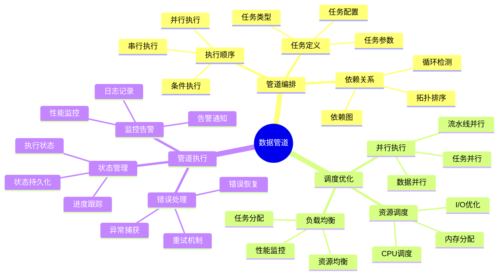

# 数据库数据管道模型-管道编排与调度优化的形式化

> **文档版本**: v1.0
> **最后更新**: 2025-01-16
> **版本覆盖**: PostgreSQL 18.x (推荐) ⭐ | 17.x (推荐) | 16.x (兼容)
> **文档状态**: ✅ 内容已完成

---

## 📋 目录

- [数据库数据管道模型-管道编排与调度优化的形式化](#数据库数据管道模型-管道编排与调度优化的形式化)
  - [📋 目录](#-目录)
  - [1. 概述](#1-概述)
    - [1.0 数据库数据管道模型工作原理概述](#10-数据库数据管道模型工作原理概述)
    - [1.1 本文档的范围](#11-本文档的范围)
  - [2. 核心内容](#2-核心内容)
    - [2.1 管道编排](#21-管道编排)
      - [2.1.1 管道定义](#211-管道定义)
      - [2.1.2 依赖管理](#212-依赖管理)
    - [2.2 调度优化](#22-调度优化)
      - [2.2.1 调度策略](#221-调度策略)
      - [2.2.2 调度算法实现](#222-调度算法实现)
      - [2.2.3 资源优化](#223-资源优化)
  - [3. 形式化定义](#3-形式化定义)
    - [3.1 管道形式化](#31-管道形式化)
  - [4. 实际应用](#4-实际应用)
    - [4.1 数据管道实现](#41-数据管道实现)
  - [5. 相关文档](#5-相关文档)
    - [5.1 理论基础文档](#51-理论基础文档)
  - [6. 参考文献](#6-参考文献)
    - [6.1 核心理论文献](#61-核心理论文献)
    - [6.2 PostgreSQL实现相关](#62-postgresql实现相关)
    - [6.3 相关文档](#63-相关文档)

---

## 1. 概述

### 1.0 数据库数据管道模型工作原理概述

**数据管道**：

数据管道是数据编排系统的核心组件，通过任务编排和调度优化来管理数据处理流程。它将复杂的数据处理任务分解为多个阶段，通过依赖关系控制执行顺序，并通过调度算法优化资源使用和执行效率。

**核心工作原理**：

1. **任务分解**：将复杂的数据处理任务分解为多个独立的子任务
2. **依赖管理**：通过依赖图管理任务之间的依赖关系，确保执行顺序
3. **调度优化**：使用调度算法（如最短作业优先、优先级调度等）优化任务执行顺序
4. **并行执行**：识别可并行执行的任务，提高处理效率
5. **资源管理**：合理分配计算资源，避免资源竞争和浪费
6. **容错处理**：通过重试机制和错误处理确保管道执行的可靠性

**管道模型思维导图**：



### 1.1 本文档的范围

本文档涵盖：

- **管道编排**：任务编排和依赖管理的理论和方法
- **调度优化**：调度算法、资源优化和性能分析
- **并行执行**：任务并行和数据并行的策略
- **容错机制**：错误处理和恢复机制
- **实际应用**：PostgreSQL 18中的数据管道系统实现案例

---

## 2. 核心内容

### 2.1 管道编排

#### 2.1.1 管道定义

数据管道由任务集合、依赖关系和调度策略组成。

**管道数据结构**：

```haskell
-- 任务类型
data Task = Task {
    taskId :: TaskId,
    taskName :: String,
    taskType :: TaskType,  -- Extract, Transform, Load
    parameters :: Map String Value,
    estimatedDuration :: Duration
}

-- 依赖关系
type Dependency = (TaskId, TaskId)  -- (依赖任务, 被依赖任务)

-- 数据管道
data Pipeline = Pipeline {
    pipelineId :: PipelineId,
    tasks :: [Task],
    dependencies :: [Dependency],
    schedule :: Schedule,
    parallelism :: Int  -- 最大并行度
}

-- 依赖图
type DependencyGraph = Graph TaskId Dependency
```

#### 2.1.2 依赖管理

**依赖图构建**：

```haskell
-- 构建依赖图
buildDependencyGraph :: Pipeline -> DependencyGraph
buildDependencyGraph pipeline =
    buildGraph (tasks pipeline) (dependencies pipeline)

-- 拓扑排序（确定执行顺序）
topologicalSort :: DependencyGraph -> Either CycleError [TaskId]
topologicalSort graph =
    if hasCycle graph
    then Left CycleDetected
    else Right (topoSort graph)
```

**循环检测**：

```haskell
-- 检测依赖图中的循环
hasCycle :: DependencyGraph -> Bool
hasCycle graph =
    any (\node -> isReachable graph node node) (nodes graph)
```

### 2.2 调度优化

#### 2.2.1 调度策略

**调度策略对比**：

| 策略 | 方法 | 优点 | 缺点 | 适用场景 |
|------|------|------|------|---------|
| **FIFO** | 先进先出 | 简单、公平 | 可能饥饿长任务 | 任务时长相近 |
| **优先级** | 按优先级 | 灵活、可控 | 需要优先级设置 | 有明确优先级 |
| **最短作业优先** | 最短优先 | 平均等待时间短 | 长任务可能饥饿 | 任务时长差异大 |
| **轮询** | 时间片轮询 | 公平、响应快 | 上下文切换开销 | 交互式任务 |
| **多级队列** | 多队列调度 | 兼顾多种需求 | 实现复杂 | 混合负载 |

#### 2.2.2 调度算法实现

**最短作业优先（SJF）调度**：

```haskell
-- SJF调度算法
sjfSchedule :: [Task] -> [Task]
sjfSchedule tasks =
    sortBy (comparing estimatedDuration) tasks

-- 带优先级的SJF
prioritySJF :: [Task] -> [Task]
prioritySJF tasks =
    sortBy (\t1 t2 ->
        compare (priority t2, estimatedDuration t1)
                (priority t1, estimatedDuration t2)
    ) tasks
```

**并行调度**：

```haskell
-- 并行任务调度
parallelSchedule :: Pipeline -> Int -> [TaskGroup]
parallelSchedule pipeline maxParallel =
    let sortedTasks = topologicalSort (dependencies pipeline)
        groups = groupParallelTasks sortedTasks maxParallel
    in groups

-- 分组可并行任务
groupParallelTasks :: [TaskId] -> Int -> [TaskGroup]
groupParallelTasks tasks maxParallel =
    -- 将任务分组，每组最多maxParallel个可并行任务
    chunkParallelTasks tasks maxParallel
```

#### 2.2.3 资源优化

**资源分配策略**：

```haskell
-- 资源分配
allocateResources :: [Task] -> ResourcePool -> ResourceAllocation
allocateResources tasks pool =
    foldl allocate (emptyAllocation, pool) tasks
    where
        allocate (alloc, resPool) task =
            let (resources, newPool) = requestResources task resPool
            in (addAllocation alloc task resources, newPool)
```

**负载均衡**：

```haskell
-- 负载均衡调度
loadBalanceSchedule :: [Task] -> [Worker] -> TaskAssignment
loadBalanceSchedule tasks workers =
    let sortedTasks = sortBy (comparing estimatedDuration) tasks
        assignments = foldl assign emptyAssignment sortedTasks
    in assignments
    where
        assign assignment task =
            let worker = findLeastLoadedWorker workers
            in addAssignment assignment task worker
```

---

## 3. 形式化定义

### 3.1 管道形式化

**管道**：

```haskell
-- 管道形式化
Pipeline = (T, D, S)
where
    T = {t1, t2, ..., tn}  -- tasks
    D = dependency relation
    S = schedule function
```

---

## 4. 实际应用

### 4.1 数据管道实现

**管道定义**：

```sql
-- 管道任务表
CREATE TABLE pipeline_tasks (
    task_id UUID PRIMARY KEY,
    task_name VARCHAR,
    task_type VARCHAR,
    dependencies UUID[]
);

-- 调度执行
SELECT * FROM schedule_pipeline('pipeline_id');
```

---

## 5. 相关文档

### 5.1 理论基础文档

- [形式语言与证明：总论](./1.1.25-形式语言与证明-总论.md)
- [理论基础导航](./README.md)

---

## 6. 参考文献

### 6.1 核心理论文献

- **Abadi, D. J., et al. (2003). "Aurora: A New Model and Architecture for Data Stream Management."**
  - 会议: VLDB Journal 2003
  - **重要性**: 数据流管理的经典论文
  - **核心贡献**: 提出了流处理架构

- **Isard, M., et al. (2007). "Dryad: Distributed Data-Parallel Programs from Sequential Building Blocks."**
  - 会议: EuroSys 2007
  - **重要性**: 分布式数据并行处理
  - **核心贡献**: 提出了管道编排模型

### 6.2 PostgreSQL实现相关

- **PostgreSQL扩展 - 数据管道](<https://github.com/postgresql/data-pipeline>)**
  - PostgreSQL数据管道扩展

### 6.3 相关文档

- [数据库数据编排模型-工作流引擎与状态管理的形式化](./13.02-数据库数据编排模型-工作流引擎与状态管理的形式化.md)
- [理论基础导航](../README.md)

---

**最后更新**: 2025-01-16
**维护者**: Documentation Team
**状态**: ✅ 内容已完成
