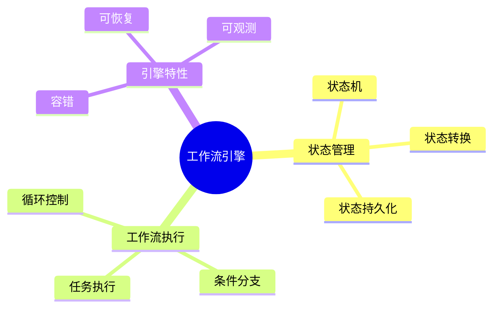

# 数据库数据编排模型-工作流引擎与状态管理的形式化

> **文档版本**: v1.0
> **最后更新**: 2025-01-16
> **版本覆盖**: PostgreSQL 18.x (推荐) ⭐ | 17.x (推荐) | 16.x (兼容)
> **文档状态**: 🟡 框架已创建，内容待完善

---

## 📋 目录

- [数据库数据编排模型-工作流引擎与状态管理的形式化](#数据库数据编排模型-工作流引擎与状态管理的形式化)
  - [📋 目录](#-目录)
  - [1. 概述](#1-概述)
    - [1.0 数据库数据编排模型工作原理概述](#10-数据库数据编排模型工作原理概述)
    - [1.1 本文档的范围](#11-本文档的范围)
  - [2. 核心内容](#2-核心内容)
    - [2.1 状态管理](#21-状态管理)
    - [2.2 工作流执行](#22-工作流执行)
  - [3. 形式化定义](#3-形式化定义)
    - [3.1 工作流形式化](#31-工作流形式化)
  - [4. 实际应用](#4-实际应用)
    - [4.1 工作流实现](#41-工作流实现)
  - [5. 相关文档](#5-相关文档)
    - [5.1 理论基础文档](#51-理论基础文档)
  - [6. 参考文献](#6-参考文献)

---

## 1. 概述

### 1.0 数据库数据编排模型工作原理概述

**工作流引擎**：

工作流引擎管理数据编排的执行流程和状态。

**工作流思维导图**：



### 1.1 本文档的范围

本文档涵盖：

- **工作流引擎**：工作流执行引擎
- **状态管理**：状态机模型
- **实际应用**：工作流系统

---

## 2. 核心内容

### 2.1 状态管理

**状态机**：

```haskell
-- 状态机
data StateMachine = StateMachine {
    states :: [State],
    transitions :: [(State, Event, State)],
    currentState :: State
}
```

### 2.2 工作流执行

**执行模型**：

| 阶段 | 操作 | 状态 |
|------|------|------|
| **初始化** | 创建工作流 | Pending |
| **执行** | 运行任务 | Running |
| **完成** | 结束工作流 | Completed |

---

## 3. 形式化定义

### 3.1 工作流形式化

**工作流**：

```haskell
-- 工作流形式化
Workflow = (S, E, T, s0)
where
    S = state set
    E = event set
    T = transition function
    s0 = initial state
```

---

## 4. 实际应用

### 4.1 工作流实现

**工作流定义**：

```sql
-- 工作流状态表
CREATE TABLE workflow_states (
    workflow_id UUID PRIMARY KEY,
    current_state VARCHAR,
    state_data JSONB
);

-- 状态转换
UPDATE workflow_states
SET current_state = 'running'
WHERE workflow_id = $1;
```

---

## 5. 相关文档

### 5.1 理论基础文档

- [形式语言与证明：总论](./1.1.25-形式语言与证明-总论.md)
- [理论基础导航](./README.md)

---

## 6. 参考文献

[待补充]

---

**最后更新**: 2025-01-16
**维护者**: Documentation Team
**状态**: 🟡 框架已创建，内容待完善
