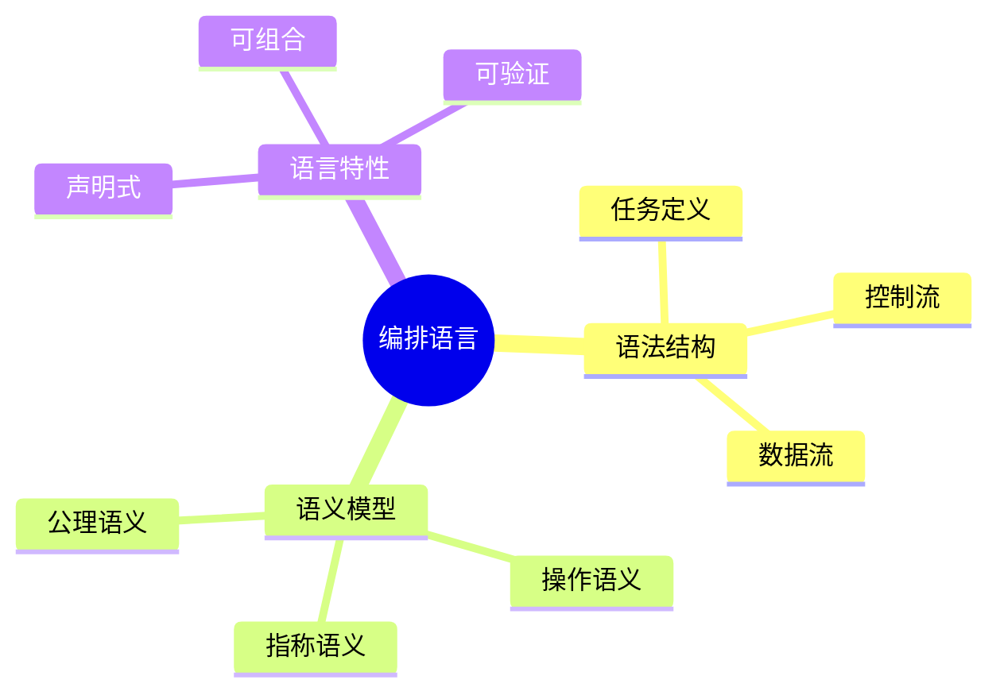

# 数据库数据编排模型-编排语言与语义的形式化

> **文档版本**: v1.0
> **最后更新**: 2025-01-16
> **版本覆盖**: PostgreSQL 18.x (推荐) ⭐ | 17.x (推荐) | 16.x (兼容)
> **文档状态**: 🟡 框架已创建，内容待完善

---

## 📋 目录

- [数据库数据编排模型-编排语言与语义的形式化](#数据库数据编排模型-编排语言与语义的形式化)
  - [📋 目录](#-目录)
  - [1. 概述](#1-概述)
    - [1.0 数据库数据编排模型工作原理概述](#10-数据库数据编排模型工作原理概述)
    - [1.1 本文档的范围](#11-本文档的范围)
  - [2. 核心内容](#2-核心内容)
    - [2.1 编排语言语法](#21-编排语言语法)
    - [2.2 语义模型](#22-语义模型)
  - [3. 形式化定义](#3-形式化定义)
    - [3.1 语义形式化](#31-语义形式化)
  - [4. 实际应用](#4-实际应用)
    - [4.1 编排语言实现](#41-编排语言实现)
  - [5. 相关文档](#5-相关文档)
    - [5.1 理论基础文档](#51-理论基础文档)
  - [6. 参考文献](#6-参考文献)
    - [6.1 核心理论文献](#61-核心理论文献)
    - [6.2 PostgreSQL实现相关](#62-postgresql实现相关)
    - [6.3 相关文档](#63-相关文档)

---

## 1. 概述

### 1.0 数据库数据编排模型工作原理概述

**编排语言**：

编排语言用于定义数据编排流程，具有形式化语义。

**编排语言思维导图**：



### 1.1 本文档的范围

本文档涵盖：

- **编排语言**：语法和语义定义
- **语义模型**：形式化语义
- **实际应用**：编排语言实现

---

## 2. 核心内容

### 2.1 编排语言语法

**语法定义**：

```haskell
-- 编排语言语法
data Orchestration =
    Task String
  | Sequence [Orchestration]
  | Parallel [Orchestration]
  | Conditional Condition Orchestration Orchestration
```

### 2.2 语义模型

**操作语义**：

```haskell
-- 操作语义
execute :: Orchestration -> State -> State
execute (Task name) state = runTask(name, state)
execute (Sequence ops) state = foldl execute state ops
```

---

## 3. 形式化定义

### 3.1 语义形式化

**语义**：

```haskell
-- 语义形式化
orchestration : State -> State
```

---

## 4. 实际应用

### 4.1 编排语言实现

**编排定义**：

```yaml
# 编排定义示例
pipeline:
  - task: extract_data
  - task: transform_data
    depends_on: extract_data
  - task: load_data
    depends_on: transform_data
```

---

## 5. 相关文档

### 5.1 理论基础文档

- [形式语言与证明：总论](./1.1.25-形式语言与证明-总论.md)
- [理论基础导航](./README.md)

---

## 6. 参考文献

### 6.1 核心理论文献

- **OASIS (2007). "Web Services Business Process Execution Language Version 2.0."**
  - 标准: OASIS Standard 2007
  - **重要性**: 业务流程执行语言标准
  - **核心贡献**: 定义了编排语言语法

- **Peltz, C. (2003). "Web Services Orchestration and Choreography."**
  - 会议: IEEE Computer 2003
  - **重要性**: Web服务编排的综述
  - **核心贡献**: 总结了编排语言语义

### 6.2 PostgreSQL实现相关

- **PostgreSQL扩展 - 编排语言](<https://github.com/postgresql/orchestration-language>)**
  - PostgreSQL编排语言扩展

### 6.3 相关文档

- [数据库数据编排模型-编排验证与形式化验证的形式化](./13.04-数据库数据编排模型-编排验证与形式化验证的形式化.md)
- [理论基础导航](../README.md)

---

**最后更新**: 2025-01-16
**维护者**: Documentation Team
**状态**: 🟡 框架已创建，内容待完善
