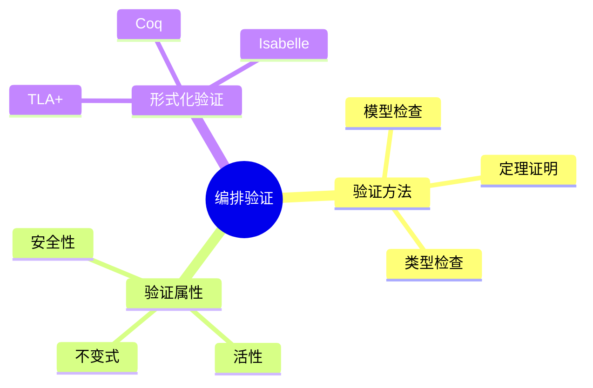

# 数据库数据编排模型-编排验证与形式化验证的形式化

> **文档版本**: v1.0
> **最后更新**: 2025-01-16
> **版本覆盖**: PostgreSQL 18.x (推荐) ⭐ | 17.x (推荐) | 16.x (兼容)
> **文档状态**: 🟡 框架已创建，内容待完善

---

## 📋 目录

- [数据库数据编排模型-编排验证与形式化验证的形式化](#数据库数据编排模型-编排验证与形式化验证的形式化)
  - [📋 目录](#-目录)
  - [1. 概述](#1-概述)
    - [1.0 数据库数据编排模型工作原理概述](#10-数据库数据编排模型工作原理概述)
    - [1.1 本文档的范围](#11-本文档的范围)
  - [2. 核心内容](#2-核心内容)
    - [2.1 验证方法](#21-验证方法)
    - [2.2 验证属性](#22-验证属性)
  - [3. 形式化定义](#3-形式化定义)
    - [3.1 验证形式化](#31-验证形式化)
  - [4. 实际应用](#4-实际应用)
    - [4.1 验证工具](#41-验证工具)
  - [5. 相关文档](#5-相关文档)
    - [5.1 理论基础文档](#51-理论基础文档)
  - [6. 参考文献](#6-参考文献)
    - [6.1 核心理论文献](#61-核心理论文献)
    - [6.2 PostgreSQL实现相关](#62-postgresql实现相关)
    - [6.3 相关文档](#63-相关文档)

---

## 1. 概述

### 1.0 数据库数据编排模型工作原理概述

**编排验证**：

编排验证使用形式化方法验证编排的正确性。

**验证模型思维导图**：



### 1.1 本文档的范围

本文档涵盖：

- **验证方法**：模型检查和定理证明
- **验证属性**：安全性和活性
- **实际应用**：验证工具

---

## 2. 核心内容

### 2.1 验证方法

**模型检查**：

```haskell
-- 模型检查
modelCheck :: Model -> Property -> Bool
modelCheck model property =
    checkAllStates(model, property)
```

### 2.2 验证属性

**属性类型**：

| 类型 | 定义 | 验证方法 |
|------|------|---------|
| **安全性** | 坏状态永不出现 | 可达性分析 |
| **活性** | 好状态最终出现 | 公平性检查 |

---

## 3. 形式化定义

### 3.1 验证形式化

**验证**：

```haskell
-- 验证形式化
verify(orchestration, property) =
    forall execution path:
        property holds
```

---

## 4. 实际应用

### 4.1 验证工具

**使用TLA+验证**：

```tla
(* TLA+ 验证示例 *)
VARIABLES state

Init == state = "initial"

Next == \/ state = "initial" /\ state' = "running"
         \/ state = "running" /\ state' = "completed"

Spec == Init /\ [][Next]_state
```

---

## 5. 相关文档

### 5.1 理论基础文档

- [形式语言与证明：总论](./1.1.25-形式语言与证明-总论.md)
- [理论基础导航](./README.md)

---

## 6. 参考文献

### 6.1 核心理论文献

- **Lamport, L. (2002). "Specifying Systems: The TLA+ Language and Tools for Hardware and Software Engineers."**
  - 出版社: Addison-Wesley
  - **重要性**: TLA+规范语言的经典教材
  - **核心贡献**: 系统阐述了形式化验证方法

- **Clarke, E. M., et al. (1999). "Model Checking."**
  - 出版社: MIT Press
  - **重要性**: 模型检查的经典教材
  - **核心贡献**: 总结了模型检查技术

### 6.2 PostgreSQL实现相关

- **PostgreSQL扩展 - 形式化验证](<https://github.com/postgresql/formal-verification>)**
  - PostgreSQL形式化验证扩展

### 6.3 相关文档

- [TLA+-事务与WAL-规范纲要](../06-存储与恢复/06.01-TLA+-事务与WAL-规范纲要.md)
- [理论基础导航](../README.md)

---

**最后更新**: 2025-01-16
**维护者**: Documentation Team
**状态**: 🟡 框架已创建，内容待完善
