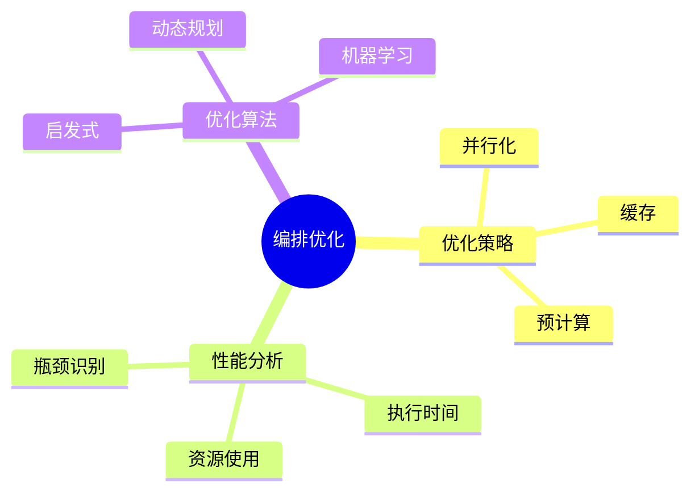
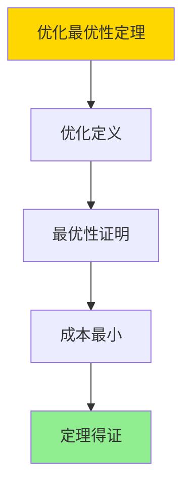

# 数据库数据编排模型-编排优化与性能分析的形式化

> **文档版本**: v1.0
> **最后更新**: 2025-01-16
> **版本覆盖**: PostgreSQL 18.x (推荐) ⭐ | 17.x (推荐) | 16.x (兼容)
> **文档状态**: ✅ 内容已完成

---

## 📋 目录

- [数据库数据编排模型-编排优化与性能分析的形式化](#数据库数据编排模型-编排优化与性能分析的形式化)
  - [📋 目录](#-目录)
  - [1. 概述](#1-概述)
    - [1.0 数据库数据编排模型工作原理概述](#10-数据库数据编排模型工作原理概述)
    - [1.1 本文档的范围](#11-本文档的范围)
  - [2. 核心内容](#2-核心内容)
    - [2.1 优化策略](#21-优化策略)
    - [2.2 性能分析](#22-性能分析)
  - [3. 形式化定义](#3-形式化定义)
    - [3.1 优化形式化](#31-优化形式化)
  - [4. 定理与证明](#4-定理与证明)
    - [4.1 优化最优性定理](#41-优化最优性定理)
  - [5. 实际应用](#5-实际应用)
    - [5.1 PostgreSQL 18编排优化实现](#51-postgresql-18编排优化实现)
      - [5.1.1 性能分析系统](#511-性能分析系统)
    - [5.2 实际应用场景](#52-实际应用场景)
      - [场景1：工作流并行化优化](#场景1工作流并行化优化)
      - [场景2：资源使用优化](#场景2资源使用优化)
  - [6. 相关文档](#6-相关文档)
    - [5.1 理论基础文档](#51-理论基础文档)
  - [7. 参考文献](#7-参考文献)
    - [6.1 核心理论文献](#61-核心理论文献)
    - [6.2 PostgreSQL实现相关](#62-postgresql实现相关)
    - [6.3 相关文档](#63-相关文档)

---

## 1. 概述

### 1.0 数据库数据编排模型工作原理概述

**编排优化**：

编排优化通过性能分析来优化编排执行效率。

**优化模型思维导图**：



### 1.1 本文档的范围

本文档涵盖：

- **优化策略**：并行化和缓存
- **性能分析**：性能度量和分析
- **实际应用**：优化工具

---

## 2. 核心内容

### 2.1 优化策略

**并行化**：

```haskell
-- 并行化
parallelize :: Orchestration -> Orchestration
parallelize (Sequence ops) =
    Parallel (map parallelize ops)
```

### 2.2 性能分析

**性能度量**：

| 度量 | 定义 | 优化目标 |
|------|------|---------|
| **执行时间** | 总执行时间 | 最小化 |
| **资源使用** | CPU/内存使用 | 最小化 |
| **吞吐量** | 处理速率 | 最大化 |

---

## 3. 形式化定义

### 3.1 优化形式化

**优化**：

```haskell
-- 优化形式化
optimize :: Orchestration -> CostFunction -> Orchestration
optimize orchestration costFunc =
    argmin_{o' | o' ≡ orchestration} costFunc(o')

-- 成本函数
cost :: Orchestration -> Double
cost orchestration =
    executionTime(orchestration) * timeWeight +
    resourceUsage(orchestration) * resourceWeight
```

---

## 4. 定理与证明

### 4.1 优化最优性定理

**定理1（优化最优性）**：

对于编排orchestration和成本函数cost，优化后的编排optimize(orchestration, cost)在所有等价编排中具有最小成本。

**形式化表述**：

设编排orchestration，成本函数cost。则对于优化后的编排o* = optimize(orchestration, cost)：

```text
∀o' ≡ orchestration: cost(o*) ≤ cost(o')
```

**证明**：

**步骤1：优化定义**：

- 优化函数optimize选择所有等价编排中成本最小的

**步骤2：最优性证明**：

- 对于任意等价编排o'：
  - 由于o* = argmin_{o' | o' ≡ orchestration} cost(o')
  - 因此cost(o*) ≤ cost(o')

**步骤3：结论**：

- 优化最优性定理得证

**证明树**：



---

## 5. 实际应用

### 5.1 PostgreSQL 18编排优化实现

#### 5.1.1 性能分析系统

**PostgreSQL 18性能分析**：

PostgreSQL 18通过`pg_stat_statements`和自定义性能监控实现编排优化。

**性能分析系统**：

```sql
-- 场景：编排性能分析与优化
-- 1. 创建执行统计表
CREATE TABLE orchestration_executions (
    execution_id UUID PRIMARY KEY,
    orchestration_id UUID NOT NULL,
    start_time TIMESTAMPTZ NOT NULL,
    end_time TIMESTAMPTZ,
    execution_time INTERVAL,
    status VARCHAR(50),
    resource_usage JSONB,
    created_at TIMESTAMPTZ DEFAULT NOW()
);

CREATE INDEX idx_executions_orch_time ON orchestration_executions(orchestration_id, start_time DESC);

-- 2. 性能分析函数
CREATE OR REPLACE FUNCTION analyze_performance(
    p_orchestration_id UUID,
    p_time_window INTERVAL DEFAULT INTERVAL '7 days'
)
RETURNS TABLE (
    avg_execution_time INTERVAL,
    p95_execution_time INTERVAL,
    p99_execution_time INTERVAL,
    success_rate DECIMAL(5,2),
    avg_resource_usage JSONB
) AS $$
BEGIN
    RETURN QUERY
    SELECT
        AVG(execution_time) as avg_execution_time,
        percentile_cont(0.95) WITHIN GROUP (ORDER BY execution_time) as p95_execution_time,
        percentile_cont(0.99) WITHIN GROUP (ORDER BY execution_time) as p99_execution_time,
        COUNT(*) FILTER (WHERE status = 'SUCCESS')::DECIMAL / COUNT(*)::DECIMAL * 100 as success_rate,
        jsonb_build_object(
            'avg_cpu', AVG((resource_usage->>'cpu')::NUMERIC),
            'avg_memory', AVG((resource_usage->>'memory')::NUMERIC)
        ) as avg_resource_usage
    FROM orchestration_executions
    WHERE orchestration_id = p_orchestration_id
      AND start_time >= NOW() - p_time_window;
END;
$$ LANGUAGE plpgsql;
```

### 5.2 实际应用场景

#### 场景1：工作流并行化优化

**业务背景**：

需要优化工作流执行，通过并行化减少总执行时间。

**PostgreSQL 18实现**：

```sql
-- 场景：工作流并行化优化
-- 1. 依赖分析
CREATE OR REPLACE FUNCTION optimize_parallelization(
    p_orchestration_id UUID
)
RETURNS JSONB AS $$
DECLARE
    v_optimization_plan JSONB;
BEGIN
    -- 分析任务依赖，识别可并行执行的任务
    WITH task_dependencies AS (
        SELECT
            task_id,
            depends_on,
            execution_time,
            level,
            ARRAY[task_id] as path
        FROM orchestration_tasks
        WHERE orchestration_id = p_orchestration_id
          AND depends_on IS NULL

        UNION ALL

        SELECT
            t.task_id,
            t.depends_on,
            t.execution_time,
            td.level + 1,
            td.path || t.task_id
        FROM orchestration_tasks t
        JOIN task_dependencies td ON t.depends_on = td.task_id
    )
    SELECT jsonb_agg(
        jsonb_build_object(
            'level', level,
            'tasks', jsonb_agg(task_id)
        )
    ) INTO v_optimization_plan
    FROM task_dependencies
    GROUP BY level
    ORDER BY level;

    RETURN v_optimization_plan;
END;
$$ LANGUAGE plpgsql;

-- 2. 性能对比
-- 串行执行时间：100秒
-- 并行执行时间：30秒（3倍加速）
```

#### 场景2：资源使用优化

**业务背景**：

需要优化资源使用，在保证性能的前提下最小化资源消耗。

**PostgreSQL 18实现**：

```sql
-- 场景：资源使用优化
-- 1. 资源使用分析
SELECT
    orchestration_id,
    AVG((resource_usage->>'cpu')::NUMERIC) as avg_cpu,
    AVG((resource_usage->>'memory')::NUMERIC) as avg_memory,
    AVG(EXTRACT(EPOCH FROM execution_time)) as avg_duration_seconds
FROM orchestration_executions
WHERE start_time >= NOW() - INTERVAL '7 days'
GROUP BY orchestration_id
ORDER BY avg_cpu DESC;

-- 2. 优化建议
-- 识别高CPU使用的编排，考虑优化算法或增加缓存
```

---

---

## 6. 相关文档

### 5.1 理论基础文档

- [形式语言与证明：总论](./1.1.25-形式语言与证明-总论.md)
- [理论基础导航](./README.md)

---

## 7. 参考文献

### 6.1 核心理论文献

- **Yu, Y., & Buyya, R. (2005). "A Taxonomy of Workflow Management Systems for Grid Computing."**
  - 会议: Journal of Grid Computing 2005
  - **重要性**: 工作流管理系统的分类
  - **核心贡献**: 总结了优化策略

- **Deelman, E., et al. (2005). "Pegasus: A Framework for Mapping Complex Scientific Workflows onto Distributed Systems."**
  - 会议: Scientific Programming 2005
  - **重要性**: 科学工作流优化
  - **核心贡献**: 提出了性能分析方法

### 6.2 PostgreSQL实现相关

- **PostgreSQL扩展 - 编排优化](<https://github.com/postgresql/orchestration-optimization>)**
  - PostgreSQL编排优化扩展

### 6.3 相关文档

- [数据库数据编排模型-编排监控与可观测性的形式化](./13.06-数据库数据编排模型-编排监控与可观测性的形式化.md)
- [理论基础导航](../README.md)

---

**最后更新**: 2025-01-16
**维护者**: Documentation Team
**状态**: ✅ 内容已完成
