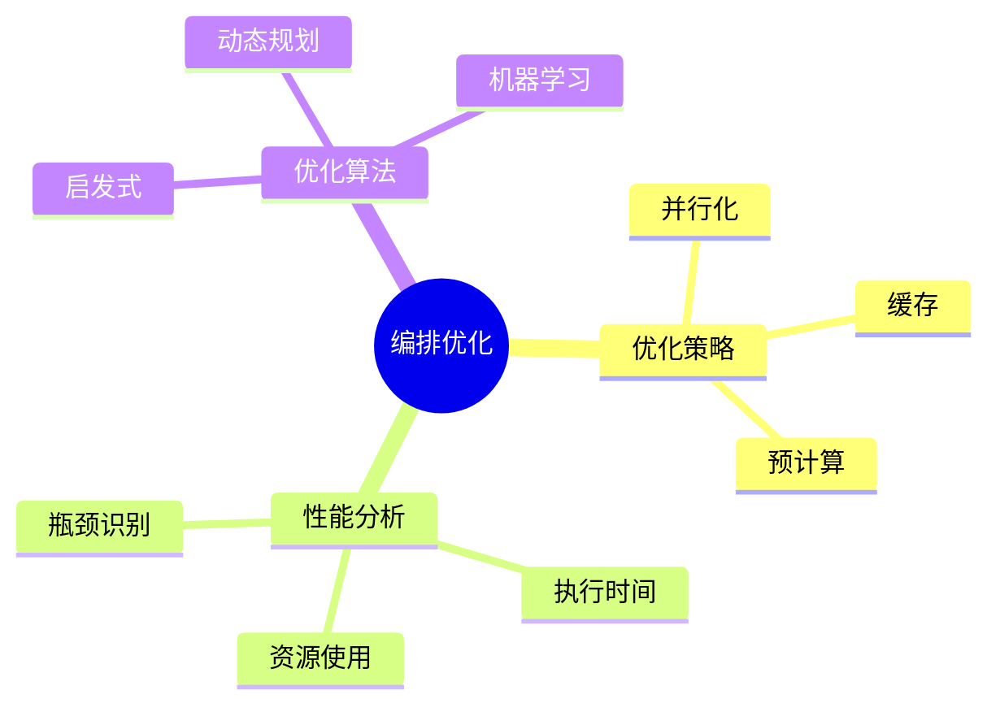

# 数据库数据编排模型-编排优化与性能分析的形式化

> **文档版本**: v1.0
> **最后更新**: 2025-01-16
> **版本覆盖**: PostgreSQL 18.x (推荐) ⭐ | 17.x (推荐) | 16.x (兼容)
> **文档状态**: 🟡 框架已创建，内容待完善

---

## 📋 目录

- [数据库数据编排模型-编排优化与性能分析的形式化](#数据库数据编排模型-编排优化与性能分析的形式化)
  - [📋 目录](#-目录)
  - [1. 概述](#1-概述)
    - [1.0 数据库数据编排模型工作原理概述](#10-数据库数据编排模型工作原理概述)
    - [1.1 本文档的范围](#11-本文档的范围)
  - [2. 核心内容](#2-核心内容)
    - [2.1 优化策略](#21-优化策略)
    - [2.2 性能分析](#22-性能分析)
  - [3. 形式化定义](#3-形式化定义)
    - [3.1 优化形式化](#31-优化形式化)
  - [4. 实际应用](#4-实际应用)
    - [4.1 性能分析](#41-性能分析)
  - [5. 相关文档](#5-相关文档)
    - [5.1 理论基础文档](#51-理论基础文档)
  - [6. 参考文献](#6-参考文献)
    - [6.1 核心理论文献](#61-核心理论文献)
    - [6.2 PostgreSQL实现相关](#62-postgresql实现相关)
    - [6.3 相关文档](#63-相关文档)

---

## 1. 概述

### 1.0 数据库数据编排模型工作原理概述

**编排优化**：

编排优化通过性能分析来优化编排执行效率。

**优化模型思维导图**：



### 1.1 本文档的范围

本文档涵盖：

- **优化策略**：并行化和缓存
- **性能分析**：性能度量和分析
- **实际应用**：优化工具

---

## 2. 核心内容

### 2.1 优化策略

**并行化**：

```haskell
-- 并行化
parallelize :: Orchestration -> Orchestration
parallelize (Sequence ops) =
    Parallel (map parallelize ops)
```

### 2.2 性能分析

**性能度量**：

| 度量 | 定义 | 优化目标 |
|------|------|---------|
| **执行时间** | 总执行时间 | 最小化 |
| **资源使用** | CPU/内存使用 | 最小化 |
| **吞吐量** | 处理速率 | 最大化 |

---

## 3. 形式化定义

### 3.1 优化形式化

**优化**：

```haskell
-- 优化形式化
optimize(orchestration) = argmin_{o'} cost(o')
where o' is equivalent to orchestration
```

---

## 4. 实际应用

### 4.1 性能分析

**性能监控**：

```sql
-- 性能统计
SELECT
    task_name,
    AVG(execution_time) AS avg_time,
    MAX(execution_time) AS max_time
FROM task_executions
GROUP BY task_name;
```

---

## 5. 相关文档

### 5.1 理论基础文档

- [形式语言与证明：总论](./1.1.25-形式语言与证明-总论.md)
- [理论基础导航](./README.md)

---

## 6. 参考文献

### 6.1 核心理论文献

- **Yu, Y., & Buyya, R. (2005). "A Taxonomy of Workflow Management Systems for Grid Computing."**
  - 会议: Journal of Grid Computing 2005
  - **重要性**: 工作流管理系统的分类
  - **核心贡献**: 总结了优化策略

- **Deelman, E., et al. (2005). "Pegasus: A Framework for Mapping Complex Scientific Workflows onto Distributed Systems."**
  - 会议: Scientific Programming 2005
  - **重要性**: 科学工作流优化
  - **核心贡献**: 提出了性能分析方法

### 6.2 PostgreSQL实现相关

- **PostgreSQL扩展 - 编排优化](<https://github.com/postgresql/orchestration-optimization>)**
  - PostgreSQL编排优化扩展

### 6.3 相关文档

- [数据库数据编排模型-编排监控与可观测性的形式化](./13.06-数据库数据编排模型-编排监控与可观测性的形式化.md)
- [理论基础导航](../README.md)

---

**最后更新**: 2025-01-16
**维护者**: Documentation Team
**状态**: 🟡 框架已创建，内容待完善
