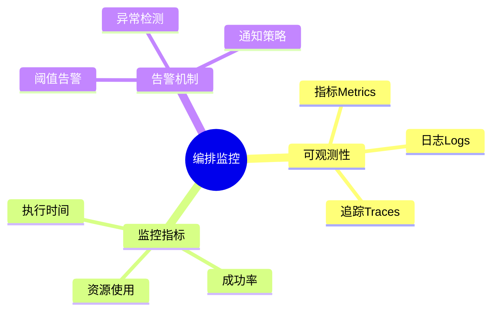

# 数据库数据编排模型-编排监控与可观测性的形式化

> **文档版本**: v1.0
> **最后更新**: 2025-01-16
> **版本覆盖**: PostgreSQL 18.x (推荐) ⭐ | 17.x (推荐) | 16.x (兼容)
> **文档状态**: 🟡 框架已创建，内容待完善

---

## 📋 目录

- [数据库数据编排模型-编排监控与可观测性的形式化](#数据库数据编排模型-编排监控与可观测性的形式化)
  - [📋 目录](#-目录)
  - [1. 概述](#1-概述)
    - [1.0 数据库数据编排模型工作原理概述](#10-数据库数据编排模型工作原理概述)
    - [1.1 本文档的范围](#11-本文档的范围)
  - [2. 核心内容](#2-核心内容)
    - [2.1 可观测性](#21-可观测性)
    - [2.2 监控指标](#22-监控指标)
  - [3. 形式化定义](#3-形式化定义)
    - [3.1 监控形式化](#31-监控形式化)
  - [4. 实际应用](#4-实际应用)
    - [4.1 监控实现](#41-监控实现)
  - [5. 相关文档](#5-相关文档)
    - [5.1 理论基础文档](#51-理论基础文档)
  - [6. 参考文献](#6-参考文献)
    - [6.1 核心理论文献](#61-核心理论文献)
    - [6.2 PostgreSQL实现相关](#62-postgresql实现相关)
    - [6.3 相关文档](#63-相关文档)

---

## 1. 概述

### 1.0 数据库数据编排模型工作原理概述

**编排监控**：

编排监控通过可观测性来监控编排执行状态。

**监控模型思维导图**：



### 1.1 本文档的范围

本文档涵盖：

- **可观测性**：指标、日志、追踪
- **监控指标**：性能和质量指标
- **实际应用**：监控系统

---

## 2. 核心内容

### 2.1 可观测性

**三大支柱**：

| 支柱 | 内容 | 用途 |
|------|------|------|
| **指标** | 数值度量 | 性能监控 |
| **日志** | 事件记录 | 问题诊断 |
| **追踪** | 请求链路 | 性能分析 |

### 2.2 监控指标

**关键指标**：

```haskell
-- 监控指标
data Metrics = Metrics {
    executionTime :: Double,
    successRate :: Double,
    resourceUsage :: ResourceUsage
}
```

---

## 3. 形式化定义

### 3.1 监控形式化

**监控**：

```haskell
-- 监控形式化
Monitor = (M, L, T)
where
    M = metrics set
    L = log stream
    T = trace set
```

---

## 4. 实际应用

### 4.1 监控实现

**监控查询**：

```sql
-- 监控指标
SELECT
    workflow_id,
    AVG(execution_time) AS avg_time,
    COUNT(*) FILTER (WHERE status = 'success') / COUNT(*)::DOUBLE AS success_rate
FROM workflow_executions
GROUP BY workflow_id;
```

---

## 5. 相关文档

### 5.1 理论基础文档

- [形式语言与证明：总论](./1.1.25-形式语言与证明-总论.md)
- [理论基础导航](./README.md)

---

## 6. 参考文献

### 6.1 核心理论文献

- **Charity, M., et al. (2021). "Observability Engineering: Achieving Production Excellence."**
  - 出版社: O'Reilly Media
  - **重要性**: 可观测性工程的经典教材
  - **核心贡献**: 系统阐述了监控、日志、追踪三大支柱

- **Dapper: A Large-Scale Distributed Systems Tracing Infrastructure (2010).**
  - 会议: Google Technical Report 2010
  - **重要性**: 分布式追踪的经典论文
  - **核心贡献**: 提出了分布式追踪架构

### 6.2 PostgreSQL实现相关

- **PostgreSQL扩展 - 监控系统](<https://github.com/postgresql/monitoring-system>)**
  - PostgreSQL监控系统扩展

### 6.3 相关文档

- [数据库监控与诊断-性能瓶颈检测与根因分析](../18-系统总结/18.03-数据库监控与诊断-性能瓶颈检测与根因分析.md)
- [理论基础导航](../README.md)

---

**最后更新**: 2025-01-16
**维护者**: Documentation Team
**状态**: 🟡 框架已创建，内容待完善
