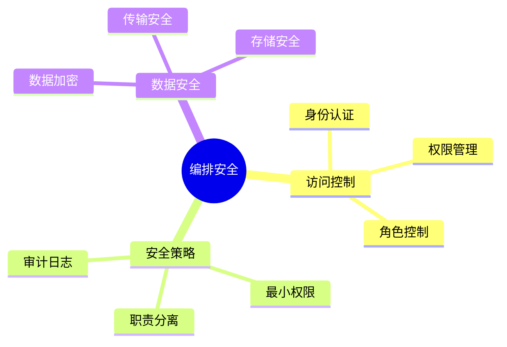

# 数据库数据编排模型-编排安全与访问控制的形式化

> **文档版本**: v1.0
> **最后更新**: 2025-01-16
> **版本覆盖**: PostgreSQL 18.x (推荐) ⭐ | 17.x (推荐) | 16.x (兼容)
> **文档状态**: 🟡 框架已创建，内容待完善

---

## 📋 目录

- [数据库数据编排模型-编排安全与访问控制的形式化](#数据库数据编排模型-编排安全与访问控制的形式化)
  - [📋 目录](#-目录)
  - [1. 概述](#1-概述)
    - [1.0 数据库数据编排模型工作原理概述](#10-数据库数据编排模型工作原理概述)
    - [1.1 本文档的范围](#11-本文档的范围)
  - [2. 核心内容](#2-核心内容)
    - [2.1 访问控制](#21-访问控制)
    - [2.2 安全策略](#22-安全策略)
  - [3. 形式化定义](#3-形式化定义)
    - [3.1 安全形式化](#31-安全形式化)
  - [4. 实际应用](#4-实际应用)
    - [4.1 安全实现](#41-安全实现)
  - [5. 相关文档](#5-相关文档)
    - [5.1 理论基础文档](#51-理论基础文档)
  - [6. 参考文献](#6-参考文献)

---

## 1. 概述

### 1.0 数据库数据编排模型工作原理概述

**编排安全**：

编排安全通过访问控制来保护编排资源。

**安全模型思维导图**：



### 1.1 本文档的范围

本文档涵盖：

- **访问控制**：身份认证和权限管理
- **安全策略**：安全策略定义
- **实际应用**：安全系统

---

## 2. 核心内容

### 2.1 访问控制

**访问控制模型**：

```haskell
-- 访问控制
data AccessControl = AccessControl {
    subject :: Subject,
    object :: Object,
    permission :: Permission
}

-- 权限检查
checkPermission :: Subject -> Object -> Permission -> Bool
checkPermission subject object permission =
    hasPermission(subject, object, permission)
```

### 2.2 安全策略

**策略类型**：

| 类型 | 定义 | 实施方式 |
|------|------|---------|
| **最小权限** | 最小必要权限 | 权限限制 |
| **职责分离** | 关键操作分离 | 多人审批 |
| **审计** | 操作记录 | 日志记录 |

---

## 3. 形式化定义

### 3.1 安全形式化

**访问控制**：

```haskell
-- 访问控制形式化
AccessControl = (S, O, P, A)
where
    S = subject set
    O = object set
    P = permission set
    A = access matrix
```

---

## 4. 实际应用

### 4.1 安全实现

**权限管理**：

```sql
-- 创建角色
CREATE ROLE pipeline_operator;

-- 授予权限
GRANT EXECUTE ON pipeline TO pipeline_operator;

-- 权限检查
SELECT has_pipeline_permission('pipeline_id', current_user);
```

---

## 5. 相关文档

### 5.1 理论基础文档

- [形式语言与证明：总论](./1.1.25-形式语言与证明-总论.md)
- [理论基础导航](./README.md)

---

## 6. 参考文献

[待补充]

---

**最后更新**: 2025-01-16
**维护者**: Documentation Team
**状态**: 🟡 框架已创建，内容待完善
