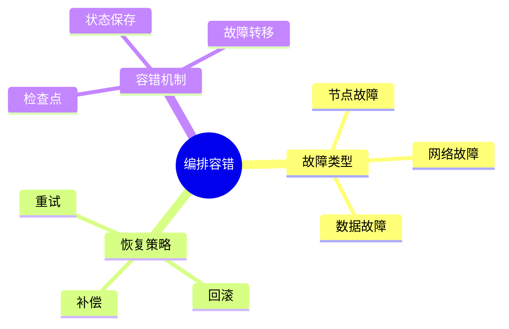

# 数据库数据编排模型-编排容错与故障恢复的形式化

> **文档版本**: v1.0
> **最后更新**: 2025-01-16
> **版本覆盖**: PostgreSQL 18.x (推荐) ⭐ | 17.x (推荐) | 16.x (兼容)
> **文档状态**: 🟡 框架已创建，内容待完善

---

## 📋 目录

- [数据库数据编排模型-编排容错与故障恢复的形式化](#数据库数据编排模型-编排容错与故障恢复的形式化)
  - [📋 目录](#-目录)
  - [1. 概述](#1-概述)
    - [1.1 本文档的范围](#11-本文档的范围)
  - [2. 核心内容](#2-核心内容)
  - [3. 形式化定义](#3-形式化定义)
  - [4. 实际应用](#4-实际应用)
  - [5. 相关文档](#5-相关文档)
    - [5.1 理论基础文档](#51-理论基础文档)
  - [6. 参考文献](#6-参考文献)

---

## 1. 概述

### 1.0 数据库数据编排模型工作原理概述

**编排容错**：

编排容错通过故障恢复机制来保证系统可靠性。

**容错模型思维导图**：



### 1.1 本文档的范围

本文档涵盖：

- **故障类型**：各种故障类型
- **恢复策略**：故障恢复方法
- **实际应用**：容错系统

---

## 2. 核心内容

### 2.1 故障恢复

**恢复策略**：

```haskell
-- 故障恢复
recover :: Failure -> State -> State
recover failure state =
    case failure.type of
        Transient -> retry(state)
        Permanent -> rollback(state)
        Partial -> compensate(state)
```

### 2.2 容错机制

**容错方法**：

| 方法 | 定义 | 适用场景 |
|------|------|---------|
| **重试** | 重新执行 | 临时故障 |
| **回滚** | 回退状态 | 永久故障 |
| **补偿** | 补偿操作 | 部分故障 |

---

## 3. 形式化定义

### 3.1 容错形式化

**容错**：

```haskell
-- 容错形式化
FaultTolerant = (S, F, R)
where
    S = state set
    F = failure set
    R = recovery function
```

---

## 4. 实际应用

### 4.1 容错实现

**故障恢复**：

```sql
-- 检查点
CREATE TABLE checkpoints (
    workflow_id UUID,
    checkpoint_id UUID,
    state_data JSONB,
    created_at TIMESTAMP
);

-- 故障恢复
SELECT recover_from_checkpoint('workflow_id', 'checkpoint_id');
```

---

## 5. 相关文档

### 5.1 理论基础文档

- [形式语言与证明：总论](./1.1.25-形式语言与证明-总论.md)
- [理论基础导航](./README.md)

---

## 6. 参考文献

### 6.1 核心理论文献

- **Lamport, L., et al. (1982). "The Byzantine Generals Problem."**
  - 会议: TOPLAS 1982
  - **重要性**: 拜占庭故障的经典论文
  - **核心贡献**: 定义了故障模型

- **Cristian, F. (1991). "Understanding Fault-Tolerant Distributed Systems."**
  - 会议: CACM 1991
  - **重要性**: 容错分布式系统综述
  - **核心贡献**: 总结了故障恢复策略

### 6.2 PostgreSQL实现相关

- **PostgreSQL官方文档 - 高可用](<https://www.postgresql.org/docs/current/high-availability.html>)**
  - PostgreSQL高可用实现说明

### 6.3 相关文档

- [数据库容错与高可用-故障模型与恢复策略的形式化](../06-存储与恢复/06.08-数据库容错与高可用-故障模型与恢复策略的形式化.md)
- [理论基础导航](../README.md)

---

**最后更新**: 2025-01-16
**维护者**: Documentation Team
**状态**: 🟡 框架已创建，内容待完善
