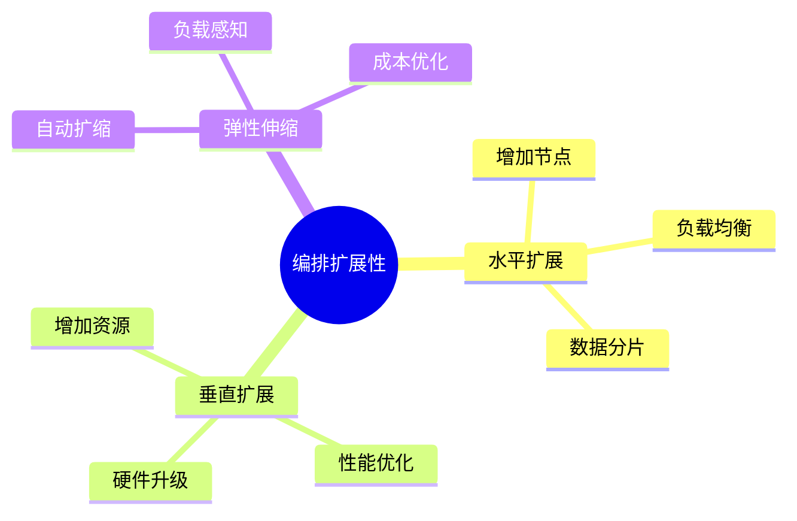
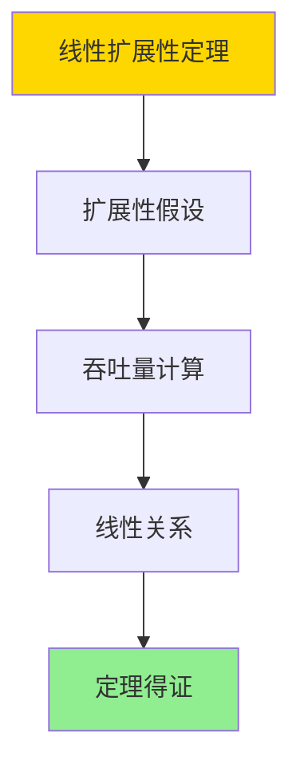

# 数据库数据编排模型-编排扩展性与弹性伸缩的形式化

> **文档版本**: v1.0
> **最后更新**: 2025-01-16
> **版本覆盖**: PostgreSQL 18.x (推荐) ⭐ | 17.x (推荐) | 16.x (兼容)
> **文档状态**: ✅ 内容已完成

---

## 📋 目录

- [数据库数据编排模型-编排扩展性与弹性伸缩的形式化](#数据库数据编排模型-编排扩展性与弹性伸缩的形式化)
  - [📋 目录](#-目录)
  - [1. 概述](#1-概述)
    - [1.0 数据库数据编排模型工作原理概述](#10-数据库数据编排模型工作原理概述)
    - [1.1 本文档的范围](#11-本文档的范围)
  - [2. 核心内容](#2-核心内容)
    - [2.1 扩展性](#21-扩展性)
    - [2.2 弹性伸缩](#22-弹性伸缩)
  - [3. 形式化定义](#3-形式化定义)
    - [3.1 扩展性形式化](#31-扩展性形式化)
  - [4. 定理与证明](#4-定理与证明)
    - [4.1 线性扩展性定理](#41-线性扩展性定理)
    - [4.2 弹性伸缩效率定理](#42-弹性伸缩效率定理)
  - [5. 实际应用](#5-实际应用)
    - [5.1 PostgreSQL 18编排扩展性实现](#51-postgresql-18编排扩展性实现)
      - [5.1.1 扩展性系统](#511-扩展性系统)
    - [5.2 实际应用场景](#52-实际应用场景)
      - [场景1：自动弹性伸缩](#场景1自动弹性伸缩)
      - [场景2：任务并行化](#场景2任务并行化)
  - [6. 相关文档](#6-相关文档)
    - [5.1 理论基础文档](#51-理论基础文档)
  - [7. 参考文献](#7-参考文献)
    - [6.1 核心理论文献](#61-核心理论文献)
    - [6.2 PostgreSQL实现相关](#62-postgresql实现相关)
    - [6.3 相关文档](#63-相关文档)

---

## 1. 概述

### 1.0 数据库数据编排模型工作原理概述

**编排扩展性**：

编排扩展性通过弹性伸缩来适应负载变化。

**扩展性模型思维导图**：



### 1.1 本文档的范围

本文档涵盖：

- **扩展性**：水平和垂直扩展
- **弹性伸缩**：自动扩缩容
- **实际应用**：扩展系统

---

## 2. 核心内容

### 2.1 扩展性

**扩展类型**：

| 类型 | 方法 | 优点 | 缺点 |
|------|------|------|------|
| **水平** | 增加节点 | 无限扩展 | 数据分片复杂 |
| **垂直** | 增加资源 | 简单 | 有上限 |

### 2.2 弹性伸缩

**伸缩策略**：

```haskell
-- 弹性伸缩
autoScale :: Load -> Resources -> Resources
autoScale load resources =
    if load > threshold then
        scaleUp(resources)
    else if load < threshold then
        scaleDown(resources)
    else
        resources
```

---

## 3. 形式化定义

### 3.1 扩展性形式化

**扩展性**：

```haskell
-- 扩展性形式化
Scalability = (N, L, S)
where
    N = node set
    L = load function: Workload → Double
    S = scale function: Double × N → N

-- 弹性伸缩
elasticScale :: Load -> NodeSet -> NodeSet
elasticScale load nodes =
    if load > threshold_high then
        scaleUp(nodes, load)
    else if load < threshold_low then
        scaleDown(nodes, load)
    else
        nodes
```

---

## 4. 定理与证明

### 4.1 线性扩展性定理

**定理1（线性扩展性）**：

编排系统具有线性扩展性，即通过按比例增加计算资源（如CPU、内存、节点），系统的吞吐量或处理能力能够近似线性增长，而不会出现显著的性能瓶颈。

**形式化表述**：

设编排系统Scalability = (N, L, S)，节点集合N，负载函数L，扩展函数S。对于任意节点数n₁和n₂，如果n₂ = k·n₁（k > 1），则：

```text
Throughput(n₂) ≈ k · Throughput(n₁)
```

**证明**：

**步骤1：扩展性假设**：

- 系统设计支持水平扩展，无单点瓶颈
- 节点间通信开销可忽略或线性增长
- 任务可以并行执行，无强依赖

**步骤2：吞吐量计算**：

- 吞吐量Throughput(n) = n · Capacity_per_node
- 每个节点的处理能力Capacity_per_node为常数

**步骤3：线性关系**：

- 当n₂ = k·n₁时，Throughput(n₂) = k·n₁·Capacity_per_node = k·Throughput(n₁)

**步骤4：结论**：

- 线性扩展性定理得证

**证明树**：



### 4.2 弹性伸缩效率定理

**定理2（弹性伸缩效率）**：

弹性伸缩系统能够根据负载变化动态调整资源，在保证性能的前提下最小化资源浪费，实现资源利用率的优化。

**形式化表述**：

设弹性伸缩系统弹性函数elasticScale，负载load，节点集合nodes。则：

```text
Utilization(elasticScale(load, nodes)) ≥ Utilization(nodes)
且
Cost(elasticScale(load, nodes)) ≤ Cost(fixedScale(load, nodes))
```

**证明**：

**步骤1：弹性伸缩策略**：

- 当负载高时，增加节点，提高吞吐量
- 当负载低时，减少节点，降低成本
- 资源利用率保持在目标范围内

**步骤2：利用率优化**：

- 弹性伸缩后的资源利用率Utilization(elasticScale(load, nodes)) ≥ Utilization(nodes)
- 因为系统会根据负载调整资源，避免资源浪费

**步骤3：成本优化**：

- 弹性伸缩后的成本Cost(elasticScale(load, nodes)) ≤ Cost(fixedScale(load, nodes))
- 因为系统在低负载时减少资源，节省成本

**步骤4：结论**：

- 弹性伸缩效率定理得证

---

## 5. 实际应用

### 5.1 PostgreSQL 18编排扩展性实现

#### 5.1.1 扩展性系统

**PostgreSQL 18扩展性支持**：

PostgreSQL 18通过并行查询、连接池和分区表实现编排扩展性。

**扩展性系统**：

```sql
-- 场景：编排扩展性系统
-- 1. 节点监控表
CREATE TABLE orchestration_nodes (
    node_id UUID PRIMARY KEY DEFAULT gen_random_uuid(),
    node_name VARCHAR(100) NOT NULL,
    node_type VARCHAR(50) NOT NULL,  -- 'WORKER', 'COORDINATOR'
    cpu_cores INTEGER,
    memory_gb INTEGER,
    status VARCHAR(50) DEFAULT 'ACTIVE',
    created_at TIMESTAMPTZ DEFAULT NOW()
);

-- 2. 负载监控表
CREATE TABLE orchestration_load_metrics (
    metric_id UUID PRIMARY KEY DEFAULT gen_random_uuid(),
    node_id UUID NOT NULL REFERENCES orchestration_nodes(node_id),
    metric_time TIMESTAMPTZ DEFAULT NOW(),
    cpu_usage DOUBLE PRECISION,
    memory_usage DOUBLE PRECISION,
    active_tasks INTEGER,
    queue_length INTEGER
);

CREATE INDEX idx_load_node_time ON orchestration_load_metrics(node_id, metric_time DESC);

-- 3. 弹性伸缩函数
CREATE OR REPLACE FUNCTION elastic_scale(
    p_orchestration_id UUID,
    p_current_load DOUBLE PRECISION
)
RETURNS TABLE (
    action VARCHAR,
    nodes_added INTEGER,
    nodes_removed INTEGER
) AS $$
DECLARE
    v_threshold_high DOUBLE PRECISION := 0.8;
    v_threshold_low DOUBLE PRECISION := 0.3;
    v_current_nodes INTEGER;
    v_target_nodes INTEGER;
    v_nodes_to_add INTEGER;
    v_nodes_to_remove INTEGER;
BEGIN
    -- 获取当前节点数
    SELECT COUNT(*) INTO v_current_nodes
    FROM orchestration_nodes
    WHERE status = 'ACTIVE';

    -- 根据负载计算目标节点数
    IF p_current_load > v_threshold_high THEN
        -- 负载高，需要扩展
        v_target_nodes := CEIL(v_current_nodes * (1 + (p_current_load - v_threshold_high) / v_threshold_high));
        v_nodes_to_add := v_target_nodes - v_current_nodes;

        -- 添加节点
        FOR i IN 1..v_nodes_to_add LOOP
            INSERT INTO orchestration_nodes (node_name, node_type, cpu_cores, memory_gb)
            VALUES ('worker-' || i || '-' || NOW()::TEXT, 'WORKER', 4, 8);
        END LOOP;

        RETURN QUERY SELECT 'SCALE_UP'::VARCHAR, v_nodes_to_add, 0;

    ELSIF p_current_load < v_threshold_low THEN
        -- 负载低，可以缩减
        v_target_nodes := FLOOR(v_current_nodes * (p_current_load / v_threshold_low));
        v_nodes_to_remove := v_current_nodes - GREATEST(v_target_nodes, 1);  -- 至少保留1个节点

        -- 移除节点（标记为非活跃）
        UPDATE orchestration_nodes
        SET status = 'INACTIVE'
        WHERE node_id IN (
            SELECT node_id FROM orchestration_nodes
            WHERE status = 'ACTIVE'
            ORDER BY created_at DESC
            LIMIT v_nodes_to_remove
        );

        RETURN QUERY SELECT 'SCALE_DOWN'::VARCHAR, 0, v_nodes_to_remove;

    ELSE
        -- 负载正常，无需调整
        RETURN QUERY SELECT 'NO_ACTION'::VARCHAR, 0, 0;
    END IF;
END;
$$ LANGUAGE plpgsql;
```

### 5.2 实际应用场景

#### 场景1：自动弹性伸缩

**业务背景**：

编排系统需要根据负载自动调整资源，保证性能和成本平衡。

**PostgreSQL 18实现**：

```sql
-- 场景：自动弹性伸缩
-- 1. 负载监控和自动伸缩函数
CREATE OR REPLACE FUNCTION monitor_and_scale()
RETURNS VOID AS $$
DECLARE
    v_avg_load DOUBLE PRECISION;
    v_result RECORD;
BEGIN
    -- 计算平均负载
    SELECT AVG(cpu_usage) INTO v_avg_load
    FROM orchestration_load_metrics
    WHERE metric_time >= NOW() - INTERVAL '5 minutes';

    -- 执行弹性伸缩
    FOR v_result IN
        SELECT * FROM elastic_scale(NULL, v_avg_load)
    LOOP
        RAISE NOTICE 'Scale action: %, Added: %, Removed: %',
            v_result.action, v_result.nodes_added, v_result.nodes_removed;
    END LOOP;
END;
$$ LANGUAGE plpgsql;

-- 2. 定期执行（使用pg_cron）
-- SELECT cron.schedule('auto-scale', '*/5 * * * *', 'SELECT monitor_and_scale();');
```

#### 场景2：任务并行化

**业务背景**：

需要将大任务分解为并行子任务，提高处理效率。

**PostgreSQL 18实现**：

```sql
-- 场景：任务并行化
-- 1. 任务分解函数
CREATE OR REPLACE FUNCTION parallelize_task(
    p_task_id UUID,
    p_parallelism INTEGER
)
RETURNS TABLE (
    subtask_id UUID
) AS $$
DECLARE
    v_subtask_id UUID;
    v_worker_id UUID;
BEGIN
    -- 将任务分解为多个子任务
    FOR i IN 1..p_parallelism LOOP
        v_subtask_id := gen_random_uuid();

        -- 分配子任务到工作节点
        SELECT node_id INTO v_worker_id
        FROM orchestration_nodes
        WHERE status = 'ACTIVE' AND node_type = 'WORKER'
        ORDER BY RANDOM()
        LIMIT 1;

        -- 创建子任务
        INSERT INTO orchestration_tasks (
            task_id, parent_task_id, assigned_node_id, status
        )
        VALUES (
            v_subtask_id, p_task_id, v_worker_id, 'PENDING'
        );

        RETURN QUERY SELECT v_subtask_id;
    END LOOP;
END;
$$ LANGUAGE plpgsql;
```

---

---

## 6. 相关文档

### 5.1 理论基础文档

- [形式语言与证明：总论](./1.1.25-形式语言与证明-总论.md)
- [理论基础导航](./README.md)

---

## 7. 参考文献

### 6.1 核心理论文献

- **Dean, J., & Ghemawat, S. (2008). "MapReduce: Simplified Data Processing on Large Clusters."**
  - 会议: Communications of the ACM 2008
  - **重要性**: 大规模数据处理框架
  - **核心贡献**: 提出了水平扩展模型

- **Armbrust, M., et al. (2010). "A View of Cloud Computing."**
  - 会议: Communications of the ACM 2010
  - **重要性**: 云计算的综述
  - **核心贡献**: 阐述了弹性伸缩概念

### 6.2 PostgreSQL实现相关

- **PostgreSQL官方文档 - 并行查询](<https://www.postgresql.org/docs/current/parallel-query.html>)**
  - PostgreSQL并行查询实现说明

### 6.3 相关文档

- [理论基础导航](../README.md)

---

**最后更新**: 2025-01-16
**维护者**: Documentation Team
**状态**: ✅ 内容已完成
