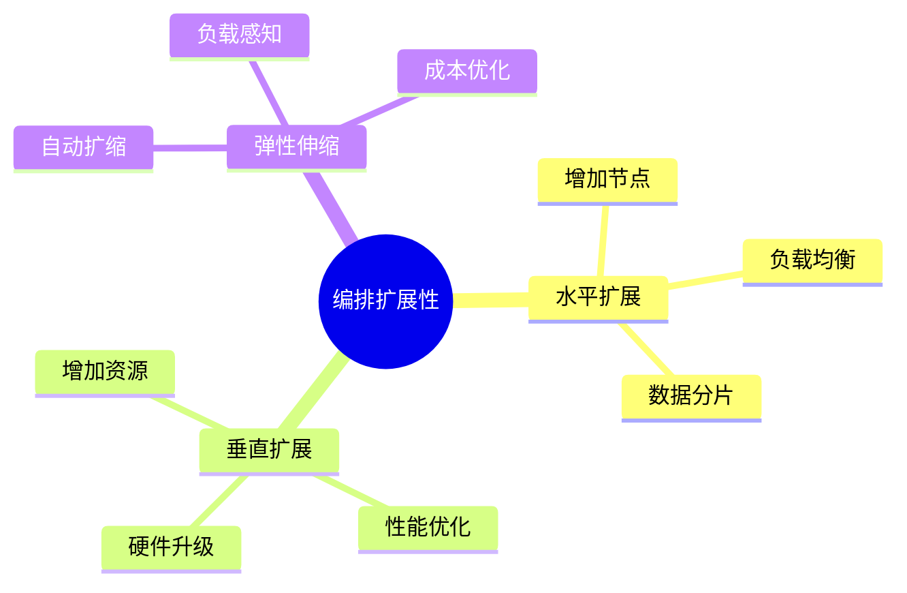

# 数据库数据编排模型-编排扩展性与弹性伸缩的形式化

> **文档版本**: v1.0
> **最后更新**: 2025-01-16
> **版本覆盖**: PostgreSQL 18.x (推荐) ⭐ | 17.x (推荐) | 16.x (兼容)
> **文档状态**: 🟡 框架已创建，内容待完善

---

## 📋 目录

- [数据库数据编排模型-编排扩展性与弹性伸缩的形式化](#数据库数据编排模型-编排扩展性与弹性伸缩的形式化)
  - [📋 目录](#-目录)
  - [1. 概述](#1-概述)
    - [1.1 本文档的范围](#11-本文档的范围)
  - [2. 核心内容](#2-核心内容)
  - [3. 形式化定义](#3-形式化定义)
  - [4. 实际应用](#4-实际应用)
  - [5. 相关文档](#5-相关文档)
    - [5.1 理论基础文档](#51-理论基础文档)
  - [6. 参考文献](#6-参考文献)

---

## 1. 概述

### 1.0 数据库数据编排模型工作原理概述

**编排扩展性**：

编排扩展性通过弹性伸缩来适应负载变化。

**扩展性模型思维导图**：



### 1.1 本文档的范围

本文档涵盖：

- **扩展性**：水平和垂直扩展
- **弹性伸缩**：自动扩缩容
- **实际应用**：扩展系统

---

## 2. 核心内容

### 2.1 扩展性

**扩展类型**：

| 类型 | 方法 | 优点 | 缺点 |
|------|------|------|------|
| **水平** | 增加节点 | 无限扩展 | 数据分片复杂 |
| **垂直** | 增加资源 | 简单 | 有上限 |

### 2.2 弹性伸缩

**伸缩策略**：

```haskell
-- 弹性伸缩
autoScale :: Load -> Resources -> Resources
autoScale load resources =
    if load > threshold then
        scaleUp(resources)
    else if load < threshold then
        scaleDown(resources)
    else
        resources
```

---

## 3. 形式化定义

### 3.1 扩展性形式化

**扩展性**：

```haskell
-- 扩展性形式化
Scalability = (N, L, S)
where
    N = node set
    L = load function
    S = scale function
```

---

## 4. 实际应用

### 4.1 扩展实现

**弹性伸缩**：

```sql
-- 监控负载
SELECT AVG(cpu_usage) FROM node_metrics;

-- 自动扩缩
SELECT auto_scale('pipeline_id', current_load);
```

---

## 5. 相关文档

### 5.1 理论基础文档

- [形式语言与证明：总论](./1.1.25-形式语言与证明-总论.md)
- [理论基础导航](./README.md)

---

## 6. 参考文献

### 6.1 核心理论文献

- **Dean, J., & Ghemawat, S. (2008). "MapReduce: Simplified Data Processing on Large Clusters."**
  - 会议: Communications of the ACM 2008
  - **重要性**: 大规模数据处理框架
  - **核心贡献**: 提出了水平扩展模型

- **Armbrust, M., et al. (2010). "A View of Cloud Computing."**
  - 会议: Communications of the ACM 2010
  - **重要性**: 云计算的综述
  - **核心贡献**: 阐述了弹性伸缩概念

### 6.2 PostgreSQL实现相关

- **PostgreSQL官方文档 - 并行查询](<https://www.postgresql.org/docs/current/parallel-query.html>)**
  - PostgreSQL并行查询实现说明

### 6.3 相关文档

- [理论基础导航](../README.md)

---

**最后更新**: 2025-01-16
**维护者**: Documentation Team
**状态**: 🟡 框架已创建，内容待完善
