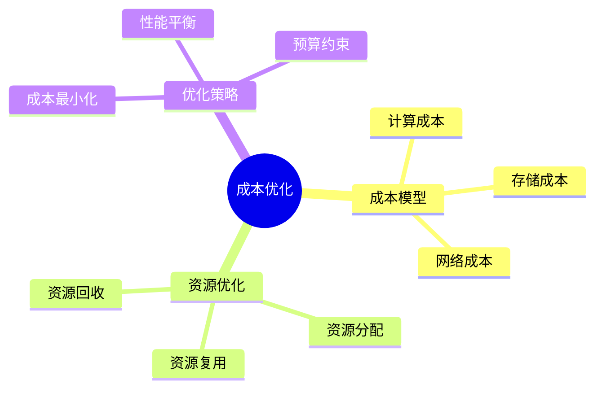

# 数据库数据编排模型-编排成本与资源优化的形式化

> **文档版本**: v1.0
> **最后更新**: 2025-01-16
> **版本覆盖**: PostgreSQL 18.x (推荐) ⭐ | 17.x (推荐) | 16.x (兼容)
> **文档状态**: 🟡 框架已创建，内容待完善

---

## 📋 目录

- [数据库数据编排模型-编排成本与资源优化的形式化](#数据库数据编排模型-编排成本与资源优化的形式化)
  - [📋 目录](#-目录)
  - [1. 概述](#1-概述)
    - [1.1 本文档的范围](#11-本文档的范围)
  - [2. 核心内容](#2-核心内容)
  - [3. 形式化定义](#3-形式化定义)
  - [4. 实际应用](#4-实际应用)
  - [5. 相关文档](#5-相关文档)
    - [5.1 理论基础文档](#51-理论基础文档)
  - [6. 参考文献](#6-参考文献)

---

## 1. 概述

### 1.0 数据库数据编排模型工作原理概述

**编排成本优化**：

编排成本优化通过资源优化来降低执行成本。

**成本优化思维导图**：



### 1.1 本文档的范围

本文档涵盖：

- **成本模型**：成本计算模型
- **资源优化**：资源分配策略
- **实际应用**：成本优化系统

---

## 2. 核心内容

### 2.1 成本模型

**成本计算**：

```haskell
-- 成本模型
data Cost = Cost {
    computeCost :: Double,
    storageCost :: Double,
    networkCost :: Double
}

-- 总成本
totalCost :: Cost -> Double
totalCost cost = computeCost cost + storageCost cost + networkCost cost
```

### 2.2 资源优化

**优化目标**：

| 目标 | 定义 | 优化方法 |
|------|------|---------|
| **成本最小** | 最小化总成本 | 资源复用 |
| **性能平衡** | 成本性能权衡 | 动态调整 |
| **预算约束** | 不超过预算 | 预算控制 |

---

## 3. 形式化定义

### 3.1 成本形式化

**成本**：

```haskell
-- 成本形式化
Cost(orchestration) = Σ cost(resource)
where resource in used_resources(orchestration)
```

---

## 4. 实际应用

### 4.1 成本优化

**成本分析**：

```sql
-- 成本统计
SELECT 
    workflow_id,
    SUM(compute_cost) AS total_cost
FROM resource_usage
GROUP BY workflow_id;
```

---

## 5. 相关文档

### 5.1 理论基础文档

- [形式语言与证明：总论](./1.1.25-形式语言与证明-总论.md)
- [理论基础导航](./README.md)

---

## 6. 参考文献

[待补充]

---

**最后更新**: 2025-01-16
**维护者**: Documentation Team
**状态**: 🟡 框架已创建，内容待完善
