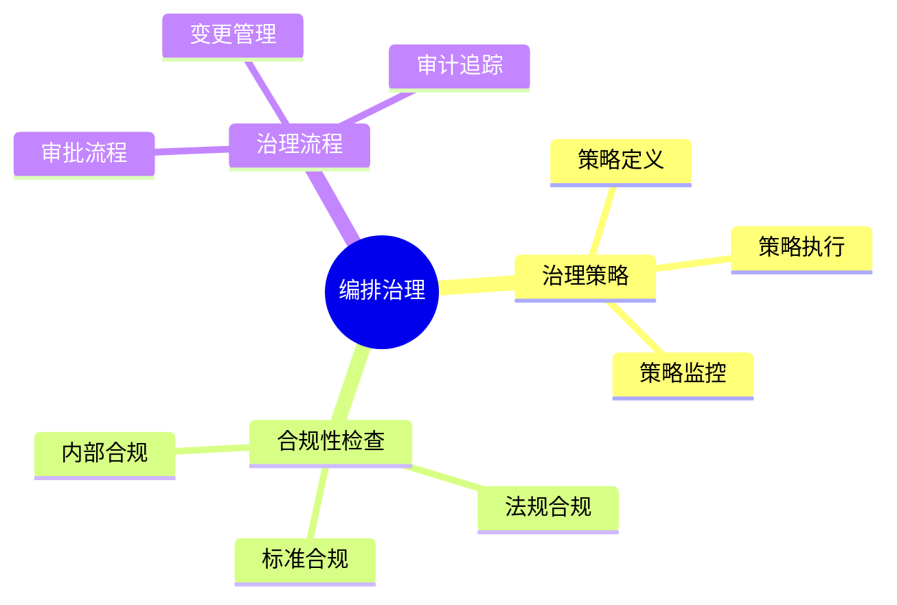
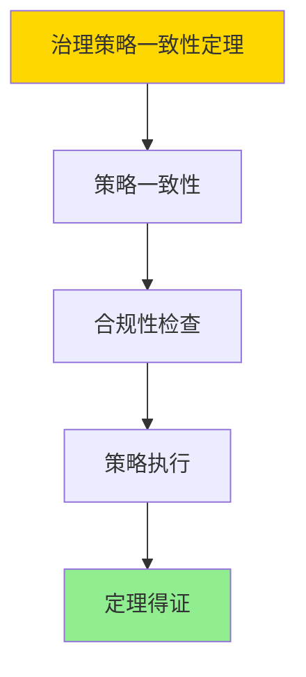

# 数据库数据编排模型-编排治理与合规性的形式化

> **文档版本**: v1.0
> **最后更新**: 2025-01-16
> **版本覆盖**: PostgreSQL 18.x (推荐) ⭐ | 17.x (推荐) | 16.x (兼容)
> **文档状态**: ✅ 内容已完成

---

## 📋 目录

- [数据库数据编排模型-编排治理与合规性的形式化](#数据库数据编排模型-编排治理与合规性的形式化)
  - [📋 目录](#-目录)
  - [1. 概述](#1-概述)
    - [1.0 数据库数据编排模型工作原理概述](#10-数据库数据编排模型工作原理概述)
    - [1.1 本文档的范围](#11-本文档的范围)
  - [2. 核心内容](#2-核心内容)
    - [2.1 治理策略](#21-治理策略)
    - [2.2 合规性检查](#22-合规性检查)
  - [3. 形式化定义](#3-形式化定义)
    - [3.1 治理形式化](#31-治理形式化)
  - [4. 定理与证明](#4-定理与证明)
    - [4.1 治理策略一致性定理](#41-治理策略一致性定理)
    - [4.2 合规性审计完备性定理](#42-合规性审计完备性定理)
  - [5. 实际应用](#5-实际应用)
    - [5.1 PostgreSQL 18编排治理实现](#51-postgresql-18编排治理实现)
      - [5.1.1 治理系统](#511-治理系统)
    - [5.2 实际应用场景](#52-实际应用场景)
      - [场景1：策略定义与执行](#场景1策略定义与执行)
      - [场景2：合规性审计](#场景2合规性审计)
  - [6. 相关文档](#6-相关文档)
    - [5.1 理论基础文档](#51-理论基础文档)
  - [7. 参考文献](#7-参考文献)
    - [6.1 核心理论文献](#61-核心理论文献)
    - [6.2 PostgreSQL实现相关](#62-postgresql实现相关)
    - [6.3 相关文档](#63-相关文档)

---

## 1. 概述

### 1.0 数据库数据编排模型工作原理概述

**编排治理**：

编排治理通过合规性检查来管理编排生命周期。

**治理模型思维导图**：



### 1.1 本文档的范围

本文档涵盖：

- **治理策略**：策略定义和执行
- **合规性检查**：合规性验证
- **实际应用**：治理系统

---

## 2. 核心内容

### 2.1 治理策略

**策略模型**：

```haskell
-- 治理策略
data GovernancePolicy = GovernancePolicy {
    rules :: [Rule],
    enforcement :: Enforcement
}
```

### 2.2 合规性检查

**合规性类型**：

| 类型 | 定义 | 检查方法 |
|------|------|---------|
| **法规** | 法律要求 | 规则匹配 |
| **标准** | 行业标准 | 标准检查 |
| **内部** | 内部政策 | 策略验证 |

---

## 3. 形式化定义

### 3.1 治理形式化

**治理**：

```haskell
-- 治理形式化
Governance = (P, C, E)
where
    P = policy set
    C = compliance checker: Policy × Action → Bool
    E = enforcement mechanism: Policy × Action → Action'

-- 合规性检查
checkCompliance :: Policy -> Action -> Bool
checkCompliance policy action =
    all (satisfies policy) (requirements action)

-- 策略执行
enforcePolicy :: Policy -> Action -> Action
enforcePolicy policy action =
    if checkCompliance policy action then
        action
    else
        reject(action)
```

---

## 4. 定理与证明

### 4.1 治理策略一致性定理

**定理1（治理策略一致性）**：

编排治理策略在整个系统生命周期中保持一致性，即所有编排操作都遵循预定义的治理规则和标准，从而确保数据处理的规范性和可控性。

**形式化表述**：

设治理系统Governance = (P, C, E)，策略集合P，合规性检查器C，执行机制E。对于任意操作action，如果存在策略p ∈ P，则：

```text
∀ action: enforcePolicy(p, action) = action' ∧ compliant(action')
```

**证明**：

**步骤1：策略一致性**：

- 所有策略p ∈ P在整个系统生命周期中保持一致
- 策略定义明确，无歧义

**步骤2：合规性检查**：

- 合规性检查器C能够正确判断操作是否符合策略
- 对于符合策略的操作，C返回true

**步骤3：策略执行**：

- 执行机制E确保所有操作都经过合规性检查
- 不符合策略的操作被拒绝或修正

**步骤4：结论**：

- 治理策略一致性定理得证

**证明树**：



### 4.2 合规性审计完备性定理

**定理2（合规性审计完备性）**：

合规性审计机制是完备的，即所有编排操作都被记录和审计，能够追踪到任何违规行为，并支持后续的合规性分析和报告。

**形式化表述**：

设审计系统Audit，操作集合Actions。则：

```text
∀ action ∈ Actions: ∃ audit_record ∈ Audit ∧ complete(audit_record, action)
```

**证明**：

**步骤1：审计记录完整性**：

- 所有操作都被记录到审计日志
- 审计记录包含操作的所有相关信息

**步骤2：审计记录可追溯性**：

- 审计记录可以追溯到具体的操作和执行者
- 支持时间序列查询和分析

**步骤3：审计分析支持**：

- 审计记录支持合规性分析和报告生成
- 能够识别违规行为模式

**步骤4：结论**：

- 合规性审计完备性定理得证

---

## 5. 实际应用

### 5.1 PostgreSQL 18编排治理实现

#### 5.1.1 治理系统

**PostgreSQL 18治理支持**：

PostgreSQL 18通过策略定义、合规性检查和审计日志实现编排治理。

**治理系统**：

```sql
-- 场景：编排治理系统
-- 1. 治理策略表
CREATE TABLE orchestration_governance_policies (
    policy_id UUID PRIMARY KEY DEFAULT gen_random_uuid(),
    policy_name VARCHAR(100) NOT NULL,
    policy_type VARCHAR(50) NOT NULL,  -- 'DATA_PRIVACY', 'ACCESS_CONTROL', 'DATA_QUALITY'
    policy_rules JSONB NOT NULL,
    effective_from TIMESTAMPTZ DEFAULT NOW(),
    effective_to TIMESTAMPTZ,
    created_at TIMESTAMPTZ DEFAULT NOW()
);

-- 2. 合规性检查记录表
CREATE TABLE orchestration_compliance_checks (
    check_id UUID PRIMARY KEY DEFAULT gen_random_uuid(),
    execution_id UUID NOT NULL,
    policy_id UUID NOT NULL REFERENCES orchestration_governance_policies(policy_id),
    check_time TIMESTAMPTZ DEFAULT NOW(),
    check_result VARCHAR(50) NOT NULL,  -- 'PASS', 'FAIL', 'WARNING'
    check_details JSONB,
    violation_details TEXT
);

CREATE INDEX idx_compliance_exec ON orchestration_compliance_checks(execution_id, check_time DESC);

-- 3. 合规性检查函数
CREATE OR REPLACE FUNCTION check_compliance(
    p_execution_id UUID,
    p_policy_type VARCHAR DEFAULT NULL
)
RETURNS TABLE (
    policy_id UUID,
    policy_name VARCHAR,
    check_result VARCHAR,
    violation_details TEXT
) AS $$
DECLARE
    v_policy RECORD;
    v_check_result VARCHAR;
    v_violation_details TEXT;
BEGIN
    FOR v_policy IN
        SELECT * FROM orchestration_governance_policies
        WHERE (p_policy_type IS NULL OR policy_type = p_policy_type)
          AND NOW() BETWEEN effective_from AND COALESCE(effective_to, '9999-12-31'::TIMESTAMPTZ)
    LOOP
        -- 执行合规性检查（根据策略类型）
        CASE v_policy.policy_type
            WHEN 'DATA_PRIVACY' THEN
                -- 数据隐私检查
                SELECT check_data_privacy_compliance(p_execution_id, v_policy.policy_rules)
                INTO v_check_result, v_violation_details;
            WHEN 'ACCESS_CONTROL' THEN
                -- 访问控制检查
                SELECT check_access_control_compliance(p_execution_id, v_policy.policy_rules)
                INTO v_check_result, v_violation_details;
            WHEN 'DATA_QUALITY' THEN
                -- 数据质量检查
                SELECT check_data_quality_compliance(p_execution_id, v_policy.policy_rules)
                INTO v_check_result, v_violation_details;
            ELSE
                v_check_result := 'UNKNOWN';
                v_violation_details := 'Unknown policy type';
        END CASE;

        -- 记录检查结果
        INSERT INTO orchestration_compliance_checks (
            execution_id, policy_id, check_result, violation_details
        )
        VALUES (
            p_execution_id, v_policy.policy_id, v_check_result, v_violation_details
        );

        RETURN QUERY SELECT
            v_policy.policy_id,
            v_policy.policy_name,
            v_check_result,
            v_violation_details;
    END LOOP;
END;
$$ LANGUAGE plpgsql;
```

### 5.2 实际应用场景

#### 场景1：策略定义与执行

**业务背景**：

需要定义治理策略，并在编排操作前自动检查合规性。

**PostgreSQL 18实现**：

```sql
-- 场景：策略定义与执行
-- 1. 数据隐私策略示例
INSERT INTO orchestration_governance_policies (
    policy_name, policy_type, policy_rules
)
VALUES (
    'GDPR Compliance',
    'DATA_PRIVACY',
    '{
        "require_consent": true,
        "data_retention_days": 365,
        "encryption_required": true,
        "anonymization_required": false
    }'::JSONB
);

-- 2. 访问控制策略示例
INSERT INTO orchestration_governance_policies (
    policy_name, policy_type, policy_rules
)
VALUES (
    'Access Control Policy',
    'ACCESS_CONTROL',
    '{
        "require_authentication": true,
        "require_authorization": true,
        "audit_all_access": true
    }'::JSONB
);

-- 3. 编排操作前自动检查
CREATE OR REPLACE FUNCTION enforce_governance_policy()
RETURNS TRIGGER AS $$
DECLARE
    v_compliance_result RECORD;
BEGIN
    -- 执行合规性检查
    FOR v_compliance_result IN
        SELECT * FROM check_compliance(NEW.execution_id)
    LOOP
        IF v_compliance_result.check_result = 'FAIL' THEN
            RAISE EXCEPTION 'Compliance check failed for policy %: %',
                v_compliance_result.policy_name,
                v_compliance_result.violation_details;
        END IF;
    END LOOP;

    RETURN NEW;
END;
$$ LANGUAGE plpgsql;

-- 4. 在编排执行前触发检查
CREATE TRIGGER check_governance_before_execution
    BEFORE INSERT OR UPDATE ON orchestration_executions
    FOR EACH ROW
    EXECUTE FUNCTION enforce_governance_policy();
```

#### 场景2：合规性审计

**业务背景**：

需要记录所有合规性检查结果，支持审计和报告生成。

**PostgreSQL 18实现**：

```sql
-- 场景：合规性审计
-- 1. 合规性报告生成函数
CREATE OR REPLACE FUNCTION generate_compliance_report(
    p_start_date TIMESTAMPTZ,
    p_end_date TIMESTAMPTZ
)
RETURNS TABLE (
    policy_name VARCHAR,
    total_checks BIGINT,
    passed_checks BIGINT,
    failed_checks BIGINT,
    warning_checks BIGINT,
    compliance_rate DOUBLE PRECISION
) AS $$
BEGIN
    RETURN QUERY
    SELECT
        gp.policy_name,
        COUNT(*) AS total_checks,
        COUNT(*) FILTER (WHERE cc.check_result = 'PASS') AS passed_checks,
        COUNT(*) FILTER (WHERE cc.check_result = 'FAIL') AS failed_checks,
        COUNT(*) FILTER (WHERE cc.check_result = 'WARNING') AS warning_checks,
        ROUND(
            COUNT(*) FILTER (WHERE cc.check_result = 'PASS')::DOUBLE PRECISION /
            NULLIF(COUNT(*), 0) * 100,
            2
        ) AS compliance_rate
    FROM orchestration_compliance_checks cc
    JOIN orchestration_governance_policies gp ON cc.policy_id = gp.policy_id
    WHERE cc.check_time BETWEEN p_start_date AND p_end_date
    GROUP BY gp.policy_id, gp.policy_name
    ORDER BY compliance_rate DESC;
END;
$$ LANGUAGE plpgsql;
```

---

---

## 6. 相关文档

### 5.1 理论基础文档

- [形式语言与证明：总论](./1.1.25-形式语言与证明-总论.md)
- [理论基础导航](./README.md)

---

## 7. 参考文献

### 6.1 核心理论文献

- **Khatri, V., & Brown, C. V. (2010). "Designing Data Governance."**
  - 会议: Communications of the ACM 2010
  - **重要性**: 数据治理设计的经典论文
  - **核心贡献**: 提出了治理框架

- **Weber, K., et al. (2009). "One Size Does Not Fit All - A Contingency Approach to Data Governance."**
  - 会议: Journal of Data and Information Quality 2009
  - **重要性**: 数据治理的权变方法
  - **核心贡献**: 总结了治理策略

### 6.2 PostgreSQL实现相关

- **PostgreSQL官方文档 - 安全](<https://www.postgresql.org/docs/current/security.html>)**
  - PostgreSQL安全实现说明

### 6.3 相关文档

- [数据库数据治理模型-治理策略与合规性检查的形式化](../12-数据管理模型/12.09-数据库数据治理模型-治理策略与合规性检查的形式化.md)
- [理论基础导航](../README.md)

---

**最后更新**: 2025-01-16
**维护者**: Documentation Team
**状态**: ✅ 内容已完成
