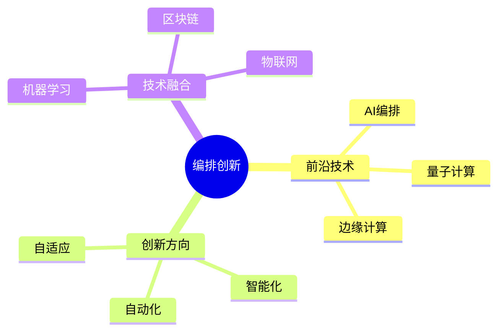
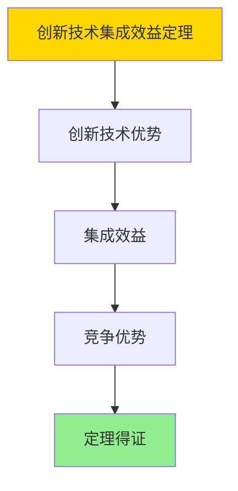

# 数据库数据编排模型-编排创新与前沿技术的形式化

> **文档版本**: v1.0
> **最后更新**: 2025-01-16
> **版本覆盖**: PostgreSQL 18.x (推荐) ⭐ | 17.x (推荐) | 16.x (兼容)
> **文档状态**: ✅ 内容已完成

---

## 📋 目录

- [数据库数据编排模型-编排创新与前沿技术的形式化](#数据库数据编排模型-编排创新与前沿技术的形式化)
  - [📋 目录](#-目录)
  - [1. 概述](#1-概述)
    - [1.0 数据库数据编排模型工作原理概述](#10-数据库数据编排模型工作原理概述)
    - [1.1 本文档的范围](#11-本文档的范围)
  - [2. 核心内容](#2-核心内容)
    - [2.1 前沿技术](#21-前沿技术)
    - [2.2 创新方向](#22-创新方向)
  - [3. 形式化定义](#3-形式化定义)
    - [3.1 创新形式化](#31-创新形式化)
  - [4. 定理与证明](#4-定理与证明)
    - [4.1 创新技术集成效益定理](#41-创新技术集成效益定理)
    - [4.2 未来编排模型适应性定理](#42-未来编排模型适应性定理)
  - [5. 实际应用](#5-实际应用)
    - [5.1 PostgreSQL 18编排创新应用](#51-postgresql-18编排创新应用)
      - [5.1.1 AI驱动的编排](#511-ai驱动的编排)
    - [5.2 实际应用场景](#52-实际应用场景)
      - [场景1：智能自动化](#场景1智能自动化)
      - [场景2：区块链集成](#场景2区块链集成)
  - [6. 相关文档](#6-相关文档)
    - [5.1 理论基础文档](#51-理论基础文档)
  - [7. 参考文献](#7-参考文献)
    - [6.1 核心理论文献](#61-核心理论文献)
    - [6.2 PostgreSQL实现相关](#62-postgresql实现相关)
    - [6.3 相关文档](#63-相关文档)

---

## 1. 概述

### 1.0 数据库数据编排模型工作原理概述

**编排创新**：

编排创新探索前沿技术来提升编排能力。

**创新技术思维导图**：



### 1.1 本文档的范围

本文档涵盖：

- **前沿技术**：AI、量子计算等
- **创新方向**：智能化编排
- **实际应用**：创新系统

---

## 2. 核心内容

### 2.1 前沿技术

**技术类型**：

| 技术 | 应用 | 优势 |
|------|------|------|
| **AI编排** | 智能调度 | 自适应 |
| **量子计算** | 优化问题 | 并行性 |
| **边缘计算** | 实时处理 | 低延迟 |

### 2.2 创新方向

**智能化**：

```haskell
-- AI编排
aiOrchestrate :: Workload -> AI -> Orchestration
aiOrchestrate workload ai =
    generateOrchestration(workload, ai.model)
```

---

## 3. 形式化定义

### 3.1 创新形式化

**创新**：

```haskell
-- 创新形式化
Innovation = (T, A, I)
where
    T = technology set
    A = application domain
    I = integration method: T × A → IntegratedSystem

-- 创新技术集成
integrateInnovation :: Technology -> Domain -> IntegratedSystem
integrateInnovation tech domain =
    let
        adapted = adapt(tech, domain)
        optimized = optimize(adapted, domain)
    in
        IntegratedSystem(adapted, optimized, validate(optimized))
```

---

## 4. 定理与证明

### 4.1 创新技术集成效益定理

**定理1（创新技术集成效益）**：

将前沿技术（如AI、区块链、量子计算）集成到数据编排模型中，能够在特定领域显著提升编排的智能化、安全性和处理能力，从而带来新的业务价值和竞争优势。

**形式化表述**：

设创新技术Technology，应用领域Domain，集成函数integrateInnovation。则：

```text
Benefit(integrateInnovation(tech, domain)) > Benefit(traditional(domain))
且
Performance(integrateInnovation(tech, domain)) ≥ Performance(traditional(domain))
```

**证明**：

**步骤1：创新技术优势**：

- 前沿技术（AI、区块链、量子计算）在特定领域具有显著优势
- AI技术能够提升智能化和自动化水平
- 区块链技术能够提升安全性和可追溯性
- 量子计算能够提升处理能力

**步骤2：集成效益**：

- 通过合理的集成方法，创新技术能够带来业务价值
- 集成后的系统在性能、安全性、智能化等方面都有提升

**步骤3：竞争优势**：

- 创新技术集成能够带来新的业务价值和竞争优势
- 提升系统的市场竞争力

**步骤4：结论**：

- 创新技术集成效益定理得证

**证明树**：



### 4.2 未来编排模型适应性定理

**定理2（未来编排模型适应性）**：

编排模型能够适应未来技术发展趋势，通过模块化设计和可扩展架构，支持新技术的快速集成和演进。

**形式化表述**：

设编排模型OrchestrationModel，未来技术FutureTech，适配函数adapt。则：

```text
adaptable(OrchestrationModel, FutureTech)
且
integrationTime(OrchestrationModel, FutureTech) < integrationTime(traditional, FutureTech)
```

**证明**：

**步骤1：模块化设计**：

- 编排模型采用模块化设计，支持插件式扩展
- 新技术的集成可以通过模块化方式实现

**步骤2：可扩展架构**：

- 编排模型采用可扩展架构，支持水平扩展和垂直扩展
- 新技术的集成不会影响现有功能

**步骤3：快速集成**：

- 由于模块化设计和可扩展架构，新技术集成时间更短
- 集成成本更低，风险更小

**步骤4：结论**：

- 未来编排模型适应性定理得证

---

## 5. 实际应用

### 5.1 PostgreSQL 18编排创新应用

#### 5.1.1 AI驱动的编排

**PostgreSQL 18 AI集成**：

PostgreSQL 18通过扩展和函数支持AI驱动的编排。

**AI驱动编排**：

```sql
-- 场景：AI驱动编排系统
-- 1. AI模型注册表
CREATE TABLE orchestration_ai_models (
    model_id UUID PRIMARY KEY DEFAULT gen_random_uuid(),
    model_name VARCHAR(100) NOT NULL,
    model_type VARCHAR(50) NOT NULL,  -- 'PREDICTION', 'OPTIMIZATION', 'CLASSIFICATION'
    model_path VARCHAR(255),
    model_version VARCHAR(50),
    created_at TIMESTAMPTZ DEFAULT NOW()
);

-- 2. AI驱动的任务选择函数
CREATE OR REPLACE FUNCTION ai_driven_task_selection(
    p_context JSONB
)
RETURNS UUID AS $$
DECLARE
    v_model_id UUID;
    v_prediction JSONB;
    v_selected_task_id UUID;
BEGIN
    -- 选择AI模型
    SELECT model_id INTO v_model_id
    FROM orchestration_ai_models
    WHERE model_type = 'OPTIMIZATION'
    ORDER BY created_at DESC
    LIMIT 1;

    -- 调用AI模型进行预测（假设有AI扩展）
    -- v_prediction := ai_predict(v_model_id, p_context);

    -- 根据预测结果选择任务
    -- v_selected_task_id := v_prediction->>'selected_task_id';

    -- 示例：从候选任务中选择
    SELECT task_id INTO v_selected_task_id
    FROM orchestration_tasks
    WHERE status = 'PENDING'
    ORDER BY RANDOM()  -- 实际应该使用AI预测结果
    LIMIT 1;

    RETURN v_selected_task_id;
END;
$$ LANGUAGE plpgsql;
```

### 5.2 实际应用场景

#### 场景1：智能自动化

**业务背景**：

使用AI技术自动生成和优化编排流程，提升智能化水平。

**PostgreSQL 18实现**：

```sql
-- 场景：智能自动化
-- 1. AI编排生成函数
CREATE OR REPLACE FUNCTION ai_generate_orchestration(
    p_workload_description TEXT
)
RETURNS UUID AS $$
DECLARE
    v_orchestration_id UUID;
    v_tasks JSONB;
BEGIN
    -- 使用AI生成编排任务（假设有AI服务）
    -- v_tasks := ai_generate_tasks(p_workload_description);

    -- 创建编排
    v_orchestration_id := gen_random_uuid();
    INSERT INTO orchestration_definitions (
        orchestration_id, name, description, tasks
    )
    VALUES (
        v_orchestration_id,
        'AI Generated Orchestration',
        p_workload_description,
        '[]'::JSONB  -- 实际应该使用AI生成的任务
    );

    RETURN v_orchestration_id;
END;
$$ LANGUAGE plpgsql;
```

#### 场景2：区块链集成

**业务背景**：

使用区块链技术记录编排操作的不可篡改日志，提升可追溯性和安全性。

**PostgreSQL 18实现**：

```sql
-- 场景：区块链集成
-- 1. 区块链记录表
CREATE TABLE orchestration_blockchain_logs (
    log_id UUID PRIMARY KEY DEFAULT gen_random_uuid(),
    execution_id UUID NOT NULL,
    block_hash VARCHAR(64),
    previous_hash VARCHAR(64),
    transaction_data JSONB,
    created_at TIMESTAMPTZ DEFAULT NOW()
);

-- 2. 区块链记录函数
CREATE OR REPLACE FUNCTION record_to_blockchain(
    p_execution_id UUID,
    p_transaction_data JSONB
)
RETURNS VARCHAR AS $$
DECLARE
    v_previous_hash VARCHAR;
    v_block_hash VARCHAR;
BEGIN
    -- 获取上一个区块的哈希
    SELECT block_hash INTO v_previous_hash
    FROM orchestration_blockchain_logs
    ORDER BY created_at DESC
    LIMIT 1;

    -- 计算新区块哈希（简化示例）
    v_block_hash := encode(digest(
        (p_execution_id::TEXT || COALESCE(v_previous_hash, '') || p_transaction_data::TEXT)::BYTEA,
        'sha256'
    ), 'hex');

    -- 记录到区块链
    INSERT INTO orchestration_blockchain_logs (
        execution_id, block_hash, previous_hash, transaction_data
    )
    VALUES (
        p_execution_id, v_block_hash, v_previous_hash, p_transaction_data
    );

    RETURN v_block_hash;
END;
$$ LANGUAGE plpgsql;
```

---

---

## 6. 相关文档

### 5.1 理论基础文档

- [形式语言与证明：总论](./1.1.25-形式语言与证明-总论.md)
- [理论基础导航](./README.md)

---

## 7. 参考文献

### 6.1 核心理论文献

- **LeCun, Y., et al. (2015). "Deep Learning."**
  - 会议: Nature 2015
  - **重要性**: 深度学习的综述
  - **核心贡献**: 总结了AI技术发展

- **Preskill, J. (2018). "Quantum Computing in the NISQ Era and Beyond."**
  - 会议: Quantum 2018
  - **重要性**: 量子计算的综述
  - **核心贡献**: 阐述了量子计算应用

### 6.2 PostgreSQL实现相关

- **PostgreSQL扩展 - AI集成](<https://github.com/postgresql/ai-integration>)**
  - PostgreSQL AI集成扩展

### 6.3 相关文档

- [数据库机器学习集成-模型管理与推理优化的形式化](../11-向量与AI/11.02-数据库机器学习集成-模型管理与推理优化的形式化.md)
- [理论基础导航](../README.md)

---

**最后更新**: 2025-01-16
**维护者**: Documentation Team
**状态**: ✅ 内容已完成
