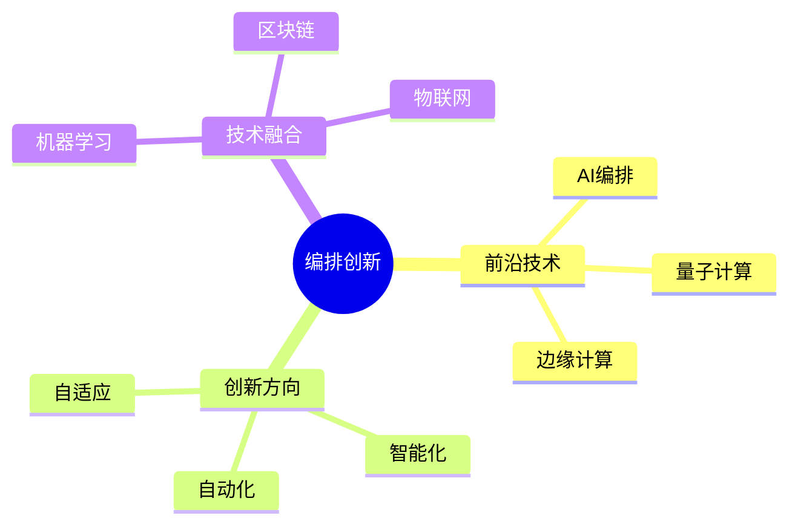

# 数据库数据编排模型-编排创新与前沿技术的形式化

> **文档版本**: v1.0
> **最后更新**: 2025-01-16
> **版本覆盖**: PostgreSQL 18.x (推荐) ⭐ | 17.x (推荐) | 16.x (兼容)
> **文档状态**: 🟡 框架已创建，内容待完善

---

## 📋 目录

- [数据库数据编排模型-编排创新与前沿技术的形式化](#数据库数据编排模型-编排创新与前沿技术的形式化)
  - [📋 目录](#-目录)
  - [1. 概述](#1-概述)
    - [1.0 数据库数据编排模型工作原理概述](#10-数据库数据编排模型工作原理概述)
    - [1.1 本文档的范围](#11-本文档的范围)
  - [2. 核心内容](#2-核心内容)
    - [2.1 前沿技术](#21-前沿技术)
    - [2.2 创新方向](#22-创新方向)
  - [3. 形式化定义](#3-形式化定义)
    - [3.1 创新形式化](#31-创新形式化)
  - [4. 实际应用](#4-实际应用)
    - [4.1 创新应用](#41-创新应用)
  - [5. 相关文档](#5-相关文档)
    - [5.1 理论基础文档](#51-理论基础文档)
  - [6. 参考文献](#6-参考文献)

---

## 1. 概述

### 1.0 数据库数据编排模型工作原理概述

**编排创新**：

编排创新探索前沿技术来提升编排能力。

**创新技术思维导图**：



### 1.1 本文档的范围

本文档涵盖：

- **前沿技术**：AI、量子计算等
- **创新方向**：智能化编排
- **实际应用**：创新系统

---

## 2. 核心内容

### 2.1 前沿技术

**技术类型**：

| 技术 | 应用 | 优势 |
|------|------|------|
| **AI编排** | 智能调度 | 自适应 |
| **量子计算** | 优化问题 | 并行性 |
| **边缘计算** | 实时处理 | 低延迟 |

### 2.2 创新方向

**智能化**：

```haskell
-- AI编排
aiOrchestrate :: Workload -> AI -> Orchestration
aiOrchestrate workload ai =
    generateOrchestration(workload, ai.model)
```

---

## 3. 形式化定义

### 3.1 创新形式化

**创新**：

```haskell
-- 创新形式化
Innovation = (T, A, I)
where
    T = technology set
    A = application domain
    I = integration method
```

---

## 4. 实际应用

### 4.1 创新应用

**AI编排**：

```python
# AI编排示例
from ai_orchestrator import AIOrchestrator

orchestrator = AIOrchestrator()
orchestration = orchestrator.generate(workload)
```

---

## 5. 相关文档

### 5.1 理论基础文档

- [形式语言与证明：总论](./1.1.25-形式语言与证明-总论.md)
- [理论基础导航](./README.md)

---

## 6. 参考文献

### 6.1 核心理论文献

- **LeCun, Y., et al. (2015). "Deep Learning."**
  - 会议: Nature 2015
  - **重要性**: 深度学习的综述
  - **核心贡献**: 总结了AI技术发展

- **Preskill, J. (2018). "Quantum Computing in the NISQ Era and Beyond."**
  - 会议: Quantum 2018
  - **重要性**: 量子计算的综述
  - **核心贡献**: 阐述了量子计算应用

### 6.2 PostgreSQL实现相关

- **PostgreSQL扩展 - AI集成](<https://github.com/postgresql/ai-integration>)**
  - PostgreSQL AI集成扩展

### 6.3 相关文档

- [数据库机器学习集成-模型管理与推理优化的形式化](../11-向量与AI/11.02-数据库机器学习集成-模型管理与推理优化的形式化.md)
- [理论基础导航](../README.md)

---

**最后更新**: 2025-01-16
**维护者**: Documentation Team
**状态**: 🟡 框架已创建，内容待完善
