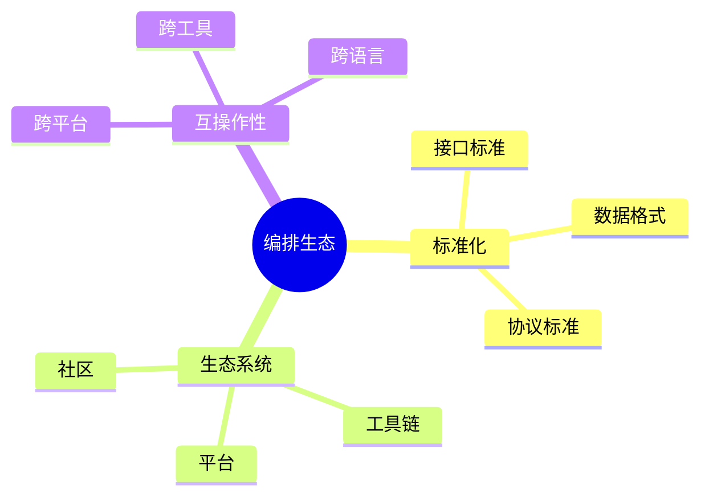

# 数据库数据编排模型-编排生态与标准化的形式化

> **文档版本**: v1.0
> **最后更新**: 2025-01-16
> **版本覆盖**: PostgreSQL 18.x (推荐) ⭐ | 17.x (推荐) | 16.x (兼容)
> **文档状态**: 🟡 框架已创建，内容待完善

---

## 📋 目录

- [数据库数据编排模型-编排生态与标准化的形式化](#数据库数据编排模型-编排生态与标准化的形式化)
  - [📋 目录](#-目录)
  - [1. 概述](#1-概述)
    - [1.1 本文档的范围](#11-本文档的范围)
  - [2. 核心内容](#2-核心内容)
  - [3. 形式化定义](#3-形式化定义)
  - [4. 实际应用](#4-实际应用)
  - [5. 相关文档](#5-相关文档)
    - [5.1 理论基础文档](#51-理论基础文档)
  - [6. 参考文献](#6-参考文献)

---

## 1. 概述

### 1.0 数据库数据编排模型工作原理概述

**编排生态**：

编排生态通过标准化来促进互操作性。

**生态模型思维导图**：



### 1.1 本文档的范围

本文档涵盖：

- **标准化**：标准和规范
- **生态系统**：工具和平台
- **实际应用**：生态建设

---

## 2. 核心内容

### 2.1 标准化

**标准类型**：

| 类型 | 内容 | 作用 |
|------|------|------|
| **接口** | API标准 | 互操作 |
| **格式** | 数据格式 | 兼容性 |
| **协议** | 通信协议 | 互通 |

### 2.2 生态系统

**生态组件**：

```haskell
-- 生态系统
data Ecosystem = Ecosystem {
    tools :: [Tool],
    platforms :: [Platform],
    standards :: [Standard]
}
```

---

## 3. 形式化定义

### 3.1 生态形式化

**生态**：

```haskell
-- 生态形式化
Ecosystem = (T, P, S)
where
    T = tool set
    P = platform set
    S = standard set
```

---

## 4. 实际应用

### 4.1 生态建设

**标准接口**：

```yaml
# 标准编排定义
apiVersion: v1
kind: Orchestration
spec:
  tasks:
    - name: task1
      type: extract
```

---

## 5. 相关文档

### 5.1 理论基础文档

- [形式语言与证明：总论](./1.1.25-形式语言与证明-总论.md)
- [理论基础导航](./README.md)

---

## 6. 参考文献

[待补充]

---

**最后更新**: 2025-01-16
**维护者**: Documentation Team
**状态**: 🟡 框架已创建，内容待完善
