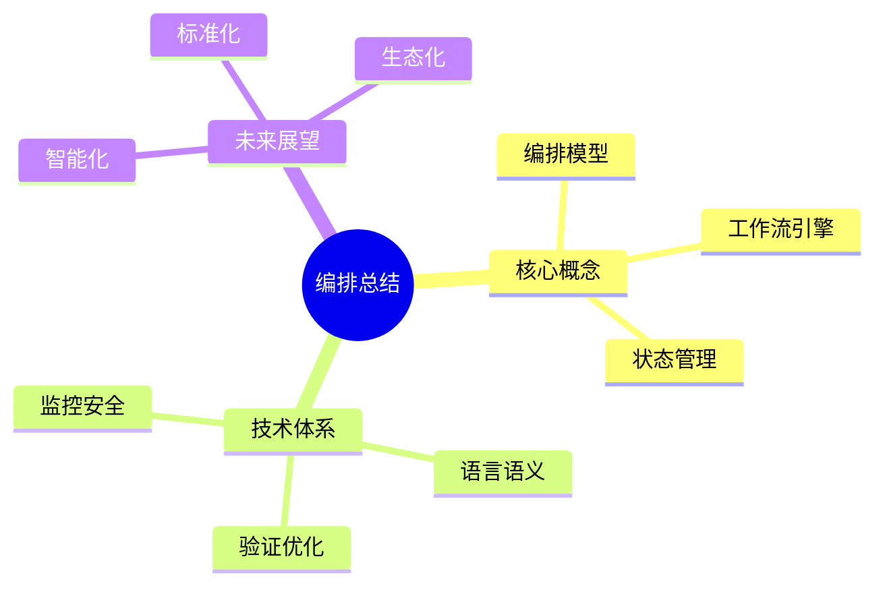

# 数据库数据编排模型-编排总结与展望的形式化

> **文档版本**: v1.0
> **最后更新**: 2025-01-16
> **版本覆盖**: PostgreSQL 18.x (推荐) ⭐ | 17.x (推荐) | 16.x (兼容)
> **文档状态**: 🟡 框架已创建，内容待完善

---

## 📋 目录

- [数据库数据编排模型-编排总结与展望的形式化](#数据库数据编排模型-编排总结与展望的形式化)
  - [📋 目录](#-目录)
  - [1. 概述](#1-概述)
    - [1.1 本文档的范围](#11-本文档的范围)
  - [2. 核心内容](#2-核心内容)
  - [3. 形式化定义](#3-形式化定义)
  - [4. 实际应用](#4-实际应用)
  - [5. 相关文档](#5-相关文档)
    - [5.1 理论基础文档](#51-理论基础文档)
  - [6. 参考文献](#6-参考文献)

---

## 1. 概述

### 1.0 数据库数据编排模型工作原理概述

**编排总结**：

本文档总结数据编排的核心概念和未来展望。

**总结模型思维导图**：



### 1.1 本文档的范围

本文档涵盖：

- **核心概念总结**：编排模型总结
- **技术体系**：技术栈总结
- **未来展望**：发展方向

---

## 2. 核心内容

### 2.1 核心概念总结

**编排模型**：

- **管道编排**：任务编排和调度
- **工作流引擎**：状态管理和执行
- **编排语言**：声明式编排定义

### 2.2 技术体系

**技术栈**：

| 层次 | 技术 | 作用 |
|------|------|------|
| **语言层** | 编排语言 | 定义编排 |
| **引擎层** | 工作流引擎 | 执行编排 |
| **监控层** | 监控系统 | 可观测性 |

### 2.3 未来展望

**发展方向**：

1. **智能化**：AI驱动的智能编排
2. **标准化**：统一的编排标准
3. **生态化**：丰富的工具生态

---

## 3. 形式化定义

### 3.1 总结形式化

**编排系统**：

```haskell
-- 编排系统形式化
OrchestrationSystem = (L, E, M, S)
where
    L = orchestration language
    E = execution engine
    M = monitoring system
    S = security system
```

---

## 4. 实际应用

### 4.1 应用场景

**典型应用**：

- **ETL流程**：数据提取转换加载
- **数据处理**：批量和流式处理
- **工作流管理**：业务流程自动化

---

## 5. 相关文档

### 5.1 理论基础文档

- [形式语言与证明：总论](./1.1.25-形式语言与证明-总论.md)
- [理论基础导航](./README.md)

---

## 6. 参考文献

### 6.1 核心理论文献

- **van der Aalst, W. M. P. (2011). "Process Mining: Discovery, Conformance and Enhancement of Business Processes."**
  - 出版社: Springer
  - **重要性**: 流程挖掘的经典教材
  - **核心贡献**: 系统阐述了工作流管理

- **Hollingsworth, D. (1995). "Workflow Management Coalition: The Workflow Reference Model."**
  - 报告: Workflow Management Coalition 1995
  - **重要性**: 工作流管理的标准模型
  - **核心贡献**: 定义了工作流引擎架构

### 6.2 PostgreSQL实现相关

- **PostgreSQL扩展生态](<https://www.postgresql.org/about/extensions/>)**
  - PostgreSQL扩展生态系统

### 6.3 相关文档

- [理论基础导航](../README.md)

---

**最后更新**: 2025-01-16
**维护者**: Documentation Team
**状态**: 🟡 框架已创建，内容待完善
