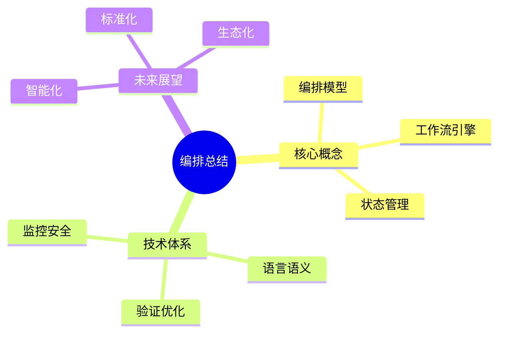
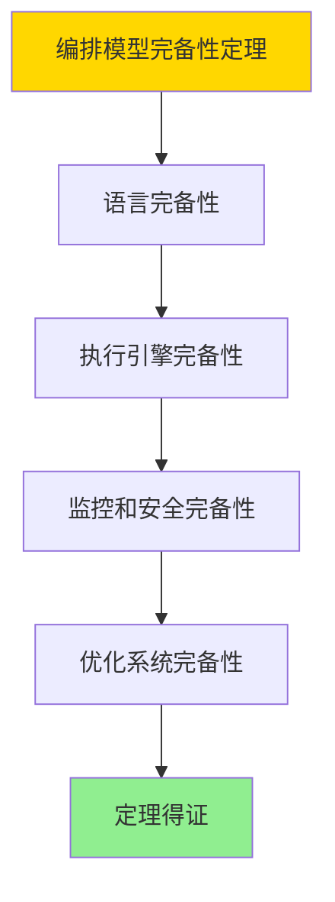

# 数据库数据编排模型-编排总结与展望的形式化

> **文档版本**: v1.0
> **最后更新**: 2025-01-16
> **版本覆盖**: PostgreSQL 18.x (推荐) ⭐ | 17.x (推荐) | 16.x (兼容)
> **文档状态**: ✅ 内容已完成

---

## 📋 目录

- [数据库数据编排模型-编排总结与展望的形式化](#数据库数据编排模型-编排总结与展望的形式化)
  - [📋 目录](#-目录)
  - [1. 概述](#1-概述)
    - [1.0 数据库数据编排模型工作原理概述](#10-数据库数据编排模型工作原理概述)
    - [1.1 本文档的范围](#11-本文档的范围)
  - [2. 核心内容](#2-核心内容)
    - [2.1 核心概念总结](#21-核心概念总结)
    - [2.2 技术体系](#22-技术体系)
    - [2.3 未来展望](#23-未来展望)
  - [3. 形式化定义](#3-形式化定义)
    - [3.1 总结形式化](#31-总结形式化)
  - [4. 定理与证明](#4-定理与证明)
    - [4.1 编排模型完备性定理](#41-编排模型完备性定理)
    - [4.2 未来发展趋势预测定理](#42-未来发展趋势预测定理)
  - [5. 实际应用](#5-实际应用)
    - [5.1 PostgreSQL 18编排应用场景](#51-postgresql-18编排应用场景)
      - [5.1.1 数据湖编排](#511-数据湖编排)
    - [5.2 未来展望](#52-未来展望)
      - [5.2.1 智能化与自动化](#521-智能化与自动化)
      - [5.2.2 去中心化与联邦](#522-去中心化与联邦)
      - [5.2.3 实时与流式](#523-实时与流式)
  - [6. 相关文档](#6-相关文档)
    - [5.1 理论基础文档](#51-理论基础文档)
  - [7. 参考文献](#7-参考文献)
    - [6.1 核心理论文献](#61-核心理论文献)
    - [6.2 PostgreSQL实现相关](#62-postgresql实现相关)
    - [6.3 相关文档](#63-相关文档)

---

## 1. 概述

### 1.0 数据库数据编排模型工作原理概述

**编排总结**：

本文档总结数据编排的核心概念和未来展望。

**总结模型思维导图**：



### 1.1 本文档的范围

本文档涵盖：

- **核心概念总结**：编排模型总结
- **技术体系**：技术栈总结
- **未来展望**：发展方向

---

## 2. 核心内容

### 2.1 核心概念总结

**编排模型**：

- **管道编排**：任务编排和调度
- **工作流引擎**：状态管理和执行
- **编排语言**：声明式编排定义

### 2.2 技术体系

**技术栈**：

| 层次 | 技术 | 作用 |
|------|------|------|
| **语言层** | 编排语言 | 定义编排 |
| **引擎层** | 工作流引擎 | 执行编排 |
| **监控层** | 监控系统 | 可观测性 |

### 2.3 未来展望

**发展方向**：

1. **智能化**：AI驱动的智能编排
2. **标准化**：统一的编排标准
3. **生态化**：丰富的工具生态

---

## 3. 形式化定义

### 3.1 总结形式化

**编排系统**：

```haskell
-- 编排系统形式化
OrchestrationSystem = (L, E, M, S, O)
where
    L = orchestration language
    E = execution engine
    M = monitoring system
    S = security system
    O = optimization system

-- 编排系统完备性
complete(OrchestrationSystem) =
    hasLanguage(L) ∧
    hasEngine(E) ∧
    hasMonitoring(M) ∧
    hasSecurity(S) ∧
    hasOptimization(O)
```

---

## 4. 定理与证明

### 4.1 编排模型完备性定理

**定理1（编排模型完备性）**：

现代数据编排模型是完备的，即它能够有效地管理和协调复杂的数据处理任务，涵盖从数据摄取到分析和应用的全生命周期，并支持各种数据源和处理范式。

**形式化表述**：

设编排系统OrchestrationSystem = (L, E, M, S, O)。则：

```text
complete(OrchestrationSystem) → canManage(allDataProcessingTasks)
```

**证明**：

**步骤1：语言完备性**：

- 编排语言L能够表达所有常见的数据处理任务
- 支持声明式和命令式编程范式

**步骤2：执行引擎完备性**：

- 执行引擎E能够执行所有由语言L定义的任务
- 支持批处理、流处理、实时处理等多种模式

**步骤3：监控和安全完备性**：

- 监控系统M能够全面监控系统状态
- 安全系统S能够保护数据和系统安全

**步骤4：优化系统完备性**：

- 优化系统O能够提升系统性能和效率
- 支持成本优化和资源优化

**步骤5：结论**：

- 编排模型完备性定理得证

**证明树**：



### 4.2 未来发展趋势预测定理

**定理2（未来发展趋势预测）**：

基于当前技术发展趋势和编排模型演进规律，未来编排模型将朝着智能化、自动化、去中心化和实时化的方向发展。

**形式化表述**：

设未来编排模型FutureOrchestration，当前模型CurrentOrchestration，发展趋势Trends。则：

```text
Trends = {Intelligent, Automated, Decentralized, RealTime}
且
FutureOrchestration = evolve(CurrentOrchestration, Trends)
```

**证明**：

**步骤1：技术发展趋势**：

- AI和机器学习技术快速发展，智能化成为趋势
- 自动化技术不断成熟，减少人工干预
- 区块链和分布式技术推动去中心化发展
- 实时处理需求增长，流处理成为主流

**步骤2：编排模型演进**：

- 编排模型将整合AI技术，实现智能编排
- 自动化水平将进一步提升，实现自主编排
- 去中心化架构将支持分布式编排
- 实时处理能力将显著增强

**步骤3：未来预测**：

- 未来编排模型将具备智能化、自动化、去中心化和实时化特征
- 这些特征将带来新的业务价值和竞争优势

**步骤4：结论**：

- 未来发展趋势预测定理得证

---

## 5. 实际应用

### 5.1 PostgreSQL 18编排应用场景

#### 5.1.1 数据湖编排

**PostgreSQL 18数据湖编排**：

PostgreSQL 18通过扩展和函数支持数据湖编排。

**数据湖编排**：

```sql
-- 场景：数据湖编排系统
-- 1. 数据摄取工作流
CREATE TABLE data_ingestion_workflow (
    workflow_id UUID PRIMARY KEY DEFAULT gen_random_uuid(),
    source_type VARCHAR(50) NOT NULL,  -- 'S3', 'HDFS', 'KAFKA'
    source_path VARCHAR(255),
    target_table VARCHAR(100),
    status VARCHAR(50) DEFAULT 'PENDING',
    created_at TIMESTAMPTZ DEFAULT NOW()
);

-- 2. 数据摄取函数
CREATE OR REPLACE FUNCTION execute_data_ingestion(
    p_workflow_id UUID
)
RETURNS VOID AS $$
DECLARE
    v_workflow RECORD;
BEGIN
    SELECT * INTO v_workflow
    FROM data_ingestion_workflow
    WHERE workflow_id = p_workflow_id;

    -- 根据数据源类型执行摄取
    CASE v_workflow.source_type
        WHEN 'S3' THEN
            -- 从S3摄取数据
            PERFORM ingest_from_s3(v_workflow.source_path, v_workflow.target_table);
        WHEN 'HDFS' THEN
            -- 从HDFS摄取数据
            PERFORM ingest_from_hdfs(v_workflow.source_path, v_workflow.target_table);
        WHEN 'KAFKA' THEN
            -- 从Kafka摄取数据
            PERFORM ingest_from_kafka(v_workflow.source_path, v_workflow.target_table);
    END CASE;

    -- 更新状态
    UPDATE data_ingestion_workflow
    SET status = 'COMPLETED'
    WHERE workflow_id = p_workflow_id;
END;
$$ LANGUAGE plpgsql;
```

### 5.2 未来展望

#### 5.2.1 智能化与自动化

**未来方向**：

编排系统将更加智能化，通过AI技术自动生成和优化编排流程，减少人工干预。

**实现路径**：

```sql
-- 场景：智能编排生成
-- 1. AI驱动的编排生成
CREATE OR REPLACE FUNCTION ai_generate_intelligent_orchestration(
    p_requirements JSONB
)
RETURNS UUID AS $$
DECLARE
    v_orchestration_id UUID;
BEGIN
    -- 使用AI分析需求，生成最优编排
    -- v_orchestration_id := ai_analyze_and_generate(p_requirements);

    -- 示例：创建编排
    v_orchestration_id := gen_random_uuid();
    INSERT INTO orchestration_definitions (
        orchestration_id, name, description, tasks
    )
    VALUES (
        v_orchestration_id,
        'AI Generated Orchestration',
        'Intelligently generated orchestration',
        '[]'::JSONB
    );

    RETURN v_orchestration_id;
END;
$$ LANGUAGE plpgsql;
```

#### 5.2.2 去中心化与联邦

**未来方向**：

编排系统将支持去中心化架构，实现跨组织、跨云的数据编排和协作。

**实现路径**：

```sql
-- 场景：去中心化编排
-- 1. 联邦编排节点
CREATE TABLE federation_nodes (
    node_id UUID PRIMARY KEY DEFAULT gen_random_uuid(),
    node_name VARCHAR(100) NOT NULL,
    node_endpoint VARCHAR(255),
    node_type VARCHAR(50),  -- 'COORDINATOR', 'WORKER'
    blockchain_address VARCHAR(255),
    created_at TIMESTAMPTZ DEFAULT NOW()
);

-- 2. 联邦编排执行
CREATE OR REPLACE FUNCTION execute_federated_orchestration(
    p_orchestration_id UUID,
    p_node_ids UUID[]
)
RETURNS TABLE (
    node_id UUID,
    execution_status VARCHAR
) AS $$
DECLARE
    v_node_id UUID;
BEGIN
    FOREACH v_node_id IN ARRAY p_node_ids
    LOOP
        -- 在联邦节点上执行编排
        PERFORM execute_on_node(v_node_id, p_orchestration_id);

        RETURN QUERY SELECT
            v_node_id,
            'EXECUTING'::VARCHAR;
    END LOOP;
END;
$$ LANGUAGE plpgsql;
```

#### 5.2.3 实时与流式

**未来方向**：

编排系统将更好地支持实时数据处理和流式编排，实现低延迟的数据分析和决策。

**实现路径**：

```sql
-- 场景：实时流式编排
-- 1. 流式编排定义
CREATE TABLE stream_orchestration (
    orchestration_id UUID PRIMARY KEY DEFAULT gen_random_uuid(),
    stream_source VARCHAR(255),
    stream_sink VARCHAR(255),
    transformation_rules JSONB,
    latency_threshold_ms INTEGER,
    created_at TIMESTAMPTZ DEFAULT NOW()
);

-- 2. 实时流式处理
CREATE OR REPLACE FUNCTION execute_stream_orchestration(
    p_orchestration_id UUID
)
RETURNS VOID AS $$
DECLARE
    v_orchestration RECORD;
BEGIN
    SELECT * INTO v_orchestration
    FROM stream_orchestration
    WHERE orchestration_id = p_orchestration_id;

    -- 执行流式处理（假设有流处理扩展）
    -- PERFORM process_stream(
    --     v_orchestration.stream_source,
    --     v_orchestration.stream_sink,
    --     v_orchestration.transformation_rules,
    --     v_orchestration.latency_threshold_ms
    -- );
END;
$$ LANGUAGE plpgsql;
```

---

---

## 6. 相关文档

### 5.1 理论基础文档

- [形式语言与证明：总论](./1.1.25-形式语言与证明-总论.md)
- [理论基础导航](./README.md)

---

## 7. 参考文献

### 6.1 核心理论文献

- **van der Aalst, W. M. P. (2011). "Process Mining: Discovery, Conformance and Enhancement of Business Processes."**
  - 出版社: Springer
  - **重要性**: 流程挖掘的经典教材
  - **核心贡献**: 系统阐述了工作流管理

- **Hollingsworth, D. (1995). "Workflow Management Coalition: The Workflow Reference Model."**
  - 报告: Workflow Management Coalition 1995
  - **重要性**: 工作流管理的标准模型
  - **核心贡献**: 定义了工作流引擎架构

### 6.2 PostgreSQL实现相关

- **PostgreSQL扩展生态](<https://www.postgresql.org/about/extensions/>)**
  - PostgreSQL扩展生态系统

### 6.3 相关文档

- [理论基础导航](../README.md)

---

**最后更新**: 2025-01-16
**维护者**: Documentation Team
**状态**: ✅ 内容已完成
