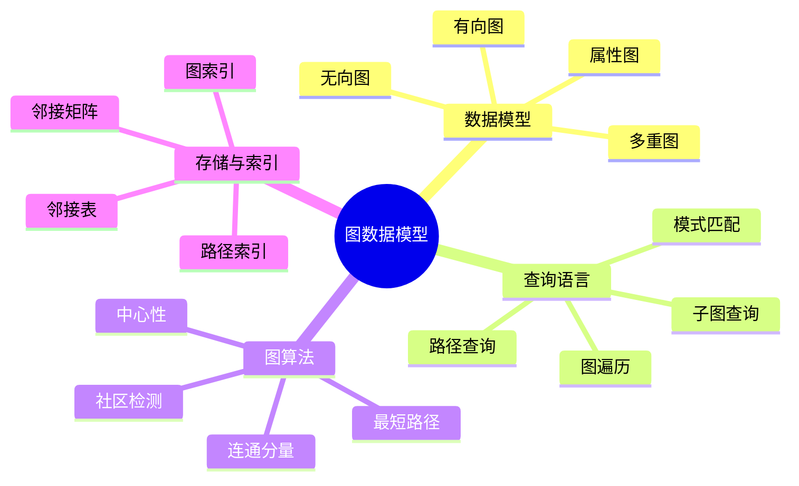
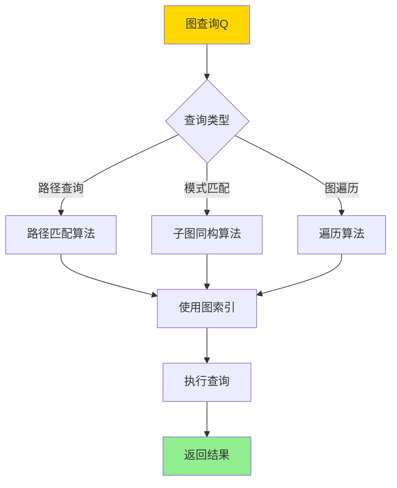
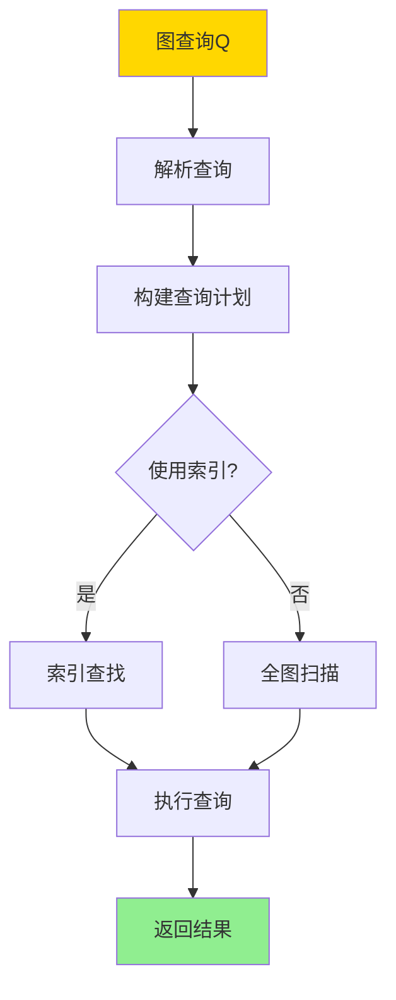

# 数据库图数据模型-图查询语言与图算法的形式化

> **文档版本**: v1.0
> **最后更新**: 2025-01-16
> **版本覆盖**: PostgreSQL 18.x (推荐) ⭐ | 17.x (推荐) | 16.x (兼容)
> **文档状态**: 🟡 框架已创建，内容待完善

---

## 📋 目录

- [数据库图数据模型-图查询语言与图算法的形式化](#数据库图数据模型-图查询语言与图算法的形式化)
  - [📋 目录](#-目录)
  - [1. 概述](#1-概述)
    - [1.0 图数据模型工作原理概述](#10-图数据模型工作原理概述)
    - [1.1 本文档的范围](#11-本文档的范围)
  - [2. 核心内容](#2-核心内容)
    - [2.1 图数据模型](#21-图数据模型)
    - [2.2 图查询语言](#22-图查询语言)
    - [2.3 图算法](#23-图算法)
  - [3. 形式化定义](#3-形式化定义)
    - [3.1 图数据模型形式化](#31-图数据模型形式化)
    - [3.2 图查询语言形式化](#32-图查询语言形式化)
    - [3.3 图算法形式化](#33-图算法形式化)
  - [4. 实际应用](#4-实际应用)
    - [4.1 PostgreSQL图扩展](#41-postgresql图扩展)
    - [4.2 图算法实现](#42-图算法实现)
    - [4.3 图分析](#43-图分析)
  - [5. 相关文档](#5-相关文档)
    - [5.1 理论基础文档](#51-理论基础文档)
  - [6. 参考文献](#6-参考文献)
    - [6.1 核心理论文献](#61-核心理论文献)
    - [6.2 图算法相关](#62-图算法相关)
    - [6.3 PostgreSQL实现相关](#63-postgresql实现相关)
    - [6.4 相关文档](#64-相关文档)

---

## 1. 概述

### 1.0 图数据模型工作原理概述

**图数据模型**：

图数据模型以节点和边表示实体及其关系。图查询语言支持路径查询、模式匹配等操作，图算法用于图分析和计算。

**图数据模型体系思维导图**：



**图查询处理决策树**：



**图查询语言对比矩阵**：

| 语言 | 表达能力 | 复杂度 | 适用场景 |
|------|---------|--------|---------|
| **Cypher** | 高 | 中 | 属性图查询 |
| **Gremlin** | 高 | 高 | 图遍历 |
| **SPARQL** | 中 | 中 | RDF图查询 |
| **SQL扩展** | 中 | 低 | 关系图查询 |

### 1.1 本文档的范围

本文档涵盖：

- **图数据模型**：属性图、有向图、无向图的形式化定义
- **图查询语言**：路径查询、模式匹配的语义
- **图算法**：最短路径、连通分量等算法的形式化
- **实际应用**：PostgreSQL图扩展的实现

---

## 2. 核心内容

### 2.1 图数据模型

**属性图定义**：

```haskell
-- 属性图
data PropertyGraph = PropertyGraph {
    nodes :: Set Node,
    edges :: Set Edge,
    nodeLabels :: Node -> Set Label,
    nodeProperties :: Node -> Map Property Value,
    edgeLabels :: Edge -> Set Label,
    edgeProperties :: Edge -> Map Property Value
}

-- 节点
data Node = Node {
    nodeId :: NodeId,
    labels :: Set Label,
    properties :: Map Property Value
}

-- 边
data Edge = Edge {
    edgeId :: EdgeId,
    source :: NodeId,
    target :: NodeId,
    label :: Label,
    properties :: Map Property Value
}
```

**图模型对比矩阵**：

| 模型 | 节点属性 | 边属性 | 多重边 | 适用场景 |
|------|---------|--------|--------|---------|
| **属性图** | 是 | 是 | 是 | 通用图数据 |
| **简单图** | 否 | 否 | 否 | 理论分析 |
| **有向图** | 可选 | 可选 | 可选 | 有向关系 |
| **无向图** | 可选 | 可选 | 可选 | 无向关系 |

### 2.2 图查询语言

**路径查询**：

```haskell
-- 路径查询
pathQuery :: Node -> Pattern -> Node -> Query
pathQuery start pattern end =
    PathQuery {
        start = start,
        pattern = pattern,
        end = end
    }

-- 路径模式
data Pattern =
    Simple EdgeLabel
  | Sequence [Pattern]
  | Alternation [Pattern]
  | KleeneStar Pattern
  | Optional Pattern

-- 路径匹配
matchPath :: PropertyGraph -> PathQuery -> Set Path
matchPath graph query =
    findPaths(graph, query.start, query.pattern, query.end)
```

**模式匹配**：

```haskell
-- 子图模式
data SubgraphPattern = SubgraphPattern {
    nodePatterns :: [NodePattern],
    edgePatterns :: [EdgePattern]
}

-- 模式匹配
matchPattern :: PropertyGraph -> SubgraphPattern -> Set Subgraph
matchPattern graph pattern =
    findSubgraphs(graph, pattern)
```

**图查询执行流程**：



### 2.3 图算法

**最短路径算法**：

```haskell
-- 最短路径
shortestPath :: PropertyGraph -> Node -> Node -> Maybe Path
shortestPath graph start end =
    dijkstra(graph, start, end)

-- Dijkstra算法
dijkstra :: PropertyGraph -> Node -> Node -> Maybe Path
dijkstra graph start end =
    -- 使用优先队列实现
    let distances = initializeDistances(graph, start)
        queue = PriorityQueue [start]
    in searchPath(graph, queue, distances, end)
```

**连通分量算法**：

```haskell
-- 连通分量
connectedComponents :: PropertyGraph -> Set (Set Node)
connectedComponents graph =
    -- 使用DFS或BFS
    let visited = Set.empty
        components = []
    in findComponents(graph, visited, components)
```

---

## 3. 形式化定义

### 3.1 图数据模型形式化

**属性图**：

```haskell
-- 属性图
G = (V, E, L_V, L_E, P_V, P_E)

其中:
  V是节点集合
  E是边集合
  L_V: V -> 2^Labels 是节点标签函数
  L_E: E -> Labels 是边标签函数
  P_V: V -> Map(Property, Value) 是节点属性函数
  P_E: E -> Map(Property, Value) 是边属性函数
```

### 3.2 图查询语言形式化

**路径查询**：

```haskell
-- 路径查询语义
path(start, pattern, end)(G) =
    {p | p is path in G,
         p starts at start,
         p matches pattern,
         p ends at end}
```

### 3.3 图算法形式化

**最短路径**：

```haskell
-- 最短路径
shortestPath(G, u, v) =
    argmin_{p: path from u to v} weight(p)

其中weight(p)是路径p的权重
```

---

## 4. 实际应用

### 4.1 PostgreSQL图扩展

**使用PostgreSQL扩展**：

```sql
-- 安装图扩展（示例：使用pgRouting或自定义扩展）
-- CREATE EXTENSION pgrouting;

-- 创建图表结构
CREATE TABLE nodes (
    id SERIAL PRIMARY KEY,
    label VARCHAR(50),
    properties JSONB
);

CREATE TABLE edges (
    id SERIAL PRIMARY KEY,
    source INTEGER REFERENCES nodes(id),
    target INTEGER REFERENCES nodes(id),
    label VARCHAR(50),
    weight FLOAT,
    properties JSONB
);

-- 创建图索引
CREATE INDEX idx_edges_source ON edges(source);
CREATE INDEX idx_edges_target ON edges(target);
```

**图查询示例**：

```sql
-- 路径查询（使用递归CTE）
WITH RECURSIVE path AS (
    -- 起始节点
    SELECT id, ARRAY[id] as path, 0 as depth
    FROM nodes
    WHERE id = 1

    UNION ALL

    -- 递归扩展路径
    SELECT e.target, p.path || e.target, p.depth + 1
    FROM path p
    JOIN edges e ON p.id = e.source
    WHERE e.target != ALL(p.path)  -- 避免循环
      AND p.depth < 10  -- 限制深度
)
SELECT * FROM path WHERE id = 5;  -- 找到目标节点
```

### 4.2 图算法实现

**最短路径查询**：

```sql
-- 使用Dijkstra算法查找最短路径
WITH RECURSIVE shortest_path AS (
    SELECT
        source,
        target,
        weight,
        ARRAY[source, target] as path,
        weight as total_weight
    FROM edges
    WHERE source = 1

    UNION ALL

    SELECT
        e.source,
        e.target,
        e.weight,
        sp.path || e.target,
        sp.total_weight + e.weight
    FROM shortest_path sp
    JOIN edges e ON sp.target = e.source
    WHERE e.target != ALL(sp.path)
      AND sp.total_weight + e.weight < (
          SELECT MIN(total_weight)
          FROM shortest_path
          WHERE target = e.target
      )
)
SELECT * FROM shortest_path
WHERE target = 5
ORDER BY total_weight
LIMIT 1;
```

### 4.3 图分析

**连通分量分析**：

```sql
-- 查找连通分量
WITH RECURSIVE component AS (
    -- 选择起始节点
    SELECT id, id as component_id
    FROM nodes
    WHERE id = 1

    UNION

    -- 递归查找连通节点
    SELECT n.id, c.component_id
    FROM component c
    JOIN edges e ON c.id = e.source OR c.id = e.target
    JOIN nodes n ON n.id = CASE
        WHEN e.source = c.id THEN e.target
        ELSE e.source
    END
    WHERE n.id NOT IN (SELECT id FROM component)
)
SELECT component_id, COUNT(*) as node_count
FROM component
GROUP BY component_id;
```

---

## 5. 相关文档

### 5.1 理论基础文档

- [知识图谱模型-图数据库与语义查询的形式化](./14.05-数据库知识图谱模型-图数据库与语义查询的形式化.md)
- [理论基础导航](../README.md)

---

## 6. 参考文献

### 6.1 核心理论文献

- **Angles, R., & Gutierrez, C. (2008). "Survey of Graph Database Models."**
  - 期刊: ACM Computing Surveys 2008
  - **重要性**: 图数据库模型的综述
  - **核心贡献**: 系统阐述了图数据模型和查询语言

- **Wood, P. T. (2012). "Query Languages for Graph Databases."**
  - 期刊: SIGMOD Record 2012
  - **重要性**: 图查询语言的经典研究
  - **核心贡献**: 提供了图查询语言的形式化语义

### 6.2 图算法相关

- **Cormen, T. H., et al. (2009). "Introduction to Algorithms."**
  - 出版社: MIT Press 2009
  - **重要性**: 算法经典教材
  - **核心贡献**: 详细阐述了图算法

### 6.3 PostgreSQL实现相关

- **[PostgreSQL官方文档 - 递归查询](<https://www.postgresql.org/docs/current/queries-with.html>)**
  - PostgreSQL递归查询实现说明

### 6.4 相关文档

- [知识图谱模型-图数据库与语义查询的形式化](./14.05-数据库知识图谱模型-图数据库与语义查询的形式化.md)
- [理论基础导航](../README.md)

---

**最后更新**: 2025-01-16
**维护者**: Documentation Team
**状态**: 🟡 框架已创建，内容待完善
