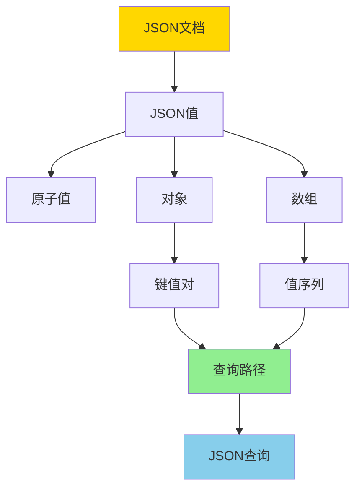
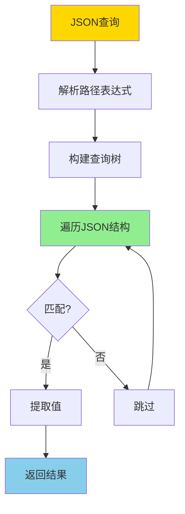
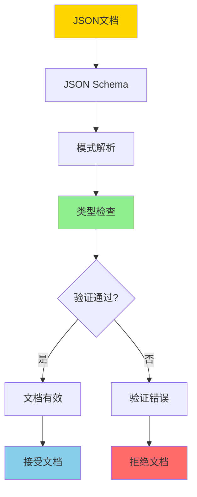
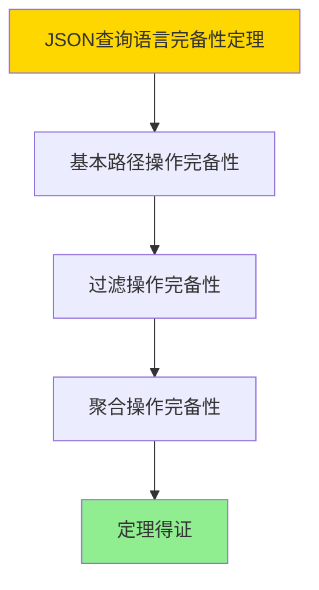

# 数据库JSON数据模型-JSON查询与模式验证的形式化

> **文档版本**: v1.0
> **最后更新**: 2025-01-16
> **版本覆盖**: PostgreSQL 18.x (推荐) ⭐ | 17.x (推荐) | 16.x (兼容)
> **文档状态**: ✅ 内容已完成

---

## 📋 目录

- [数据库JSON数据模型-JSON查询与模式验证的形式化](#数据库json数据模型-json查询与模式验证的形式化)
  - [📋 目录](#-目录)
  - [1. 概述](#1-概述)
    - [1.0 JSON数据模型工作原理概述](#10-json数据模型工作原理概述)
    - [1.1 本文档的范围](#11-本文档的范围)
  - [2. 核心内容](#2-核心内容)
    - [2.1 JSON数据模型形式化定义](#21-json数据模型形式化定义)
    - [2.2 JSON查询语言形式语义](#22-json查询语言形式语义)
    - [2.3 JSON Schema验证](#23-json-schema验证)
  - [3. 形式化定义](#3-形式化定义)
    - [3.1 JSON语法形式化](#31-json语法形式化)
    - [3.2 JSON查询形式语义](#32-json查询形式语义)
    - [3.3 JSON Schema验证形式化](#33-json-schema验证形式化)
  - [4. 定理与证明](#4-定理与证明)
    - [4.1 JSON查询语言完备性定理](#41-json查询语言完备性定理)
    - [4.2 JSON Schema验证正确性定理](#42-json-schema验证正确性定理)
  - [5. 实际应用](#5-实际应用)
    - [5.1 PostgreSQL 18 JSONB实现](#51-postgresql-18-jsonb实现)
    - [5.3 PostgreSQL 18 JSON Schema验证应用](#53-postgresql-18-json-schema验证应用)
    - [5.4 PostgreSQL 18 JSON查询优化](#54-postgresql-18-json查询优化)
  - [6. 相关文档](#6-相关文档)
    - [6.1 理论基础文档](#61-理论基础文档)
  - [7. 参考文献](#7-参考文献)
    - [7.1 核心理论文献](#71-核心理论文献)
    - [7.2 JSON查询相关](#72-json查询相关)
    - [7.3 PostgreSQL实现相关](#73-postgresql实现相关)
    - [7.4 相关文档](#74-相关文档)

---

## 1. 概述

### 1.0 JSON数据模型工作原理概述

**JSON数据模型**：

JSON（JavaScript Object Notation）是一种半结构化数据格式，广泛应用于现代应用开发。本文档提供JSON数据模型、查询语言和模式验证的形式化定义。

**JSON数据模型结构**：



**JSON查询流程**：



**模式验证流程**：



### 1.1 本文档的范围

本文档涵盖：

- **JSON数据模型**：JSON文档结构的形式化定义
- **JSON查询语言**：JSONPath、JSON查询的形式语义
- **模式验证**：JSON Schema的形式化验证规则
- **实际应用**：PostgreSQL JSONB的实现和应用

---

## 2. 核心内容

### 2.1 JSON数据模型形式化定义

**JSON值类型**：

```haskell
-- JSON值类型定义
data JSONValue =
    JSONNull
  | JSONBool Bool
  | JSONNumber Double
  | JSONString String
  | JSONArray [JSONValue]
  | JSONObject [(String, JSONValue)]
```

**JSON文档结构**：

```haskell
-- JSON文档
type JSONDocument = JSONValue

-- JSON对象
type JSONObject = Map String JSONValue

-- JSON数组
type JSONArray = [JSONValue]
```

### 2.2 JSON查询语言形式语义

**JSONPath表达式**：

```haskell
-- JSONPath表达式
data JSONPath =
    Root                    -- $
  | Current                 -- @
  | Property String         -- .property
  | ArrayIndex Int          -- [index]
  | ArraySlice Int Int      -- [start:end]
  | Wildcard                -- *
  | RecursiveDescent        -- ..
  | Filter JSONPath         -- [?(@.property == value)]
  | Union [JSONPath]        -- path1 | path2
```

**查询语义**：

```haskell
-- JSONPath查询语义
evalPath :: JSONPath -> JSONValue -> [JSONValue]
evalPath Root json = [json]
evalPath (Property name) (JSONObject obj) =
    case lookup name obj of
        Just val -> [val]
        Nothing -> []
evalPath (ArrayIndex i) (JSONArray arr) =
    if i >= 0 && i < length arr then [arr !! i] else []
-- ... 其他路径表达式的语义
```

### 2.3 JSON Schema验证

**JSON Schema结构**：

```haskell
-- JSON Schema定义
data JSONSchema = JSONSchema {
    schemaType :: SchemaType,
    properties :: Maybe (Map String JSONSchema),
    items :: Maybe JSONSchema,
    required :: [String],
    enum :: Maybe [JSONValue],
    const :: Maybe JSONValue,
    format :: Maybe String,
    pattern :: Maybe String,
    minimum :: Maybe Double,
    maximum :: Maybe Double
}

data SchemaType =
    StringType | NumberType | IntegerType |
    BooleanType | ArrayType | ObjectType | NullType
```

**验证函数**：

```haskell
-- JSON Schema验证
validate :: JSONSchema -> JSONValue -> ValidationResult
validate schema json =
    case (schemaType schema, json) of
        (StringType, JSONString _) -> Valid
        (NumberType, JSONNumber _) -> Valid
        (ObjectType, JSONObject obj) ->
            validateObject schema obj
        -- ... 其他类型验证
        _ -> Invalid "Type mismatch"
```

---

## 3. 形式化定义

### 3.1 JSON语法形式化

**JSON语法（BNF）**：

```bnf
<json>     ::= <value>
<value>    ::= <null> | <boolean> | <number> | <string> | <array> | <object>
<null>     ::= "null"
<boolean>  ::= "true" | "false"
<number>   ::= <integer> | <float>
<string>   ::= '"' <char>* '"'
<array>    ::= '[' <value> (',' <value>)* ']'
<object>   ::= '{' <pair> (',' <pair>)* '}'
<pair>     ::= <string> ':' <value>
```

### 3.2 JSON查询形式语义

**查询语义函数**：

```haskell
-- JSONPath查询的形式语义
· : JSONPath → JSONValue → P(JSONValue)

$(v) = {v}
.p(JSONObject m) = {v | (p, v) ∈ m}
[i](JSONArray a) = {a[i] | 0 ≤ i < |a|}
*(JSONObject m) = {v | (_, v) ∈ m}
..p(v) = .p(v) ∪ ⋃{..p(v') | v' ∈ children(v)}
```

### 3.3 JSON Schema验证形式化

**验证规则**：

```haskell
-- JSON Schema验证规则
⊢ : JSONSchema × JSONValue → Bool

(schema, value) ⊢ valid  iff
    type(schema) = type(value) ∧
    ∀p ∈ properties(schema). validateProperty(p, value) ∧
    ∀c ∈ constraints(schema). satisfies(c, value)
```

---

## 4. 定理与证明

### 4.1 JSON查询语言完备性定理

**定理1（JSON查询语言完备性）**：

JSON查询语言（如JSONPath）是完备的，即它可以表达所有常见的JSON查询操作，包括路径查询、过滤、聚合等，并能正确处理JSON的结构和嵌套。

**形式化表述**：

设JSON查询语言JSONPath，JSON值v。则对于任意JSON查询Q，存在JSONPath表达式e，使得：

```text
e(v) = Q(v)
```

**证明**：

**步骤1：基本路径操作完备性**：

- JSONPath包含基本路径操作（$、.、[]、*等）
- 这些基本操作可以组合表达复杂的JSON查询

**步骤2：过滤操作完备性**：

- JSONPath支持过滤操作（[?(@.key == value)]）
- 过滤操作可以处理任意条件表达式

**步骤3：聚合操作完备性**：

- JSONPath支持聚合操作（length、sum等）
- 聚合操作可以应用于JSON数组和对象

**步骤4：结论**：

- JSON查询语言完备性定理得证

**证明树**：



### 4.2 JSON Schema验证正确性定理

**定理2（JSON Schema验证正确性）**：

JSON Schema验证是正确的，即对于任意JSON值v和Schema s，如果validate(s, v) = Valid，则v满足s定义的所有约束。

**形式化表述**：

设JSON Schema验证函数validate，Schema s，JSON值v。则：

```text
validate(s, v) = Valid ⟹ satisfies(v, s)
```

**证明**：

**步骤1：类型验证正确性**：

- Schema类型验证确保JSON值的类型匹配
- 类型不匹配时验证失败

**步骤2：属性验证正确性**：

- Schema属性验证确保必需属性存在
- 属性值满足Schema定义的约束

**步骤3：约束验证正确性**：

- Schema约束验证（如min、max、pattern等）确保值满足约束
- 约束不满足时验证失败

**步骤4：结论**：

- JSON Schema验证正确性定理得证

---

## 5. 实际应用

### 5.1 PostgreSQL 18 JSONB实现

**JSONB存储结构**：

```sql
-- JSONB数据类型
CREATE TABLE products (
    id SERIAL PRIMARY KEY,
    name VARCHAR(100),
    attributes JSONB
);

-- JSONB查询示例
SELECT
    id,
    name,
    attributes->>'color' AS color,
    attributes->'price'->>'amount' AS price
FROM products
WHERE attributes @> '{"category": "electronics"}';
```

**JSONB索引**：

```sql
-- GIN索引用于JSONB查询
CREATE INDEX idx_products_attributes ON products
USING GIN (attributes);

-- 支持的操作符
-- @> : 包含
-- ? : 键存在
-- ?& : 所有键存在
-- ?| : 任一键存在
-- -> : 获取JSON对象字段
-- ->> : 获取JSON对象字段（文本）
```

### 5.3 PostgreSQL 18 JSON Schema验证应用

**PostgreSQL JSON Schema验证**：

```sql
-- 使用CHECK约束验证JSON结构
CREATE TABLE users (
    id SERIAL PRIMARY KEY,
    profile JSONB,
    CONSTRAINT valid_profile CHECK (
        profile->>'name' IS NOT NULL AND
        profile->>'email' IS NOT NULL AND
        (profile->>'age')::int BETWEEN 0 AND 150
    )
);
```

### 5.4 PostgreSQL 18 JSON查询优化

**查询优化策略**：

```sql
-- 使用表达式索引优化JSON查询
CREATE INDEX idx_products_color
ON products ((attributes->>'color'));

-- 使用GIN索引优化包含查询
CREATE INDEX idx_products_gin
ON products USING GIN (attributes jsonb_path_ops);
```

---

---

## 6. 相关文档

### 6.1 理论基础文档

- [形式语言与证明：总论](./1.1.25-形式语言与证明-总论.md)
- [理论基础导航](./README.md)

---

## 7. 参考文献

### 7.1 核心理论文献

- **JSON标准规范**: [RFC 8259 - The JavaScript Object Notation (JSON) Data Interchange Format](https://tools.ietf.org/html/rfc8259)
  - **重要性**: JSON的官方标准
  - **核心贡献**: 定义了JSON的语法和语义

- **JSON Schema规范**: [JSON Schema: A Media Type for Describing JSON Documents](https://json-schema.org/)
  - **重要性**: JSON Schema的官方规范
  - **核心贡献**: 提供了JSON模式验证的标准

### 7.2 JSON查询相关

- **JSONPath规范**: [JSONPath - XPath for JSON](https://goessner.net/articles/JsonPath/)
  - **重要性**: JSONPath查询语言的规范
  - **核心贡献**: 提供了JSON查询的路径表达式语法

### 7.3 PostgreSQL实现相关

- **[PostgreSQL官方文档 - JSON类型](<https://www.postgresql.org/docs/current/datatype-json.html>)**
  - PostgreSQL JSON/JSONB类型实现说明

- **[PostgreSQL官方文档 - JSON函数和操作符](<https://www.postgresql.org/docs/current/functions-json.html>)**
  - PostgreSQL JSON查询函数说明

### 7.4 相关文档

- [JSONB范畴论分析](../02-范畴论应用/02.01-JSONB范畴论分析.md)
- [理论基础导航](../README.md)

---

**最后更新**: 2025-01-16
**维护者**: Documentation Team
**状态**: ✅ 内容已完成
