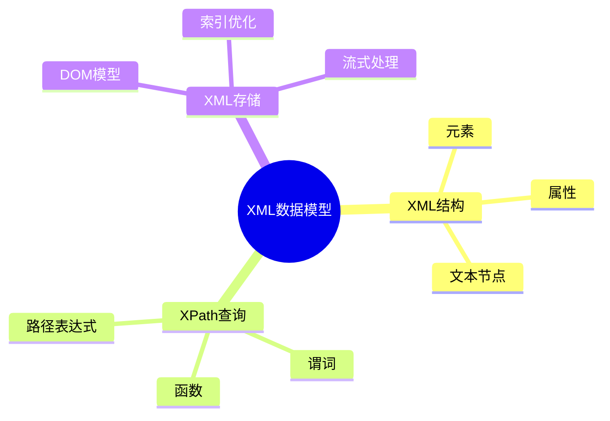

# 数据库XML数据模型-XML查询与XPath的形式化

> **文档版本**: v1.0
> **最后更新**: 2025-01-16
> **版本覆盖**: PostgreSQL 18.x (推荐) ⭐ | 17.x (推荐) | 16.x (兼容)
> **文档状态**: 🟡 框架已创建，内容待完善

---

## 📋 目录

- [数据库XML数据模型-XML查询与XPath的形式化](#数据库xml数据模型-xml查询与xpath的形式化)
  - [📋 目录](#-目录)
  - [1. 概述](#1-概述)
    - [1.1 本文档的范围](#11-本文档的范围)
  - [2. 核心内容](#2-核心内容)
  - [3. 形式化定义](#3-形式化定义)
  - [4. 实际应用](#4-实际应用)
  - [5. 相关文档](#5-相关文档)
    - [5.1 理论基础文档](#51-理论基础文档)
  - [6. 参考文献](#6-参考文献)

---

## 1. 概述

### 1.0 数据库XML数据模型工作原理概述

**XML数据模型**：

XML数据模型用于存储和查询XML文档，使用XPath和XQuery进行查询。

**XML模型思维导图**：



### 1.1 本文档的范围

本文档涵盖：

- **XML数据模型**：XML文档的形式化定义
- **XPath查询**：XPath表达式的语义
- **实际应用**：PostgreSQL XML支持

---

## 2. 核心内容

### 2.1 XML数据模型

**XML文档结构**：

```haskell
-- XML文档
data XMLDocument = XMLDocument {
    root :: XMLElement,
    namespace :: Maybe Namespace
}

-- XML元素
data XMLElement = XMLElement {
    name :: String,
    attributes :: Map String String,
    children :: [XMLNode]
}
```

### 2.2 XPath查询

**XPath表达式**：

```haskell
-- XPath表达式
data XPath = XPath {
    path :: PathExpression,
    predicate :: Maybe Predicate
}

-- 路径表达式
data PathExpression =
    AbsolutePath [Step]
  | RelativePath [Step]
```

---

## 3. 形式化定义

### 3.1 XML形式化

**XML文档**：

```haskell
-- XML形式化
XML = (E, A, T)
where
    E = element set
    A = attribute set
    T = text node set
```

---

## 4. 实际应用

### 4.1 PostgreSQL XML支持

**XML数据类型**：

```sql
-- 创建XML列
CREATE TABLE documents (
    id INTEGER,
    content XML
);

-- XPath查询
SELECT
    id,
    (xpath('/book/title/text()', content))[1] AS title
FROM documents;

-- XML索引
CREATE INDEX idx_documents_content ON documents
USING GIN (content);
```

---

## 5. 相关文档

### 5.1 理论基础文档

- [形式语言与证明：总论](./1.1.25-形式语言与证明-总论.md)
- [理论基础导航](./README.md)

---

## 6. 参考文献

[待补充]

---

**最后更新**: 2025-01-16
**维护者**: Documentation Team
**状态**: 🟡 框架已创建，内容待完善
