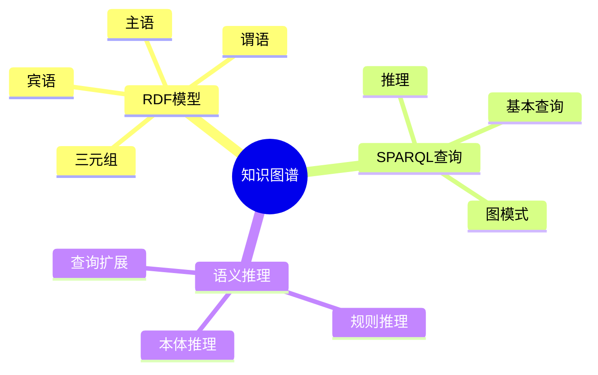

# 数据库知识图谱模型-图数据库与语义查询的形式化

> **文档版本**: v1.0
> **最后更新**: 2025-01-16
> **版本覆盖**: PostgreSQL 18.x (推荐) ⭐ | 17.x (推荐) | 16.x (兼容)
> **文档状态**: 🟡 框架已创建，内容待完善

---

## 📋 目录

- [数据库知识图谱模型-图数据库与语义查询的形式化](#数据库知识图谱模型-图数据库与语义查询的形式化)
  - [📋 目录](#-目录)
  - [1. 概述](#1-概述)
    - [1.0 数据库知识图谱模型工作原理概述](#10-数据库知识图谱模型工作原理概述)
    - [1.1 本文档的范围](#11-本文档的范围)
  - [2. 核心内容](#2-核心内容)
    - [2.1 RDF模型](#21-rdf模型)
    - [2.2 SPARQL查询](#22-sparql查询)
  - [3. 形式化定义](#3-形式化定义)
    - [3.1 RDF形式化](#31-rdf形式化)
  - [4. 实际应用](#4-实际应用)
    - [4.1 知识图谱实现](#41-知识图谱实现)
  - [5. 相关文档](#5-相关文档)
    - [5.1 理论基础文档](#51-理论基础文档)
  - [6. 参考文献](#6-参考文献)
    - [6.1 核心理论文献](#61-核心理论文献)
    - [6.2 PostgreSQL实现相关](#62-postgresql实现相关)
    - [6.3 相关文档](#63-相关文档)

---

## 1. 概述

### 1.0 数据库知识图谱模型工作原理概述

**知识图谱**：

知识图谱使用RDF模型存储语义数据，支持SPARQL查询。

**知识图谱思维导图**：



### 1.1 本文档的范围

本文档涵盖：

- **RDF模型**：三元组的形式化定义
- **SPARQL查询**：SPARQL的语义
- **语义推理**：推理规则的形式化
- **实际应用**：知识图谱系统

---

## 2. 核心内容

### 2.1 RDF模型

**RDF三元组**：

```haskell
-- RDF三元组
data RDFTriple = RDFTriple {
    subject :: URI,
    predicate :: URI,
    object :: URIOrLiteral
}
```

### 2.2 SPARQL查询

**SPARQL语法**：

```haskell
-- SPARQL查询
data SPARQLQuery = SPARQLQuery {
    select :: [Variable],
    where :: GraphPattern,
    optional :: Maybe GraphPattern
}
```

---

## 3. 形式化定义

### 3.1 RDF形式化

**RDF**：

```haskell
-- RDF形式化
RDF = {(s, p, o) | s, p, o in (URI ∪ Literal)}
```

---

## 4. 实际应用

### 4.1 知识图谱实现

**使用Apache AGE**：

```sql
-- 创建图
SELECT * FROM cypher('graph', $$
    CREATE (a:Person {name: 'Alice'})
    CREATE (b:Person {name: 'Bob'})
    CREATE (a)-[:KNOWS]->(b)
$$) AS (result agtype);

-- SPARQL查询
SELECT * FROM sparql_query('
    SELECT ?name WHERE {
        ?person :name ?name
    }
');
```

---

## 5. 相关文档

### 5.1 理论基础文档

- [形式语言与证明：总论](./1.1.25-形式语言与证明-总论.md)
- [理论基础导航](./README.md)

---

## 6. 参考文献

### 6.1 核心理论文献

- **World Wide Web Consortium (2013). "RDF 1.1 Primer."**
  - 标准: W3C Recommendation 2013
  - **重要性**: RDF数据模型的规范
  - **核心贡献**: 定义了知识图谱数据模型

- **Pérez, J., et al. (2009). "Semantics and Complexity of SPARQL."**
  - 会议: TODS 2009
  - **重要性**: SPARQL查询语言的经典论文
  - **核心贡献**: 形式化了SPARQL语义

### 6.2 PostgreSQL实现相关

- **Apache AGE文档](<https://age.apache.org/>)**
  - Apache AGE图数据库扩展说明

### 6.3 相关文档

- [数据库图数据模型-图查询语言与图算法的形式化](./14.01-数据库图数据模型-图查询语言与图算法的形式化.md)
- [理论基础导航](../README.md)

---

**最后更新**: 2025-01-16
**维护者**: Documentation Team
**状态**: 🟡 框架已创建，内容待完善
