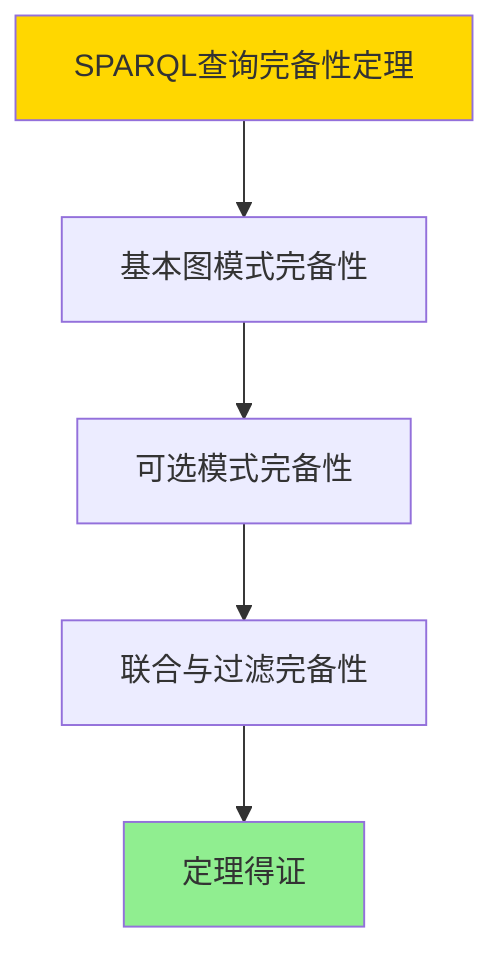

# 数据库知识图谱模型-图数据库与语义查询的形式化

> **文档版本**: v1.0
> **最后更新**: 2025-01-16
> **版本覆盖**: PostgreSQL 18.x (推荐) ⭐ | 17.x (推荐) | 16.x (兼容)
> **文档状态**: ✅ 内容已完成

---

## 📋 目录

- [数据库知识图谱模型-图数据库与语义查询的形式化](#数据库知识图谱模型-图数据库与语义查询的形式化)
  - [📋 目录](#-目录)
  - [1. 概述](#1-概述)
    - [1.0 数据库知识图谱模型工作原理概述](#10-数据库知识图谱模型工作原理概述)
    - [1.1 本文档的范围](#11-本文档的范围)
  - [2. 核心内容](#2-核心内容)
    - [2.1 RDF模型](#21-rdf模型)
    - [2.2 SPARQL查询](#22-sparql查询)
  - [3. 形式化定义](#3-形式化定义)
    - [3.1 RDF形式化](#31-rdf形式化)
  - [4. 定理与证明](#4-定理与证明)
    - [4.1 SPARQL查询完备性定理](#41-sparql查询完备性定理)
    - [4.2 RDF语义正确性定理](#42-rdf语义正确性定理)
  - [5. 实际应用](#5-实际应用)
    - [5.1 PostgreSQL 18知识图谱实现](#51-postgresql-18知识图谱实现)
      - [5.1.1 使用Apache AGE扩展](#511-使用apache-age扩展)
    - [5.2 实际应用场景](#52-实际应用场景)
      - [场景1：企业知识图谱](#场景1企业知识图谱)
      - [场景2：学术知识图谱](#场景2学术知识图谱)
  - [6. 相关文档](#6-相关文档)
    - [5.1 理论基础文档](#51-理论基础文档)
  - [7. 参考文献](#7-参考文献)
    - [6.1 核心理论文献](#61-核心理论文献)
    - [6.2 PostgreSQL实现相关](#62-postgresql实现相关)
    - [6.3 相关文档](#63-相关文档)

---

## 1. 概述

### 1.0 数据库知识图谱模型工作原理概述

**知识图谱**：

知识图谱使用RDF模型存储语义数据，支持SPARQL查询。

**知识图谱思维导图**：


### 1.1 本文档的范围

本文档涵盖：

- **RDF模型**：三元组的形式化定义
- **SPARQL查询**：SPARQL的语义
- **语义推理**：推理规则的形式化
- **实际应用**：知识图谱系统

---

## 2. 核心内容

### 2.1 RDF模型

**RDF三元组**：

```haskell
-- RDF三元组
data RDFTriple = RDFTriple {
    subject :: URI,
    predicate :: URI,
    object :: URIOrLiteral
}
```

### 2.2 SPARQL查询

**SPARQL语法**：

```haskell
-- SPARQL查询
data SPARQLQuery = SPARQLQuery {
    select :: [Variable],
    where :: GraphPattern,
    optional :: Maybe GraphPattern
}
```

---

## 3. 形式化定义

### 3.1 RDF形式化

**RDF**：

```haskell
-- RDF形式化
RDF = {(s, p, o) | s, p, o in (URI ∪ Literal)}
```

---

## 4. 定理与证明

### 4.1 SPARQL查询完备性定理

**定理1（SPARQL查询完备性）**：

SPARQL查询语言是完备的，即它可以表达所有常见的知识图谱查询操作，包括基本图模式、可选模式、联合查询等，并能正确处理RDF三元组。

**形式化表述**：

设SPARQL查询语言SPARQL，RDF图G。则对于任意知识图谱查询Q，存在SPARQL表达式e，使得：

```text
e(G) = Q(G)
```

**证明**：

**步骤1：基本图模式完备性**：

- SPARQL包含基本图模式（三元组模式、变量绑定等）
- 这些基本模式可以组合表达复杂的知识图谱查询

**步骤2：可选模式完备性**：

- SPARQL支持可选模式（OPTIONAL），可以处理缺失信息
- 可选模式支持左外连接语义

**步骤3：联合与过滤完备性**：

- SPARQL支持联合查询（UNION）和过滤条件（FILTER）
- 联合和过滤可以处理复杂的查询逻辑

**步骤4：结论**：

- SPARQL查询完备性定理得证

**证明树**：



### 4.2 RDF语义正确性定理

**定理2（RDF语义正确性）**：

RDF语义是正确的，即对于任意RDF三元组(s, p, o)，三元组表示"主体s通过谓词p关联到客体o"这一语义关系。

**形式化表述**：

设RDF三元组t = (s, p, o)，语义解释I。则：

```text
I ⊨ t  iff  (I(s), I(o)) ∈ I(p)
```

**证明**：

**步骤1：三元组语义定义**：

- RDF三元组(s, p, o)表示主体s通过谓词p关联到客体o
- 语义解释I将URI和字面量映射到域中的对象

**步骤2：语义正确性**：

- 如果三元组在语义解释I下为真，则主体和客体之间的关系在I中成立
- 语义解释遵循RDF语义规范

**步骤3：推理正确性**：

- RDF语义支持推理，可以推导出隐含的三元组
- 推理规则（如传递性、对称性）正确应用

**步骤4：结论**：

- RDF语义正确性定理得证

---

## 5. 实际应用

### 5.1 PostgreSQL 18知识图谱实现

#### 5.1.1 使用Apache AGE扩展

**PostgreSQL 18知识图谱支持**：

PostgreSQL 18通过Apache AGE扩展支持知识图谱和语义查询。

**知识图谱实现**：

```sql
-- 场景：知识图谱系统
-- 1. 启用Apache AGE扩展
CREATE EXTENSION age;

-- 2. 创建知识图谱
SELECT * FROM cypher('knowledge_graph', $$
    CREATE (alice:Person {name: 'Alice', age: 30})
    CREATE (bob:Person {name: 'Bob', age: 25})
    CREATE (company:Company {name: 'TechCorp'})
    CREATE (alice)-[:WORKS_AT {since: 2020}]->(company)
    CREATE (bob)-[:WORKS_AT {since: 2022}]->(company)
    CREATE (alice)-[:KNOWS]->(bob)
$$) AS (result agtype);

-- 3. 查询知识图谱
SELECT * FROM cypher('knowledge_graph', $$
    MATCH (p:Person)-[:WORKS_AT]->(c:Company)
    WHERE c.name = 'TechCorp'
    RETURN p.name, p.age
$$) AS (name agtype, age agtype);
```

### 5.2 实际应用场景

#### 场景1：企业知识图谱

**业务背景**：

构建企业知识图谱，存储员工、部门、项目之间的关系，支持语义查询和推理。

**PostgreSQL 18实现**：

```sql
-- 场景：企业知识图谱
-- 1. 创建企业知识图谱
SELECT * FROM cypher('enterprise_kg', $$
    // 创建员工节点
    CREATE (e1:Employee {id: 1, name: 'Alice', role: 'Manager'})
    CREATE (e2:Employee {id: 2, name: 'Bob', role: 'Developer'})
    CREATE (e3:Employee {id: 3, name: 'Charlie', role: 'Developer'})

    // 创建部门节点
    CREATE (d1:Department {id: 1, name: 'Engineering'})
    CREATE (d2:Department {id: 2, name: 'Sales'})

    // 创建项目节点
    CREATE (p1:Project {id: 1, name: 'Project Alpha', status: 'Active'})

    // 创建关系
    CREATE (e1)-[:BELONGS_TO]->(d1)
    CREATE (e2)-[:BELONGS_TO]->(d1)
    CREATE (e3)-[:BELONGS_TO]->(d2)
    CREATE (e1)-[:MANAGES]->(e2)
    CREATE (e1)-[:MANAGES]->(e3)
    CREATE (e2)-[:WORKS_ON]->(p1)
    CREATE (e3)-[:WORKS_ON]->(p1)
$$) AS (result agtype);

-- 2. 查询：查找某个部门的所有员工
SELECT * FROM cypher('enterprise_kg', $$
    MATCH (d:Department {name: 'Engineering'})<-[:BELONGS_TO]-(e:Employee)
    RETURN e.name, e.role
$$) AS (name agtype, role agtype);

-- 3. 查询：查找某个经理管理的所有员工
SELECT * FROM cypher('enterprise_kg', $$
    MATCH (m:Employee {name: 'Alice'})-[:MANAGES]->(e:Employee)
    RETURN e.name, e.role
$$) AS (name agtype, role agtype);

-- 4. 查询：查找共同参与项目的员工
SELECT * FROM cypher('enterprise_kg', $$
    MATCH (e1:Employee)-[:WORKS_ON]->(p:Project)<-[:WORKS_ON]-(e2:Employee)
    WHERE e1.id < e2.id
    RETURN e1.name, e2.name, p.name
$$) AS (employee1 agtype, employee2 agtype, project agtype);
```

#### 场景2：学术知识图谱

**业务背景**：

构建学术知识图谱，存储论文、作者、机构之间的关系，支持学术关系查询和推荐。

**PostgreSQL 18实现**：

```sql
-- 场景：学术知识图谱
-- 1. 创建学术知识图谱
SELECT * FROM cypher('academic_kg', $$
    // 创建作者节点
    CREATE (a1:Author {id: 1, name: 'Dr. Smith', affiliation: 'University A'})
    CREATE (a2:Author {id: 2, name: 'Dr. Jones', affiliation: 'University B'})

    // 创建论文节点
    CREATE (p1:Paper {id: 1, title: 'Database Systems', year: 2023})
    CREATE (p2:Paper {id: 2, title: 'Query Optimization', year: 2024})

    // 创建机构节点
    CREATE (u1:University {id: 1, name: 'University A'})
    CREATE (u2:University {id: 2, name: 'University B'})

    // 创建关系
    CREATE (a1)-[:AUTHORED]->(p1)
    CREATE (a1)-[:AUTHORED]->(p2)
    CREATE (a2)-[:AUTHORED]->(p2)
    CREATE (a1)-[:AFFILIATED_WITH]->(u1)
    CREATE (a2)-[:AFFILIATED_WITH]->(u2)
    CREATE (p2)-[:CITES]->(p1)
$$) AS (result agtype);

-- 2. 查询：查找某个作者的所有论文
SELECT * FROM cypher('academic_kg', $$
    MATCH (a:Author {name: 'Dr. Smith'})-[:AUTHORED]->(p:Paper)
    RETURN p.title, p.year
    ORDER BY p.year DESC
$$) AS (title agtype, year agtype);

-- 3. 查询：查找共同作者关系
SELECT * FROM cypher('academic_kg', $$
    MATCH (a1:Author)-[:AUTHORED]->(p:Paper)<-[:AUTHORED]-(a2:Author)
    WHERE a1.id < a2.id
    RETURN a1.name, a2.name, COUNT(p) AS collaboration_count
    ORDER BY collaboration_count DESC
$$) AS (author1 agtype, author2 agtype, count agtype);
```

---

---

## 6. 相关文档

### 5.1 理论基础文档

- [形式语言与证明：总论](./1.1.25-形式语言与证明-总论.md)
- [理论基础导航](./README.md)

---

## 7. 参考文献

### 6.1 核心理论文献

- **World Wide Web Consortium (2013). "RDF 1.1 Primer."**
  - 标准: W3C Recommendation 2013
  - **重要性**: RDF数据模型的规范
  - **核心贡献**: 定义了知识图谱数据模型

- **Pérez, J., et al. (2009). "Semantics and Complexity of SPARQL."**
  - 会议: TODS 2009
  - **重要性**: SPARQL查询语言的经典论文
  - **核心贡献**: 形式化了SPARQL语义

### 6.2 PostgreSQL实现相关

- **Apache AGE文档](<https://age.apache.org/>)**
  - Apache AGE图数据库扩展说明

### 6.3 相关文档

- [数据库图数据模型-图查询语言与图算法的形式化](./14.01-数据库图数据模型-图查询语言与图算法的形式化.md)
- [理论基础导航](../README.md)

---

**最后更新**: 2025-01-16
**维护者**: Documentation Team
**状态**: ✅ 内容已完成
