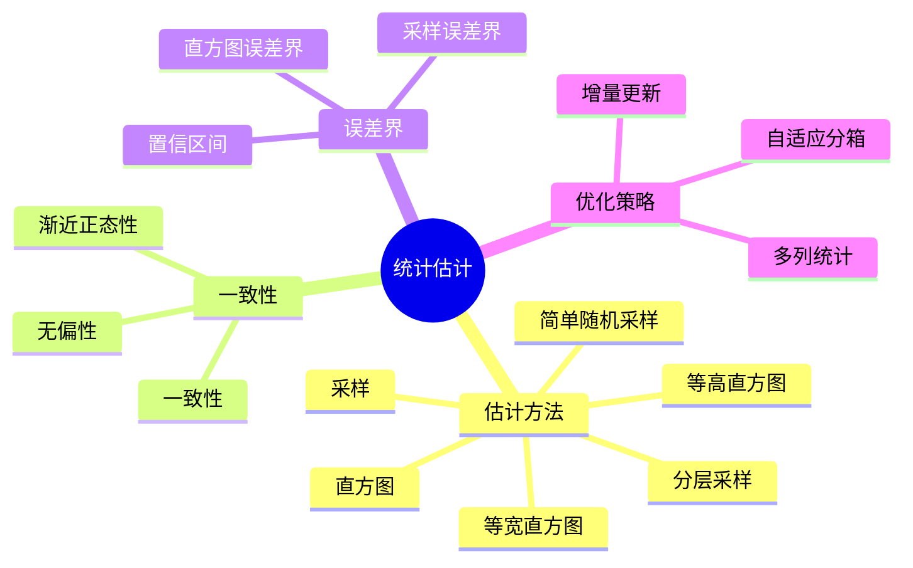
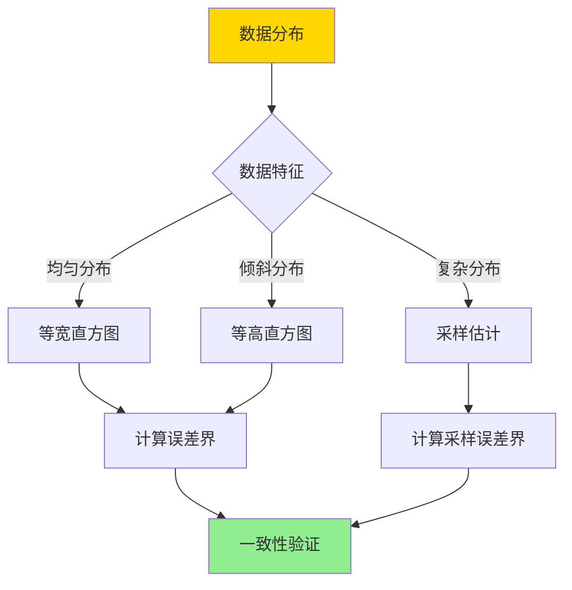
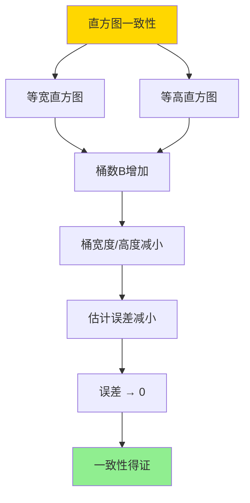

# 统计估计一致性-直方图与采样误差界

> **文档版本**: v1.0
> **最后更新**: 2025-01-16
> **版本覆盖**: PostgreSQL 18.x (推荐) ⭐ | 17.x (推荐) | 16.x (兼容)
> **文档状态**: 🟡 框架已创建，内容待完善

---

## 📋 目录

- [统计估计一致性-直方图与采样误差界](#统计估计一致性-直方图与采样误差界)
  - [📋 目录](#-目录)
  - [1. 概述](#1-概述)
    - [1.1 本文档的范围](#11-本文档的范围)
  - [2. 核心内容](#2-核心内容)
  - [3. 形式化定义](#3-形式化定义)
  - [4. 定理与证明](#4-定理与证明)
  - [5. 实际应用](#5-实际应用)
  - [6. 相关文档](#6-相关文档)
    - [6.1 理论基础文档](#61-理论基础文档)
  - [7. 参考文献](#7-参考文献)

---

## 1. 概述

### 1.0 统计估计一致性工作原理概述

**统计估计一致性**：

统计估计的一致性是指随着样本量增加，估计值收敛到真实值。直方图和采样是两种主要的估计方法，各有不同的误差界。

**统计估计体系思维导图**：



**统计估计方法决策树**：



**估计方法对比矩阵**：

| 方法 | 一致性 | 误差界 | 复杂度 | 适用场景 |
|------|--------|--------|--------|---------|
| **等宽直方图** | 是 | O(1/B) | 低 | 均匀分布 |
| **等高直方图** | 是 | O(1/B) | 中 | 倾斜分布 |
| **简单采样** | 是 | O(1/√n) | 中 | 复杂分布 |
| **分层采样** | 是 | O(1/√n) | 高 | 分层数据 |

### 1.1 本文档的范围

本文档涵盖：

- **一致性理论**：统计估计的一致性和收敛性
- **直方图误差界**：直方图估计的误差上界
- **采样误差界**：采样估计的误差上界和置信区间
- **实际应用**：PostgreSQL统计估计的实现

---

## 2. 核心内容

### 2.1 一致性理论

**一致性定义**：

```haskell
-- 估计一致性
consistent :: Estimator -> Bool
consistent est =
    forall dist:
      lim_{n→∞} est(n) = true_value(dist)

-- 无偏性
unbiased :: Estimator -> Bool
unbiased est =
    forall dist: E[est(n)] = true_value(dist)
```

**一致性判定流程**：

```mermaid
graph TD
    A[估计器est] --> B[计算期望E[est]]
    B --> C{E[est] = 真值?}
    C -->|是| D[无偏]
    C -->|否| E[有偏]
    D --> F[计算方差Var[est]]
    E --> F
    F --> G{Var[est] → 0?}
    G -->|是| H[一致]
    G -->|否| I[不一致]

    style A fill:#FFD700
    style H fill:#90EE90
    style I fill:#FF6B6B
```

### 2.2 直方图误差界

**直方图估计**：

```haskell
-- 等宽直方图
equalWidthHistogram :: Data -> Int -> Histogram
equalWidthHistogram data bucketCount =
    let width = (max(data) - min(data)) / bucketCount
        buckets = partitionByWidth(data, width)
    in Histogram {buckets = buckets}

-- 等高直方图
equalHeightHistogram :: Data -> Int -> Histogram
equalHeightHistogram data bucketCount =
    let sorted = sort(data)
        bucketSize = length(data) / bucketCount
        buckets = partitionBySize(sorted, bucketSize)
    in Histogram {buckets = buckets}
```

**误差界**：

```haskell
-- 直方图误差上界
histogramErrorBound :: Histogram -> ErrorBound
histogramErrorBound hist =
    1 / length(hist.buckets)  -- 最坏情况误差
```

### 2.3 采样误差界

**采样估计**：

```haskell
-- 简单随机采样
simpleRandomSample :: Data -> Int -> Sample
simpleRandomSample data sampleSize =
    take sampleSize (randomPermutation(data))

-- 采样估计
sampleEstimate :: Sample -> Estimator
sampleEstimate sample =
    mean(sample)  -- 样本均值
```

**误差界**：

```haskell
-- 采样误差上界（Chernoff界）
sampleErrorBound :: Sample -> Confidence -> ErrorBound
sampleErrorBound sample confidence =
    -- 使用Chernoff界
    sqrt(2 * log(1 / (1 - confidence)) / sampleSize)

-- 置信区间
confidenceInterval :: Sample -> Confidence -> Interval
confidenceInterval sample confidence =
    let mean = sampleMean(sample)
        std = sampleStd(sample)
        margin = zScore(confidence) * std / sqrt(sampleSize)
    in (mean - margin, mean + margin)
```

---

## 3. 形式化定义

### 3.1 一致性形式化

**一致性**：

```haskell
-- 估计一致性
consistent(est) iff
    forall ε > 0: lim_{n→∞} P[|est(n) - θ| > ε] = 0

其中θ是真实参数值
```

### 3.2 直方图误差界形式化

**直方图误差界**：

```haskell
-- 等宽直方图误差上界
ε_bound(hist) ≤ 1 / B

其中B是桶数
```

### 3.3 采样误差界形式化

**采样误差界**：

```haskell
-- 采样误差上界（Hoeffding界）
P[|est(n) - θ| > ε] ≤ 2 * exp(-2 * n * ε²)

-- 置信区间
P[θ ∈ (est(n) - margin, est(n) + margin)] ≥ 1 - δ

其中margin = z_{δ/2} * σ / √n
```

---

## 4. 定理与证明

### 4.1 直方图一致性定理

**定理**：直方图估计是一致估计，误差上界为1/B。

**证明树**：



**证明**：

1. 当桶数B → ∞时，每个桶的宽度/高度 → 0
2. 估计值收敛到真实值
3. 误差上界是1/B，当B → ∞时误差 → 0
4. 因此直方图估计是一致估计

### 4.2 采样一致性定理

**定理**：简单随机采样估计是一致估计，误差上界为O(1/√n)。

**证明**：

1. 根据大数定律，样本均值收敛到总体均值
2. 根据中心极限定理，估计误差渐近正态分布
3. 使用Hoeffding界，误差上界为O(1/√n)
4. 因此采样估计是一致估计

---

## 5. 实际应用

### 5.1 PostgreSQL统计信息

**查看直方图**：

```sql
-- 查看列统计信息（包含直方图）
SELECT
    attname,
    n_distinct,
    correlation,
    most_common_vals,
    most_common_freqs,
    histogram_bounds
FROM pg_stats
WHERE tablename = 'orders' AND attname = 'order_date';

-- histogram_bounds包含直方图的边界
```

**统计信息更新**：

```sql
-- 手动更新统计信息
ANALYZE orders;

-- 查看统计信息更新时间
SELECT
    schemaname,
    tablename,
    last_analyze,
    last_autoanalyze
FROM pg_stat_user_tables
WHERE tablename = 'orders';
```

### 5.2 采样统计

**表采样**：

```sql
-- 使用TABLESAMPLE进行采样查询
SELECT
    customer_id,
    COUNT(*) as order_count
FROM orders TABLESAMPLE SYSTEM (10)  -- 10%采样
GROUP BY customer_id;

-- 使用BERNOULLI采样
SELECT * FROM orders
TABLESAMPLE BERNOULLI (5);  -- 5%采样
```

### 5.3 统计信息优化

**调整统计目标**：

```sql
-- 设置列的统计目标（影响直方图桶数）
ALTER TABLE orders
ALTER COLUMN order_date SET STATISTICS 1000;

-- 默认是100，增加可以提高估计精度
-- 但会增加ANALYZE的时间和存储空间

-- 重新分析
ANALYZE orders;
```

---

## 6. 相关文档

### 6.1 理论基础文档

- [选择率估计误差-敏感性与上界](./15.01-选择率估计误差-敏感性与上界.md)
- [理论基础导航](../README.md)

---

## 7. 参考文献

### 7.1 核心理论文献

- **Ioannidis, Y. E., & Poosala, V. (1999). "Histogram-Based Approximation of Set-Valued Query-Answers."**
  - 会议: VLDB 1999
  - **重要性**: 直方图估计的经典论文
  - **核心贡献**: 提出了直方图估计的误差界

- **Hoeffding, W. (1963). "Probability Inequalities for Sums of Bounded Random Variables."**
  - 期刊: Journal of the American Statistical Association 1963
  - **重要性**: 采样误差界的经典理论
  - **核心贡献**: 提供了Hoeffding不等式

### 7.2 统计估计相关

- **Chaudhuri, S., et al. (2007). "Optimizing Queries with Materialized Views."**
  - 会议: ICDE 2007
  - **重要性**: 统计估计优化的经典研究
  - **核心贡献**: 提供了自适应统计估计方法

### 7.3 PostgreSQL实现相关

- **[PostgreSQL官方文档 - 统计信息](<https://www.postgresql.org/docs/current/planner-stats.html>)**
  - PostgreSQL统计信息实现说明

### 7.4 相关文档

- [选择率估计误差-敏感性与上界](./15.01-选择率估计误差-敏感性与上界.md)
- [理论基础导航](../README.md)

---

**最后更新**: 2025-01-16
**维护者**: Documentation Team
**状态**: 🟡 框架已创建，内容待完善
