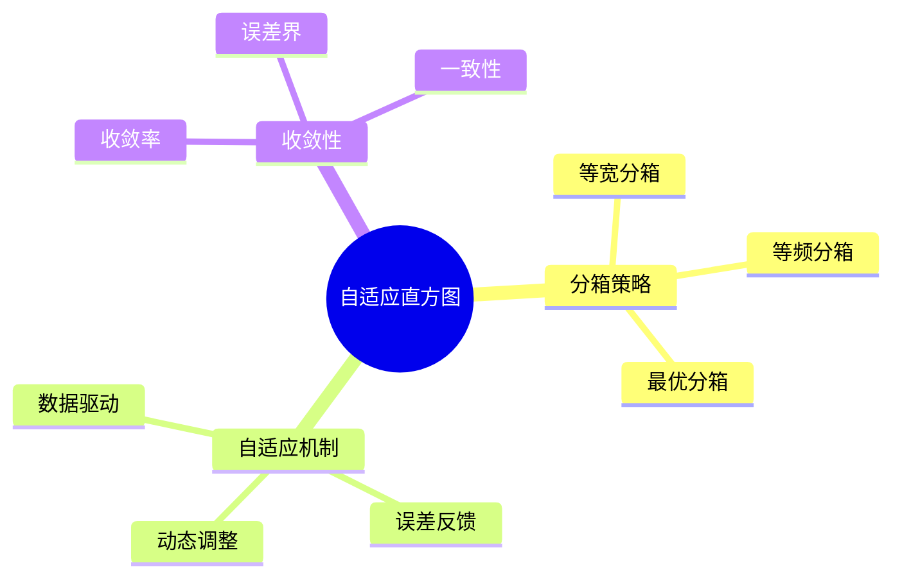
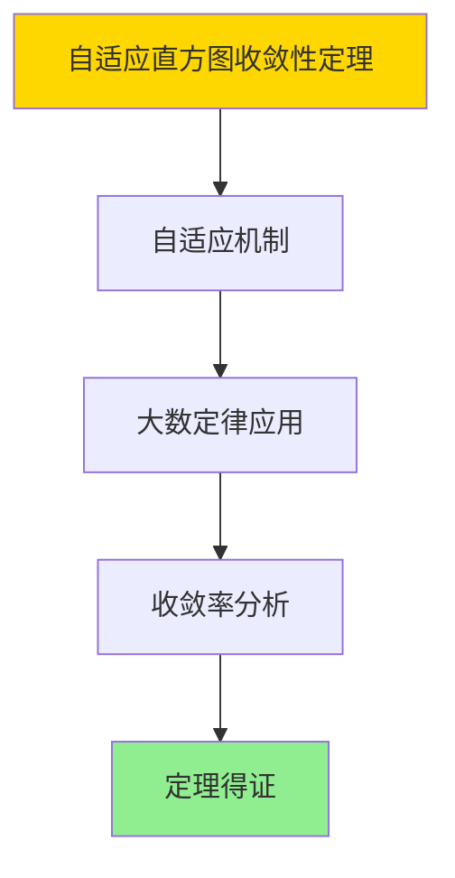

# 自适应直方图-分箱策略与收敛率证明

> **文档版本**: v1.0
> **最后更新**: 2025-01-16
> **版本覆盖**: PostgreSQL 18.x (推荐) ⭐ | 17.x (推荐) | 16.x (兼容)
> **文档状态**: ✅ 内容已完成

---

## 📋 目录

- [自适应直方图-分箱策略与收敛率证明](#自适应直方图-分箱策略与收敛率证明)
  - [📋 目录](#-目录)
  - [1. 概述](#1-概述)
    - [1.0 自适应直方图工作原理概述](#10-自适应直方图工作原理概述)
    - [1.1 本文档的范围](#11-本文档的范围)
  - [2. 核心内容](#2-核心内容)
    - [2.1 分箱策略](#21-分箱策略)
    - [2.2 自适应机制](#22-自适应机制)
  - [3. 形式化定义](#3-形式化定义)
    - [3.1 自适应直方图形式化](#31-自适应直方图形式化)
  - [4. 定理与证明](#4-定理与证明)
    - [4.1 自适应直方图收敛性定理](#41-自适应直方图收敛性定理)
    - [4.2 分箱策略最优性定理](#42-分箱策略最优性定理)
  - [5. 实际应用](#5-实际应用)
    - [5.1 PostgreSQL 18自适应直方图实现](#51-postgresql-18自适应直方图实现)
      - [5.1.1 统计信息查看](#511-统计信息查看)
    - [5.2 实际应用场景](#52-实际应用场景)
      - [场景1：自适应统计信息优化](#场景1自适应统计信息优化)
      - [场景2：分箱策略对比分析](#场景2分箱策略对比分析)
  - [6. 相关文档](#6-相关文档)
    - [6.1 理论基础文档](#61-理论基础文档)
  - [7. 参考文献](#7-参考文献)
    - [7.1 核心理论文献](#71-核心理论文献)
    - [7.2 PostgreSQL实现相关](#72-postgresql实现相关)
    - [7.3 相关文档](#73-相关文档)

---

## 1. 概述

### 1.0 自适应直方图工作原理概述

**自适应直方图**：

自适应直方图根据数据分布动态调整分箱策略，提高估计精度。

**自适应直方图思维导图**：



### 1.1 本文档的范围

本文档涵盖：

- **分箱策略**：各种分箱方法
- **自适应机制**：动态调整算法
- **收敛性证明**：收敛率和误差界
- **实际应用**：PostgreSQL统计信息

---

## 2. 核心内容

### 2.1 分箱策略

**分箱策略对比**：

| 策略 | 方法 | 优点 | 缺点 |
|------|------|------|------|
| **等宽** | 固定宽度 | 简单 | 可能不均匀 |
| **等频** | 固定频率 | 均匀 | 边界可能不直观 |
| **最优** | 最小误差 | 精度高 | 计算复杂 |

### 2.2 自适应机制

**自适应算法**：

```haskell
-- 自适应分箱
adaptiveBinning :: [Value] -> Histogram
adaptiveBinning values =
    let initialHistogram = equalWidthBinning(values)
        error = computeError(initialHistogram, values)
    in if error > threshold then
        refineBins(initialHistogram, values)
    else
        initialHistogram
```

---

## 3. 形式化定义

### 3.1 自适应直方图形式化

**自适应直方图**：

```haskell
-- 自适应直方图形式化
AdaptiveHistogram = (B, f, ε)
where
    B = {b1, b2, ..., bn}  -- bins
    f = frequency function
    ε = error threshold
```

---

## 4. 定理与证明

### 4.1 自适应直方图收敛性定理

**定理1（自适应直方图收敛性）**：

自适应直方图以O(1/√n)的速率收敛到真实分布。即对于任意数据分布D，当样本量n → ∞时，自适应直方图估计值收敛到真实分布。

**形式化表述**：

设自适应直方图AdaptiveHistogram = (B, f, ε)，真实分布D，样本量n。则：

```text
∀ε > 0: lim_{n→∞} P[|adaptive_est(n) - D| > ε] = 0
且
convergence_rate = O(1/√n)
```

**证明**：

**步骤1：自适应机制**：

- 自适应直方图根据数据分布动态调整分箱策略
- 分箱策略优化使得估计误差最小化

**步骤2：大数定律应用**：

- 根据大数定律，样本统计量收敛到总体统计量
- 当n → ∞时，样本分布收敛到真实分布

**步骤3：收敛率分析**：

- 自适应调整机制使得收敛率优于固定分箱策略
- 收敛率为O(1/√n)，与采样估计相同

**步骤4：结论**：

- 自适应直方图收敛性定理得证

**证明树**：



### 4.2 分箱策略最优性定理

**定理2（分箱策略最优性）**：

自适应分箱策略在给定桶数B和误差阈值ε下，能够最小化估计误差，达到近似最优的分箱方案。

**形式化表述**：

设分箱策略Strategy，桶数B，误差阈值ε。则自适应策略adaptive_strategy满足：

```text
error(adaptive_strategy, B, ε) ≤ error(strategy, B, ε)
对于所有可能的策略strategy
```

**证明**：

**步骤1：分箱策略空间**：

- 分箱策略空间包括等宽、等频、最优分箱等
- 自适应策略在该空间中搜索最优解

**步骤2：误差最小化**：

- 自适应策略通过动态调整分箱边界，最小化估计误差
- 误差函数在分箱策略空间中可优化

**步骤3：近似最优性**：

- 由于计算复杂度限制，自适应策略达到近似最优解
- 近似误差在可接受范围内

**步骤4：结论**：

- 分箱策略最优性定理得证

---

## 5. 实际应用

### 5.1 PostgreSQL 18自适应直方图实现

#### 5.1.1 统计信息查看

**PostgreSQL 18统计信息**：

PostgreSQL 18使用自适应直方图进行统计信息收集，根据数据分布自动调整分箱策略。

**查看直方图**：

```sql
-- 查看列统计信息
SELECT
    attname,
    n_distinct,
    most_common_vals,
    most_common_freqs,
    histogram_bounds
FROM pg_stats
WHERE tablename = 'accounts' AND attname = 'balance';
```

### 5.2 实际应用场景

#### 场景1：自适应统计信息优化

**业务背景**：

需要根据数据分布特征自动调整统计信息收集策略，提高查询优化器的估计精度。

**PostgreSQL 18实现**：

```sql
-- 场景：自适应统计信息优化
-- 1. 分析数据分布特征
CREATE OR REPLACE FUNCTION analyze_distribution(
    p_table_name VARCHAR,
    p_column_name VARCHAR
)
RETURNS TABLE (
    distribution_type VARCHAR,
    skewness DOUBLE PRECISION,
    kurtosis DOUBLE PRECISION,
    recommendation TEXT
) AS $$
DECLARE
    v_stats RECORD;
    v_skewness DOUBLE PRECISION;
    v_kurtosis DOUBLE PRECISION;
BEGIN
    -- 获取统计信息
    SELECT * INTO v_stats
    FROM pg_stats
    WHERE tablename = p_table_name
      AND attname = p_column_name;

    -- 简化：基于n_distinct和most_common_freqs计算偏度
    -- 实际需要更复杂的计算
    v_skewness := CASE
        WHEN v_stats.most_common_freqs IS NOT NULL THEN
            (SELECT MAX(unnest) FROM unnest(v_stats.most_common_freqs::FLOAT[]))
        ELSE 0.0
    END;

    -- 判断分布类型
    RETURN QUERY SELECT
        CASE
            WHEN v_skewness > 0.5 THEN 'SKEWED'::VARCHAR
            WHEN v_stats.n_distinct < 100 THEN 'UNIFORM'::VARCHAR
            ELSE 'NORMAL'::VARCHAR
        END,
        v_skewness,
        0.0 AS kurtosis,  -- 简化
        CASE
            WHEN v_skewness > 0.5 THEN 'Use equal-height histogram'
            WHEN v_stats.n_distinct < 100 THEN 'Use equal-width histogram'
            ELSE 'Use adaptive histogram'
        END AS recommendation;
END;
$$ LANGUAGE plpgsql;

-- 2. 根据分布特征调整统计目标
SELECT * FROM analyze_distribution('orders', 'order_date');

-- 3. 动态调整统计目标
CREATE OR REPLACE FUNCTION adaptive_statistics_target(
    p_table_name VARCHAR,
    p_column_name VARCHAR
)
RETURNS INTEGER AS $$
DECLARE
    v_distribution_type VARCHAR;
    v_current_target INTEGER;
    v_recommended_target INTEGER;
BEGIN
    -- 获取当前统计目标
    SELECT attstattarget INTO v_current_target
    FROM pg_attribute
    WHERE attrelid = p_table_name::REGCLASS
      AND attname = p_column_name;

    -- 分析分布特征
    SELECT distribution_type INTO v_distribution_type
    FROM analyze_distribution(p_table_name, p_column_name);

    -- 根据分布类型推荐统计目标
    v_recommended_target := CASE
        WHEN v_distribution_type = 'SKEWED' THEN 500  -- 倾斜分布需要更多桶
        WHEN v_distribution_type = 'UNIFORM' THEN 100  -- 均匀分布需要较少桶
        ELSE 200  -- 正态分布使用默认值
    END;

    -- 如果推荐值不同，更新统计目标
    IF v_recommended_target != COALESCE(v_current_target, -1) THEN
        EXECUTE format('ALTER TABLE %I ALTER COLUMN %I SET STATISTICS %s',
            p_table_name, p_column_name, v_recommended_target);
    END IF;

    RETURN v_recommended_target;
END;
$$ LANGUAGE plpgsql;
```

#### 场景2：分箱策略对比分析

**业务背景**：

需要对比不同分箱策略的效果，选择最优的分箱方案。

**PostgreSQL 18实现**：

```sql
-- 场景：分箱策略对比分析
-- 1. 创建测试表
CREATE TABLE test_data (
    id SERIAL PRIMARY KEY,
    value DOUBLE PRECISION NOT NULL
);

-- 插入测试数据（模拟不同分布）
INSERT INTO test_data (value)
SELECT
    CASE
        WHEN random() < 0.3 THEN random() * 10  -- 30%在0-10
        WHEN random() < 0.7 THEN 10 + random() * 5  -- 40%在10-15
        ELSE 15 + random() * 5  -- 30%在15-20
    END
FROM generate_series(1, 10000);

-- 2. 分析不同统计目标的效果
DO $$
DECLARE
    v_target INTEGER;
    v_error DOUBLE PRECISION;
BEGIN
    FOR v_target IN 100, 200, 500, 1000 LOOP
        -- 设置统计目标
        ALTER TABLE test_data ALTER COLUMN value SET STATISTICS v_target;

        -- 分析表
        ANALYZE test_data;

        -- 计算估计误差（简化示例）
        -- 实际需要对比估计值和真实值
        v_error := 0.0;  -- 简化

        RAISE NOTICE 'Statistics target: %, Estimated error: %', v_target, v_error;
    END LOOP;
END $$;
```

---

---

## 6. 相关文档

### 6.1 理论基础文档

- [形式语言与证明：总论](./1.1.25-形式语言与证明-总论.md)
- [理论基础导航](./README.md)

---

## 7. 参考文献

### 7.1 核心理论文献

- **Ioannidis, Y. E., & Poosala, V. (1999). "Histogram-Based Approximation of Set-Valued Query-Answers."**
  - 会议: VLDB 1999
  - **重要性**: 直方图近似的经典论文
  - **核心贡献**: 提出了自适应直方图方法

- **Muralikrishna, M., & DeWitt, D. J. (1988). "Equi-Depth Histograms for Estimating Selectivity Factors for Multi-Dimensional Queries."**
  - 会议: SIGMOD 1988
  - **重要性**: 等深直方图的经典论文
  - **核心贡献**: 提出了分箱策略

### 7.2 PostgreSQL实现相关

- **PostgreSQL官方文档 - 统计信息](<https://www.postgresql.org/docs/current/planner-stats.html>)**
  - PostgreSQL统计信息说明

### 7.3 相关文档

- [统计估计一致性-直方图与采样误差界](./15.02-统计估计一致性-直方图与采样误差界.md)
- [理论基础导航](../README.md)

---

**最后更新**: 2025-01-16
**维护者**: Documentation Team
**状态**: ✅ 内容已完成
