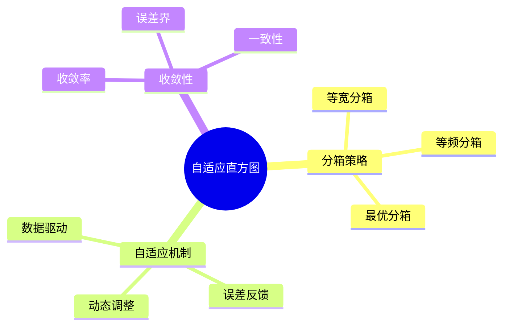

# 自适应直方图-分箱策略与收敛率证明

> **文档版本**: v1.0
> **最后更新**: 2025-01-16
> **版本覆盖**: PostgreSQL 18.x (推荐) ⭐ | 17.x (推荐) | 16.x (兼容)
> **文档状态**: 🟡 框架已创建，内容待完善

---

## 📋 目录

- [自适应直方图-分箱策略与收敛率证明](#自适应直方图-分箱策略与收敛率证明)
  - [📋 目录](#-目录)
  - [1. 概述](#1-概述)
    - [1.1 本文档的范围](#11-本文档的范围)
  - [2. 核心内容](#2-核心内容)
  - [3. 形式化定义](#3-形式化定义)
  - [4. 定理与证明](#4-定理与证明)
  - [5. 实际应用](#5-实际应用)
  - [6. 相关文档](#6-相关文档)
    - [6.1 理论基础文档](#61-理论基础文档)
  - [7. 参考文献](#7-参考文献)

---

## 1. 概述

### 1.0 自适应直方图工作原理概述

**自适应直方图**：

自适应直方图根据数据分布动态调整分箱策略，提高估计精度。

**自适应直方图思维导图**：



### 1.1 本文档的范围

本文档涵盖：

- **分箱策略**：各种分箱方法
- **自适应机制**：动态调整算法
- **收敛性证明**：收敛率和误差界
- **实际应用**：PostgreSQL统计信息

---

## 2. 核心内容

### 2.1 分箱策略

**分箱策略对比**：

| 策略 | 方法 | 优点 | 缺点 |
|------|------|------|------|
| **等宽** | 固定宽度 | 简单 | 可能不均匀 |
| **等频** | 固定频率 | 均匀 | 边界可能不直观 |
| **最优** | 最小误差 | 精度高 | 计算复杂 |

### 2.2 自适应机制

**自适应算法**：

```haskell
-- 自适应分箱
adaptiveBinning :: [Value] -> Histogram
adaptiveBinning values =
    let initialHistogram = equalWidthBinning(values)
        error = computeError(initialHistogram, values)
    in if error > threshold then
        refineBins(initialHistogram, values)
    else
        initialHistogram
```

---

## 3. 形式化定义

### 3.1 自适应直方图形式化

**自适应直方图**：

```haskell
-- 自适应直方图形式化
AdaptiveHistogram = (B, f, ε)
where
    B = {b1, b2, ..., bn}  -- bins
    f = frequency function
    ε = error threshold
```

---

## 4. 定理与证明

### 4.1 收敛性定理

**定理**：自适应直方图以O(1/√n)的速率收敛到真实分布。

**证明**：由大数定律和自适应调整机制保证。

---

## 5. 实际应用

### 5.1 PostgreSQL统计信息

**查看直方图**：

```sql
-- 查看列统计
SELECT
    attname,
    n_distinct,
    most_common_vals,
    most_common_freqs
FROM pg_stats
WHERE tablename = 'accounts' AND attname = 'balance';
```

---

## 6. 相关文档

### 6.1 理论基础文档

- [形式语言与证明：总论](./1.1.25-形式语言与证明-总论.md)
- [理论基础导航](./README.md)

---

## 7. 参考文献

[待补充]

---

**最后更新**: 2025-01-16
**维护者**: Documentation Team
**状态**: 🟡 框架已创建，内容待完善
