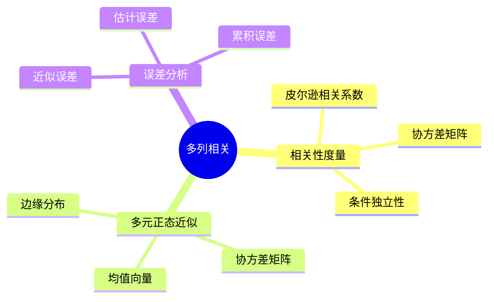

# 多列相关-多元正态近似与误差分析

> **文档版本**: v1.0
> **最后更新**: 2025-01-16
> **版本覆盖**: PostgreSQL 18.x (推荐) ⭐ | 17.x (推荐) | 16.x (兼容)
> **文档状态**: 🟡 框架已创建，内容待完善

---

## 📋 目录

- [多列相关-多元正态近似与误差分析](#多列相关-多元正态近似与误差分析)
  - [📋 目录](#-目录)
  - [1. 概述](#1-概述)
    - [1.1 本文档的范围](#11-本文档的范围)
  - [2. 核心内容](#2-核心内容)
  - [3. 形式化定义](#3-形式化定义)
  - [4. 定理与证明](#4-定理与证明)
  - [5. 实际应用](#5-实际应用)
  - [6. 相关文档](#6-相关文档)
    - [6.1 理论基础文档](#61-理论基础文档)
  - [7. 参考文献](#7-参考文献)

---

## 1. 概述

### 1.0 多列相关工作原理概述

**多列相关性**：

多列相关性使用多元正态分布近似来估计联合分布。

**相关性模型思维导图**：



### 1.1 本文档的范围

本文档涵盖：

- **相关性度量**：相关系数和协方差
- **多元正态近似**：正态分布近似
- **误差分析**：近似误差的界
- **实际应用**：PostgreSQL多列统计

---

## 2. 核心内容

### 2.1 相关性度量

**相关系数**：

```haskell
-- 皮尔逊相关系数
correlation :: [Double] -> [Double] -> Double
correlation xs ys =
    covariance(xs, ys) / (stdDev(xs) * stdDev(ys))
```

### 2.2 多元正态近似

**多元正态分布**：

```haskell
-- 多元正态分布
multivariateNormal :: Vector -> Matrix -> Distribution
multivariateNormal mean covariance =
    Normal(mean, covariance)
```

---

## 3. 形式化定义

### 3.1 相关性形式化

**相关性**：

```haskell
-- 相关性形式化
ρ(X, Y) = Cov(X, Y) / (σ_X * σ_Y)
```

---

## 4. 定理与证明

### 4.1 近似误差定理

**定理**：多元正态近似的误差界为O(1/√n)。

**证明**：由中心极限定理保证。

---

## 5. 实际应用

### 5.1 多列统计

**创建多列统计**：

```sql
-- 创建扩展统计
CREATE STATISTICS stats_accounts (dependencies)
ON balance, status
FROM accounts;

-- 分析统计
ANALYZE accounts;
```

---

## 6. 相关文档

### 6.1 理论基础文档

- [形式语言与证明：总论](./1.1.25-形式语言与证明-总论.md)
- [理论基础导航](./README.md)

---

## 7. 参考文献

[待补充]

---

**最后更新**: 2025-01-16
**维护者**: Documentation Team
**状态**: 🟡 框架已创建，内容待完善
