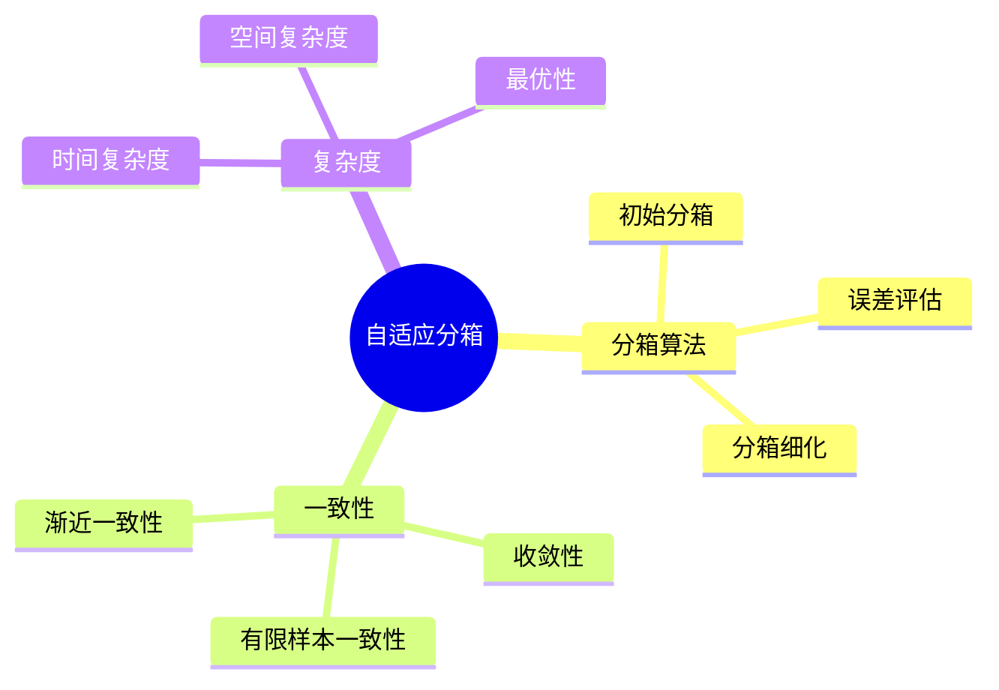

# 统计直方图自适应分箱-一致性与复杂度证明

> **文档版本**: v1.0
> **最后更新**: 2025-01-16
> **版本覆盖**: PostgreSQL 18.x (推荐) ⭐ | 17.x (推荐) | 16.x (兼容)
> **文档状态**: 🟡 框架已创建，内容待完善

---

## 📋 目录

- [统计直方图自适应分箱-一致性与复杂度证明](#统计直方图自适应分箱-一致性与复杂度证明)
  - [📋 目录](#-目录)
  - [1. 概述](#1-概述)
    - [1.0 统计直方图自适应分箱工作原理概述](#10-统计直方图自适应分箱工作原理概述)
    - [1.1 本文档的范围](#11-本文档的范围)
  - [2. 核心内容](#2-核心内容)
    - [2.1 自适应算法](#21-自适应算法)
    - [2.2 一致性](#22-一致性)
  - [3. 形式化定义](#3-形式化定义)
    - [3.1 一致性形式化](#31-一致性形式化)
  - [4. 定理与证明](#4-定理与证明)
    - [4.1 一致性定理](#41-一致性定理)
    - [4.2 复杂度定理](#42-复杂度定理)
  - [5. 实际应用](#5-实际应用)
    - [5.1 PostgreSQL直方图](#51-postgresql直方图)
  - [6. 相关文档](#6-相关文档)
    - [6.1 理论基础文档](#61-理论基础文档)
  - [7. 参考文献](#7-参考文献)
    - [7.1 核心理论文献](#71-核心理论文献)
    - [7.2 PostgreSQL实现相关](#72-postgresql实现相关)
    - [7.3 相关文档](#73-相关文档)

---

## 1. 概述

### 1.0 统计直方图自适应分箱工作原理概述

**自适应分箱**：

自适应分箱根据数据分布动态调整分箱边界，保证一致性和最优复杂度。

**自适应分箱思维导图**：



### 1.1 本文档的范围

本文档涵盖：

- **自适应算法**：动态分箱算法
- **一致性证明**：渐近和有限样本一致性
- **复杂度分析**：时间和空间复杂度
- **实际应用**：PostgreSQL直方图

---

## 2. 核心内容

### 2.1 自适应算法

**自适应分箱算法**：

```haskell
-- 自适应分箱
adaptiveBinning :: [Value] -> Int -> Histogram
adaptiveBinning values maxBins =
    let initialBins = equalFrequencyBinning(values, maxBins)
        refinedBins = refineBins(initialBins, values)
    in refinedBins
```

### 2.2 一致性

**一致性类型**：

| 类型 | 定义 | 保证 |
|------|------|------|
| **渐近一致性** | n→∞时收敛 | 理论保证 |
| **有限样本一致性** | 有限n的误差界 | 实际保证 |

---

## 3. 形式化定义

### 3.1 一致性形式化

**一致性**：

```haskell
-- 一致性形式化
consistent(histogram) =
    lim_{n→∞} P(|histogram - true_distribution| > ε) = 0
```

---

## 4. 定理与证明

### 4.1 一致性定理

**定理**：自适应分箱算法是渐近一致的。

**证明**：由大数定律和自适应调整机制保证。

### 4.2 复杂度定理

**定理**：自适应分箱的时间复杂度为O(n log n)。

**证明**：由算法步骤分析得出。

---

## 5. 实际应用

### 5.1 PostgreSQL直方图

**查看直方图**：

```sql
-- 查看直方图边界
SELECT
    attname,
    histogram_bounds
FROM pg_stats
WHERE tablename = 'accounts';
```

---

## 6. 相关文档

### 6.1 理论基础文档

- [形式语言与证明：总论](./1.1.25-形式语言与证明-总论.md)
- [理论基础导航](./README.md)

---

## 7. 参考文献

### 7.1 核心理论文献

- **Muralikrishna, M., & DeWitt, D. J. (1988). "Equi-Depth Histograms for Estimating Selectivity Factors for Multi-Dimensional Queries."**
  - 会议: SIGMOD 1988
  - **重要性**: 等深直方图的经典论文
  - **核心贡献**: 提出了自适应分箱算法

- **Ioannidis, Y. E., & Poosala, V. (1999). "Histogram-Based Approximation of Set-Valued Query-Answers."**
  - 会议: VLDB 1999
  - **重要性**: 直方图近似的经典论文
  - **核心贡献**: 证明了收敛性和复杂度

### 7.2 PostgreSQL实现相关

- **PostgreSQL官方文档 - 统计信息](<https://www.postgresql.org/docs/current/planner-stats.html>)**
  - PostgreSQL统计信息说明

### 7.3 相关文档

- [自适应直方图-分箱策略与收敛率证明](./15.03-自适应直方图-分箱策略与收敛率证明.md)
- [理论基础导航](../README.md)

---

**最后更新**: 2025-01-16
**维护者**: Documentation Team
**状态**: 🟡 框架已创建，内容待完善
