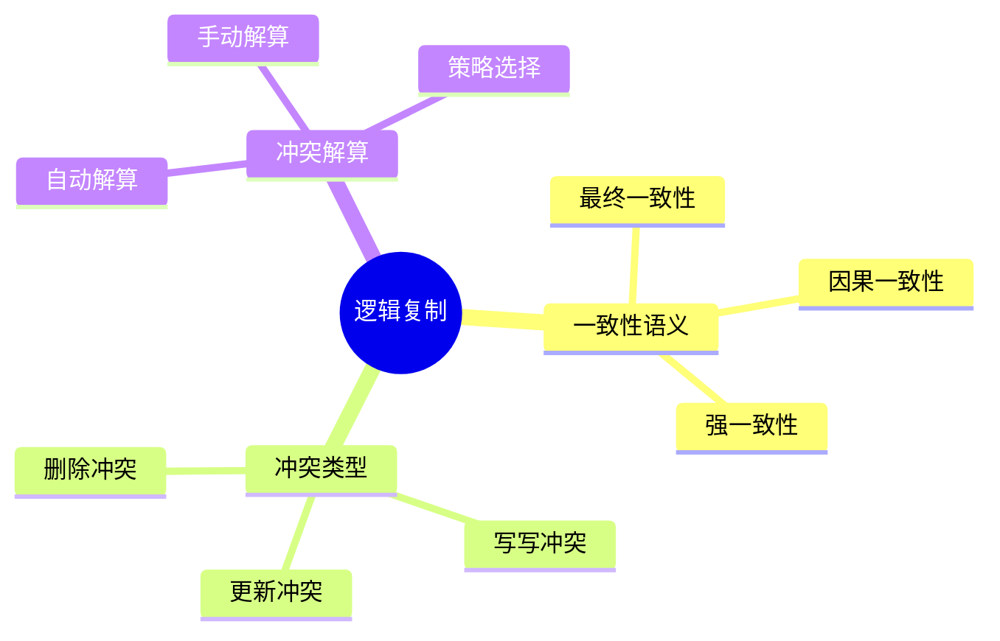

# 逻辑复制-一致性语义与冲突解算

> **文档版本**: v1.0
> **最后更新**: 2025-01-16
> **版本覆盖**: PostgreSQL 18.x (推荐) ⭐ | 17.x (推荐) | 16.x (兼容)
> **文档状态**: 🟡 框架已创建，内容待完善

---

## 📋 目录

- [逻辑复制-一致性语义与冲突解算](#逻辑复制-一致性语义与冲突解算)
  - [📋 目录](#-目录)
  - [1. 概述](#1-概述)
    - [1.1 本文档的范围](#11-本文档的范围)
  - [2. 核心内容](#2-核心内容)
  - [3. 形式化定义](#3-形式化定义)
  - [4. 定理与证明](#4-定理与证明)
  - [5. 实际应用](#5-实际应用)
  - [6. 相关文档](#6-相关文档)
    - [6.1 理论基础文档](#61-理论基础文档)
  - [7. 参考文献](#7-参考文献)

---

## 1. 概述

### 1.0 逻辑复制工作原理概述

**逻辑复制**：

逻辑复制在数据库级别复制数据变更，需要处理一致性语义和冲突。

**逻辑复制思维导图**：



### 1.1 本文档的范围

本文档涵盖：

- **一致性语义**：各种一致性级别
- **冲突类型**：冲突分类
- **冲突解算**：解算策略
- **实际应用**：PostgreSQL逻辑复制

---

## 2. 核心内容

### 2.1 一致性语义

**一致性级别**：

| 级别 | 定义 | 保证 |
|------|------|------|
| **最终一致** | 最终相同 | 弱 |
| **因果一致** | 因果关系保持 | 中 |
| **强一致** | 立即相同 | 强 |

### 2.2 冲突类型

**冲突分类**：

```haskell
-- 冲突类型
data Conflict =
    WriteWriteConflict Row Row
  | UpdateConflict Row Row
  | DeleteConflict Row
```

---

## 3. 形式化定义

### 3.1 一致性形式化

**一致性**：

```haskell
-- 一致性形式化
consistent(replica1, replica2) =
    eventually(replica1 = replica2)
```

---

## 4. 定理与证明

### 4.1 一致性定理

**定理**：逻辑复制保证最终一致性。

**证明**：由复制协议保证。

---

## 5. 实际应用

### 5.1 PostgreSQL逻辑复制

**创建发布**：

```sql
-- 创建发布
CREATE PUBLICATION my_publication FOR TABLE accounts;

-- 创建订阅
CREATE SUBSCRIPTION my_subscription
CONNECTION 'host=target_db' PUBLICATION my_publication;
```

---

## 6. 相关文档

### 6.1 理论基础文档

- [形式语言与证明：总论](./1.1.25-形式语言与证明-总论.md)
- [理论基础导航](./README.md)

---

## 7. 参考文献

[待补充]

---

**最后更新**: 2025-01-16
**维护者**: Documentation Team
**状态**: 🟡 框架已创建，内容待完善
