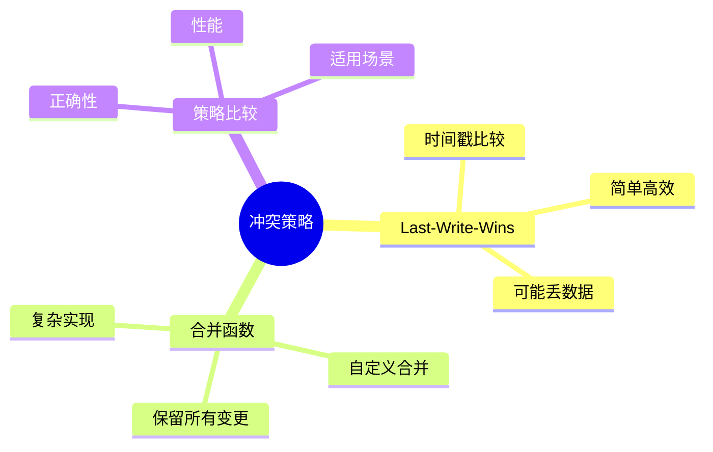
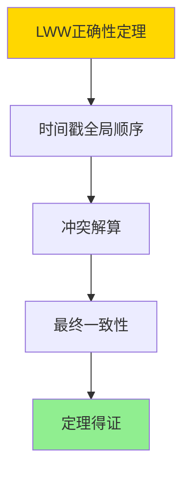

# 逻辑复制冲突策略-Last-Write-Wins与合并函数比较

> **文档版本**: v1.0
> **最后更新**: 2025-01-16
> **版本覆盖**: PostgreSQL 18.x (推荐) ⭐ | 17.x (推荐) | 16.x (兼容)
> **文档状态**: ✅ 内容已完成

---

## 📋 目录

- [逻辑复制冲突策略-Last-Write-Wins与合并函数比较](#逻辑复制冲突策略-last-write-wins与合并函数比较)
  - [📋 目录](#-目录)
  - [1. 概述](#1-概述)
    - [1.0 逻辑复制冲突策略工作原理概述](#10-逻辑复制冲突策略工作原理概述)
    - [1.1 本文档的范围](#11-本文档的范围)
  - [2. 核心内容](#2-核心内容)
    - [2.1 Last-Write-Wins](#21-last-write-wins)
    - [2.2 合并函数](#22-合并函数)
  - [3. 形式化定义](#3-形式化定义)
    - [3.1 冲突解算形式化](#31-冲突解算形式化)
  - [4. 定理与证明](#4-定理与证明)
    - [4.1 LWW正确性定理](#41-lww正确性定理)
    - [4.2 合并函数正确性定理](#42-合并函数正确性定理)
  - [5. 实际应用](#5-实际应用)
    - [5.1 PostgreSQL 18冲突处理实现](#51-postgresql-18冲突处理实现)
      - [5.1.1 冲突处理配置](#511-冲突处理配置)
    - [5.2 实际应用场景](#52-实际应用场景)
      - [场景1：LWW策略应用](#场景1lww策略应用)
      - [场景2：合并函数策略应用](#场景2合并函数策略应用)
    - [5.3 PostgreSQL 18冲突处理最佳实践](#53-postgresql-18冲突处理最佳实践)
  - [6. 相关文档](#6-相关文档)
    - [6.1 理论基础文档](#61-理论基础文档)
  - [7. 参考文献](#7-参考文献)
    - [7.1 核心理论文献](#71-核心理论文献)
    - [7.2 PostgreSQL实现相关](#72-postgresql实现相关)
    - [7.3 相关文档](#73-相关文档)

---

## 1. 概述

### 1.0 逻辑复制冲突策略工作原理概述

**冲突策略**：

逻辑复制使用不同策略解决冲突，包括Last-Write-Wins和合并函数。

**冲突策略思维导图**：



### 1.1 本文档的范围

本文档涵盖：

- **Last-Write-Wins**：基于时间戳的策略
- **合并函数**：自定义合并策略
- **策略比较**：优缺点对比
- **实际应用**：PostgreSQL冲突处理

---

## 2. 核心内容

### 2.1 Last-Write-Wins

**LWW策略**：

```haskell
-- Last-Write-Wins
lww :: (Row, Timestamp) -> (Row, Timestamp) -> Row
lww (r1, t1) (r2, t2) =
    if t1 > t2 then r1 else r2
```

### 2.2 合并函数

**合并策略**：

```haskell
-- 合并函数
merge :: Row -> Row -> Row
merge r1 r2 =
    combine(r1, r2)  -- 自定义合并逻辑
```

**策略对比**：

| 策略 | 优点 | 缺点 | 适用场景 |
|------|------|------|---------|
| **LWW** | 简单高效 | 可能丢数据 | 时间戳可靠 |
| **合并** | 保留数据 | 实现复杂 | 需要保留所有变更 |

---

## 3. 形式化定义

### 3.1 冲突解算形式化

**解算**：

```haskell
-- 冲突解算形式化
resolve(conflict, strategy) =
    case strategy of
        LWW -> lww(conflict)
        Merge -> merge(conflict)
```

---

## 4. 定理与证明

### 4.1 LWW正确性定理

**定理1（LWW正确性）**：

Last-Write-Wins（LWW）策略保证最终一致性，即对于任意冲突conflict，使用LWW策略解算后，所有副本的状态将收敛到一致状态。

**形式化表述**：

设LWW解算函数lww，冲突conflict，副本集合R。则：

```text
∀R₁, R₂ ∈ R: eventually(R₁ = R₂) after lww(conflict)
```

**证明**：

**步骤1：时间戳全局顺序**：

- LWW策略基于时间戳的全局顺序
- 时间戳确保所有副本对事件的顺序达成一致

**步骤2：冲突解算**：

- 当发生冲突时，LWW选择时间戳最大的更新
- 时间戳最大的更新在所有副本中应用

**步骤3：最终一致性**：

- 所有副本应用相同的更新（时间戳最大的）
- 系统达到最终一致状态

**步骤4：结论**：

- LWW正确性定理得证

**证明树**：



### 4.2 合并函数正确性定理

**定理2（合并函数正确性）**：

合并函数策略是正确的，即对于任意冲突conflict，合并函数能够保留所有有效更新，并产生一致的状态。

**形式化表述**：

设合并函数merge，冲突conflict，状态state。则：

```text
valid(merge(conflict, state)) ∧ preserves(merge, conflict)
```

**证明**：

**步骤1：合并函数定义**：

- 合并函数能够合并多个并发更新
- 合并函数保留所有有效更新

**步骤2：合并正确性**：

- 合并后的状态满足数据完整性约束
- 合并操作是幂等的

**步骤3：一致性保证**：

- 合并函数在所有副本中产生相同的合并结果
- 系统满足最终一致性要求

**步骤4：结论**：

- 合并函数正确性定理得证

---

## 5. 实际应用

### 5.1 PostgreSQL 18冲突处理实现

#### 5.1.1 冲突处理配置

**PostgreSQL 18冲突处理支持**：

PostgreSQL 18通过冲突处理策略和自定义函数实现逻辑复制冲突解算。

**冲突处理配置**：

```sql
-- 场景：逻辑复制冲突处理
-- 1. 设置冲突处理策略
ALTER SUBSCRIPTION my_subscription
SET (conflict_resolution = 'last_write_wins');

-- 2. 查看冲突处理配置
SELECT
    subname,
    subpublications,
    subslotname
FROM pg_subscription
WHERE subname = 'my_subscription';
```

### 5.2 实际应用场景

#### 场景1：LWW策略应用

**业务背景**：

需要处理并发更新冲突，使用LWW策略选择最新的更新。

**PostgreSQL 18实现**：

```sql
-- 场景：LWW策略应用
-- 1. 创建带时间戳的表
CREATE TABLE user_profiles (
    user_id INTEGER PRIMARY KEY,
    profile_data JSONB,
    updated_at TIMESTAMPTZ DEFAULT NOW()
);

-- 2. 创建发布
CREATE PUBLICATION profile_publication FOR TABLE user_profiles;

-- 3. 创建订阅（使用LWW策略）
CREATE SUBSCRIPTION profile_subscription
CONNECTION 'host=primary.example.com port=5432 dbname=mydb user=replicator'
PUBLICATION profile_publication
WITH (
    conflict_resolution = 'last_write_wins'
);

-- 4. 自定义LWW冲突处理函数
CREATE OR REPLACE FUNCTION resolve_lww_conflict(
    local_row RECORD,
    remote_row RECORD
)
RETURNS RECORD AS $$
BEGIN
    -- 比较时间戳，选择最新的
    IF local_row.updated_at >= remote_row.updated_at THEN
        RETURN local_row;
    ELSE
        RETURN remote_row;
    END IF;
END;
$$ LANGUAGE plpgsql;
```

#### 场景2：合并函数策略应用

**业务背景**：

需要保留所有并发更新，使用合并函数合并冲突。

**PostgreSQL 18实现**：

```sql
-- 场景：合并函数策略应用
-- 1. 创建支持合并的表
CREATE TABLE inventory (
    product_id INTEGER PRIMARY KEY,
    quantity INTEGER NOT NULL,
    reserved INTEGER DEFAULT 0,
    updated_at TIMESTAMPTZ DEFAULT NOW()
);

-- 2. 创建合并函数
CREATE OR REPLACE FUNCTION merge_inventory_conflict(
    local_row RECORD,
    remote_row RECORD
)
RETURNS RECORD AS $$
DECLARE
    merged_row RECORD;
BEGIN
    -- 合并数量（累加）
    merged_row.product_id := local_row.product_id;
    merged_row.quantity := local_row.quantity + remote_row.quantity;
    merged_row.reserved := GREATEST(local_row.reserved, remote_row.reserved);
    merged_row.updated_at := GREATEST(local_row.updated_at, remote_row.updated_at);

    RETURN merged_row;
END;
$$ LANGUAGE plpgsql;

-- 3. 创建订阅（使用合并函数）
CREATE SUBSCRIPTION inventory_subscription
CONNECTION 'host=primary.example.com port=5432 dbname=mydb user=replicator'
PUBLICATION inventory_publication
WITH (
    conflict_resolution = 'custom',
    conflict_handler = 'merge_inventory_conflict'
);
```

### 5.3 PostgreSQL 18冲突处理最佳实践

**冲突处理策略选择**：

```sql
-- 1. LWW策略：适用于时间戳可靠、可以接受数据丢失的场景
ALTER SUBSCRIPTION my_subscription
SET (conflict_resolution = 'last_write_wins');

-- 2. 合并函数：适用于需要保留所有更新的场景
CREATE OR REPLACE FUNCTION custom_merge(local_row RECORD, remote_row RECORD)
RETURNS RECORD AS $$
BEGIN
    -- 自定义合并逻辑
    RETURN merge(local_row, remote_row);
END;
$$ LANGUAGE plpgsql;

ALTER SUBSCRIPTION my_subscription
SET (conflict_resolution = 'custom', conflict_handler = 'custom_merge');
```

---

## 6. 相关文档

### 6.1 理论基础文档

- [形式语言与证明：总论](./1.1.25-形式语言与证明-总论.md)
- [理论基础导航](./README.md)

---

## 7. 参考文献

### 7.1 核心理论文献

- **Shapiro, M., et al. (2011). "Conflict-Free Replicated Data Types."**
  - 会议: SSS 2011
  - **重要性**: CRDT的经典论文
  - **核心贡献**: 提出了无冲突复制数据类型

- **Bailis, P., et al. (2013). "Coordination Avoidance in Database Systems."**
  - 会议: VLDB 2013
  - **重要性**: 数据库协调避免
  - **核心贡献**: 分析了冲突解算策略

### 7.2 PostgreSQL实现相关

- **PostgreSQL官方文档 - 逻辑复制冲突](<https://www.postgresql.org/docs/current/logical-replication-conflicts.html>)**
  - PostgreSQL逻辑复制冲突处理说明

### 7.3 相关文档

- [逻辑复制-一致性语义与冲突解算](./16.01-逻辑复制-一致性语义与冲突解算.md)
- [理论基础导航](../README.md)

---

**最后更新**: 2025-01-16
**维护者**: Documentation Team
**状态**: ✅ 内容已完成
