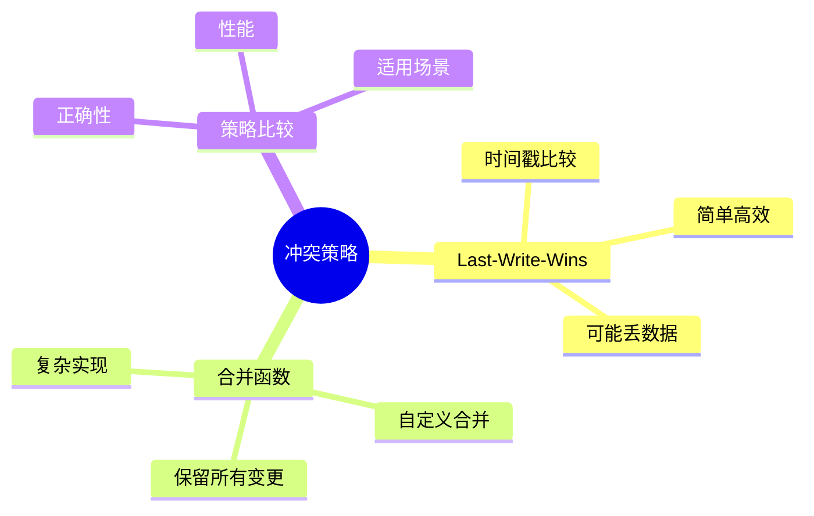

# 逻辑复制冲突策略-Last-Write-Wins与合并函数比较

> **文档版本**: v1.0
> **最后更新**: 2025-01-16
> **版本覆盖**: PostgreSQL 18.x (推荐) ⭐ | 17.x (推荐) | 16.x (兼容)
> **文档状态**: 🟡 框架已创建，内容待完善

---

## 📋 目录

- [逻辑复制冲突策略-Last-Write-Wins与合并函数比较](#逻辑复制冲突策略-last-write-wins与合并函数比较)
  - [📋 目录](#-目录)
  - [1. 概述](#1-概述)
    - [1.1 本文档的范围](#11-本文档的范围)
  - [2. 核心内容](#2-核心内容)
  - [3. 形式化定义](#3-形式化定义)
  - [4. 定理与证明](#4-定理与证明)
  - [5. 实际应用](#5-实际应用)
  - [6. 相关文档](#6-相关文档)
    - [6.1 理论基础文档](#61-理论基础文档)
  - [7. 参考文献](#7-参考文献)

---

## 1. 概述

### 1.0 逻辑复制冲突策略工作原理概述

**冲突策略**：

逻辑复制使用不同策略解决冲突，包括Last-Write-Wins和合并函数。

**冲突策略思维导图**：



### 1.1 本文档的范围

本文档涵盖：

- **Last-Write-Wins**：基于时间戳的策略
- **合并函数**：自定义合并策略
- **策略比较**：优缺点对比
- **实际应用**：PostgreSQL冲突处理

---

## 2. 核心内容

### 2.1 Last-Write-Wins

**LWW策略**：

```haskell
-- Last-Write-Wins
lww :: (Row, Timestamp) -> (Row, Timestamp) -> Row
lww (r1, t1) (r2, t2) =
    if t1 > t2 then r1 else r2
```

### 2.2 合并函数

**合并策略**：

```haskell
-- 合并函数
merge :: Row -> Row -> Row
merge r1 r2 =
    combine(r1, r2)  -- 自定义合并逻辑
```

**策略对比**：

| 策略 | 优点 | 缺点 | 适用场景 |
|------|------|------|---------|
| **LWW** | 简单高效 | 可能丢数据 | 时间戳可靠 |
| **合并** | 保留数据 | 实现复杂 | 需要保留所有变更 |

---

## 3. 形式化定义

### 3.1 冲突解算形式化

**解算**：

```haskell
-- 冲突解算形式化
resolve(conflict, strategy) =
    case strategy of
        LWW -> lww(conflict)
        Merge -> merge(conflict)
```

---

## 4. 定理与证明

### 4.1 LWW正确性定理

**定理**：LWW策略保证最终一致性。

**证明**：由时间戳的全局顺序保证。

---

## 5. 实际应用

### 5.1 PostgreSQL冲突处理

**冲突处理**：

```sql
-- 设置冲突处理
ALTER SUBSCRIPTION my_subscription
SET (conflict_resolution = 'last_write_wins');

-- 自定义冲突处理函数
CREATE FUNCTION resolve_conflict(local_row, remote_row)
RETURNS ROW AS $$
BEGIN
    -- 自定义合并逻辑
    RETURN merge(local_row, remote_row);
END;
$$ LANGUAGE plpgsql;
```

---

## 6. 相关文档

### 6.1 理论基础文档

- [形式语言与证明：总论](./1.1.25-形式语言与证明-总论.md)
- [理论基础导航](./README.md)

---

## 7. 参考文献

[待补充]

---

**最后更新**: 2025-01-16
**维护者**: Documentation Team
**状态**: 🟡 框架已创建，内容待完善
